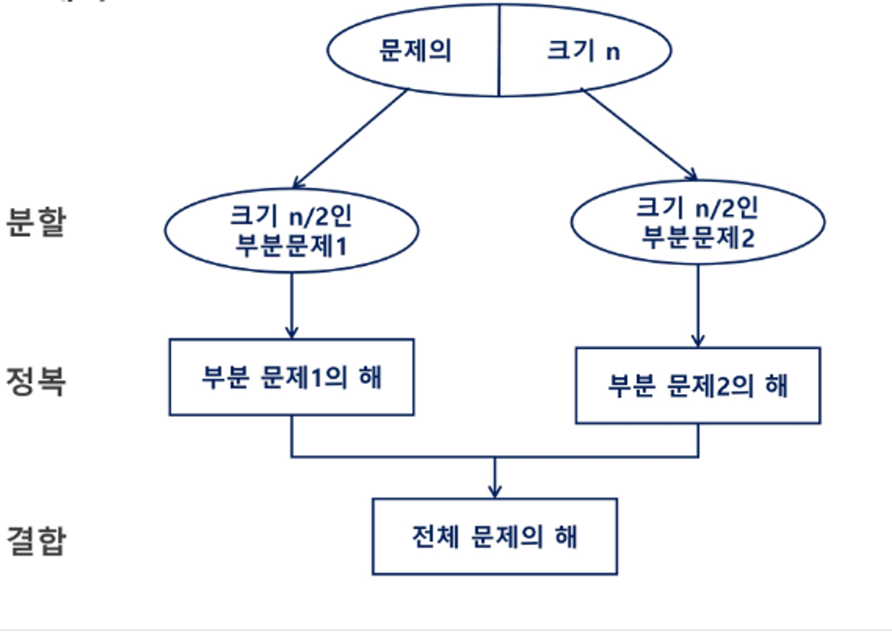
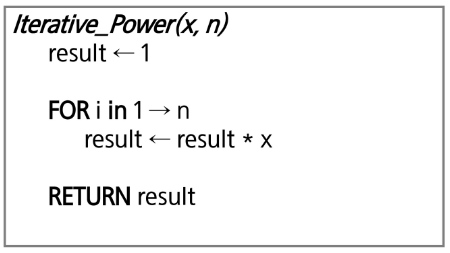
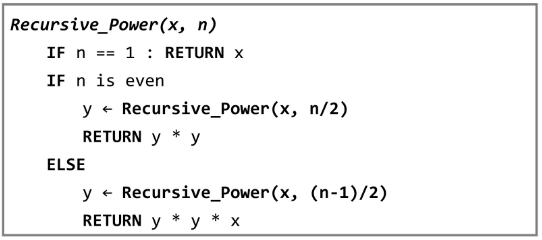

# 분할 정복 알고리즘
분할 정복(Divide and Conquer) 알고리즘은 복잡한 문제를 더 간단한 문제로 나누어 해결하는 전략

## 유래

- 1805년 12월 2일 아우스터리츠 전투에서 나폴레옹이 사용한 전략
- 전력이 우세한 연합군을 공격하기 위해 나폴레옹은 연합군의 중앙부로 쳐들어가 연합군을 둘로 나눔
- 둘로 나뉜 연합군을 한 부분씩 격파함

## 분할 정복 알고리즘 접근 방식
1. 분할(Divide)
: 원래 문제를 **더 작은 하위 문제**로 나눈다.   
2. 정복(Conquer)
: 나눠진 **하위 문제를 해결**한다. 하위 문제가 더 이상 나눌 수 없는 경우( 즉, 기본 사례), **직접 해결**한다. 그렇지 않으면 재귀적으로 해결한다.
3. 결합(Combine)
: (필요하다면) 하위 문제들의 **해결 결과를 모아서** 원래 문제의 해답을 구성한다.

> 이러한 방식은 문제를 더 관리하기 쉬운 부분으로 나누어 문제 해결의 `복잡성`을 줄여준다.

📌 Top-down approach 예시

 

📌 분할 정복 알고리즘 예시

- 병합 정렬
- 퀵 정렬
- 이진 탐색
- 거듭제곱 연산

# 분할 정복 알고리즘 예시
## 거듭제곱 연산

- 분할: 지수를 반으로 나눕니다.
- 정복: 각 부분을 재귀적으로 계산합니다.
- 결합: 결과를 곱하여 최종 결과를 얻습니다.

$ C^2 = C \times C $  
$ C^3 = C \times C \times C $  
$ ... $  
$ C^n = C \times C \times C \times ...  \times C$  

 

- 분할 정복 기반의 알고리즘 : $O(\log_2 n)$  
  - $ C^8 = C \times C \times C \times C \times C \times C \times C \times C$  
  - $ C^8 = C^4 \times C^4 = (C^4)^2  = ((C^2)^2)^2 $  
  - $ C^n = C^{\frac {n-1} {2}} \times C^{\frac {n-1} {2}} \times C = (C^{\frac{n-1}{2}})^2 $

  $$y = \begin{dcases} 
   C^{\frac {n} {2}} \times C^{\frac {n} {2}} \quad    n은 \space 홀수\\
   C^{\frac {n-1} {2}} \times C^{\frac {n-1} {2}} \times C \quad n은 \space 짝수 
   \end{dcases} $$

 

## 병합 정렬 Merge Sort
- 여러 개의 정렬된 자료의 집합을 병합하여 한 개의 정렬된 집합으로 만드는 방식
- 분할 정복 알고리즘 활용
  - 자료를 최소 단위의 문제까지 나눈 후에 차례대로 정렬하여 최종 결과를 얻어냄
  - top-down 방식
- 시간 복잡도 $O(n \log n)$

병합 정렬은 배열을 반으로 나누고, 각 부분을 재귀적으로 정렬한 후 병합하는 방식으로 동작합니다.
- 분할: 배열을 두 개의 부분 배열로 나눕니다.
- 정복: 각 부분 배열을 재귀적으로 정렬합니다.
- 결합: 정렬된 부분 배열들을 하나의 정렬된 배열로 병합합니다.

## 퀵 정렬 Quick Sort

## 이진 검색 Binary Search
