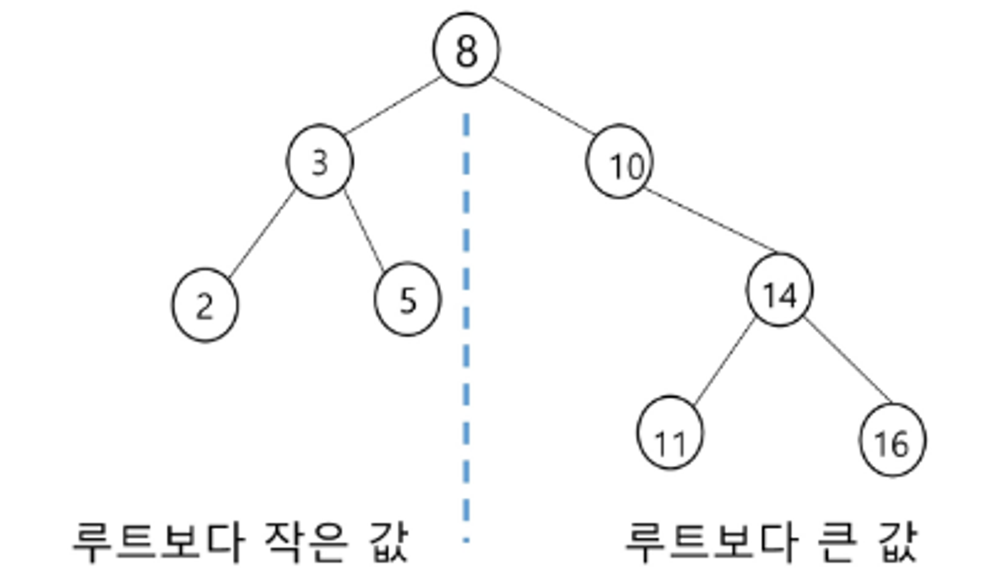
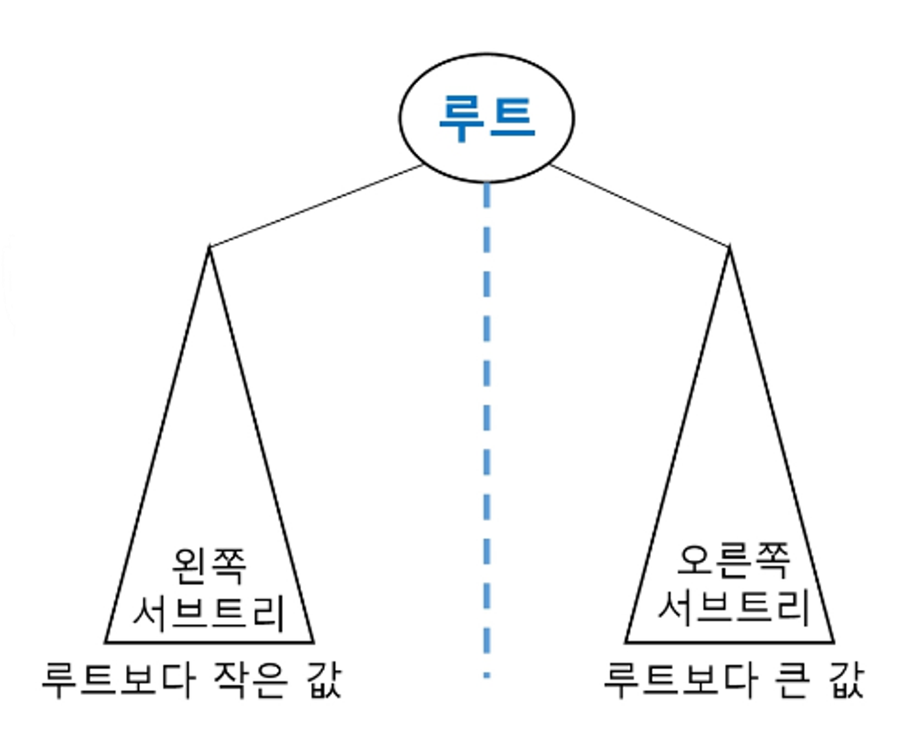
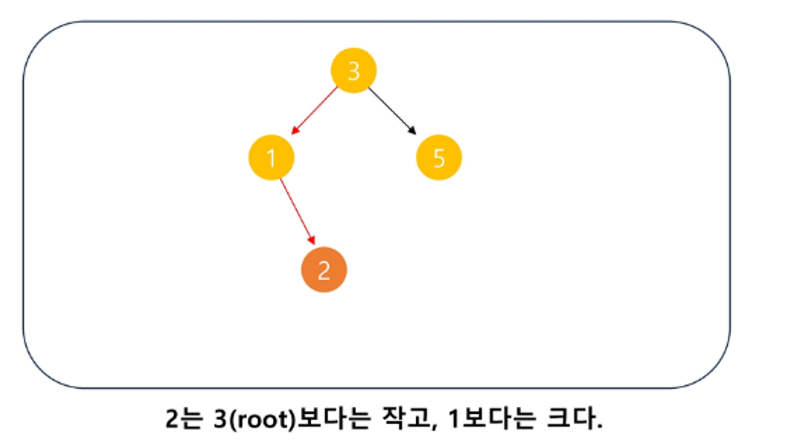
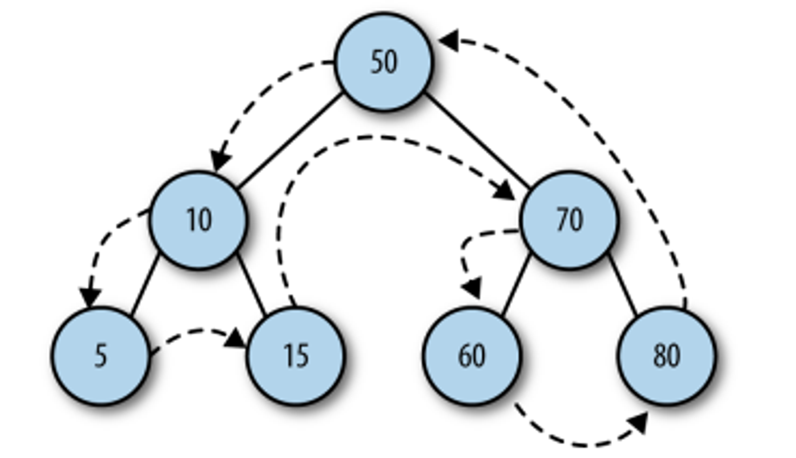
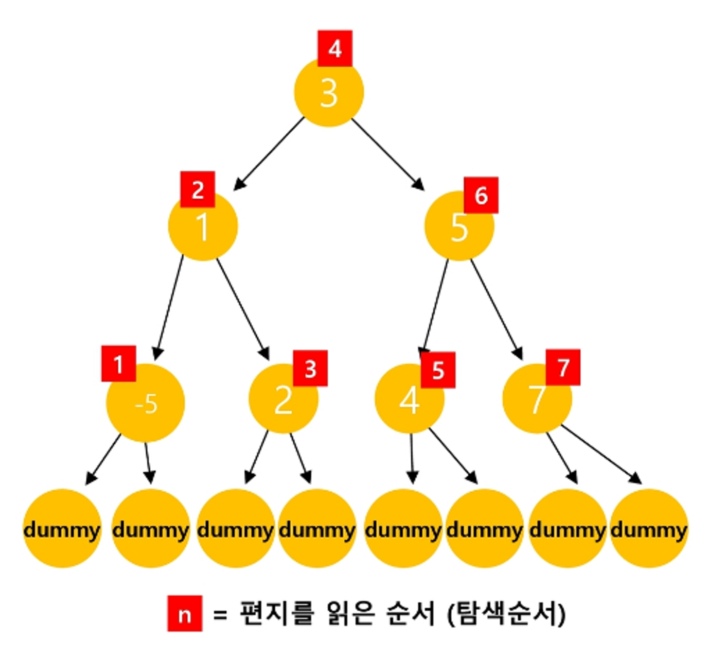

<!-- TOC start (generated with https://github.com/derlin/bitdowntoc) -->

- [이진 탐색 트리](#이진-탐색-트리)
  - [정의와 특징](#정의와-특징)
  - [장점](#장점)
  - [주요 연산](#주요-연산)
    - [탐색 (Search), 삽입 (Insertion)](#탐색-search-삽입-insertion)
    - [삭제 (Deletion)](#삭제-deletion)
      - [리프 노드 삭제](#리프-노드-삭제)
      - [자식이 둘인 노드 삭제](#자식이-둘인-노드-삭제)
    - [순회 (Traversal)](#순회-traversal)
      - [중위(Inorder) 순회](#중위inorder-순회)
      - [전위(Preorder) 순회](#전위preorder-순회)
      - [후위(Postorder) 순회](#후위postorder-순회)
  - [성능](#성능)
  - [주요 특성](#주요-특성)
  - [구현 및 사용](#구현-및-사용)
  - [Summary](#summary)

<!-- TOC end -->

# 이진 탐색 트리
BST(Binary Search Tree) 자료구조  
📌 이진 탐색 트리  
> Data들을 빠르게 검색할 수 있도록 체계적으로 저장을 해 두고, 최대 $O(\log n)$의 빠른 속도로 값을 검색할 수 있는 자료구조로, 빠르게 검색될 수 있도록, 특정 규칙을 갖는 이진트리 형태로 값을 저장해둔다.

## 정의와 특징

A binary search tree is a binary tree in which data with lesser values are stored in left nodes and data with greater values are stored in right nodes.

- 각 노드가 최대 두 개의 자식 노드를 가지는 이진 트리
- 왼쪽 자식 노드 < 부모 노드 < 오른쪽 자식 노드의 순서로 값이 정렬됨
- 자식 노드를 2개로 제한함으로써 자료의 삽입, 삭제, 검색이 유용함

<div style="display: flex; justify-content: center; align-items: center;">
  
  
</div>


## 장점
- 리스트나 배열에 비해 빠른 탐색, 삽입, 삭제 가능 (평균적으로 O(log N) 시간 복잡도)
- 정렬된 데이터 구조 유지

||리스트 성능|BST 성능|
|---|---|---|
|삽입|$O(n)$, 단 맨 끝 삽입은 $O(1)$|$O(\log N)$|
|삭제|$O(n)$, 단 맨 끝 삽입은 $O(1)$|$O(\log N)$|
|탐색|$O(n)$|$O(\log N)$|

## 주요 연산

### 탐색 (Search), 삽입 (Insertion)

<div style="display: flex; justify-content: center; align-items: center; padding: 15px">
  
  
</div>


1. **루트 노드**를 현재 노드로 설정합니다.
2. 삽입할 노드의 데이터 값이 현재 노드의 데이터 값보다 `작으면`, 새로운 현재 노드를 현재 노드의 `왼쪽 자식 노드`로 설정합니다. 삽입할 노드의 데이터 값이 현재 노드의 데이터 값보다 `크면`, 4단계로 건너뜁니다.
3. 현재 노드의 `왼쪽 자식 노드`가 `null`이면, 새로운 노드를 이 위치에 `삽입`하고 반복을 종료합니다. 그렇지 않으면 반복문의 다음 단계로 넘어갑니다.
4. 현재 노드를 현재 노드의 `오른쪽 자식 노드`로 설정합니다.
5. 현재 노드의 `오른쪽 자식 노드`가 `null`이면, 새로운 노드를 이 위치에 `삽입`하고 반복을 종료합니다. 그렇지 않으면 반복문의 다음 단계로 넘어갑니다.

<p style="text-align: center;">
  
</p>

📌 삽입 시간
<p style="text-align: center;">
  
</p>

- 삽입을 위해 root부터 바닥 노드까지 탐색하며 자기 위치를 찾음
    - 이는 트리의 높이(h)만큼 탐색시간이 걸림
    - $2^{높이(h)} - 1 = 노드 수(N)$ (-1은 작은값이라 생략) → $\log_2N = h$
- 완벽하게 균형 잡힌 이진트리의 경우, 삽입 시간복잡도는 $O(\log N)$이다.

### 삭제 (Deletion)

1. 삭제할 노드를 찾습니다.
2. 노드의 자식 수에 따라 다르게 처리합니다:
   - 자식이 없는 경우: 해당 노드를 단순히 제거합니다.
   - 자식이 하나인 경우: 해당 노드를 제거하고 그 자식을 부모와 연결합니다.
   - 자식이 둘인 경우:
     - a) 오른쪽 서브트리의 최소값 또는 왼쪽 서브트리의 최대값을 찾습니다.
     - b) 그 값을 삭제할 노드의 위치로 복사합니다.
     - c) 복사한 값의 원래 노드를 삭제합니다.

📌 시작트리
```cs
    23
   /  \
 16   45
 / \  / \
3  22 37 99
```

#### 리프 노드 삭제
3 삭제
```cs
    23
   /  \
 16   45
  \  / \
  22 37 99
```
- 3을 찾음
- 3은 자식이 없으므로 단순히 제거

#### 자식이 둘인 노드 삭제

```Cs
    37
   /  \
 16   45
  \    \
  22   99
```

23(루트)을 삭제
- 23을 찾습니다.
- 23은 두 자식이 있으므로, 오른쪽 서브트리의 최소값(여기서는 37)을 찾습니다.
- 23을 37로 대체합니다.
- 원래 37의 위치는 삭제합니다.


### 순회 (Traversal)

<table>
  <tr>
    <th>중위 순회</th>
    <th>전위 순회</th>
    <th>후위 순회</th>
  </tr>
  <tr>
    <td></td>
    <td></td>
    <td></td>
  </tr>
</table>


#### 중위(Inorder) 순회
- 왼쪽 서브트리 → 루트 → 오른쪽 서브트리
- BST에서 `오름차순 정렬` 결과 얻음
- [예시] 3 ➡️ 16 ➡️ 22 ➡️ 23 ➡️ 37 ➡️ 45 ➡️ 99
- [예시] 편지 전달  
  - 각 노드는 세 가지 미션을 순서대로 수행해야 함
    - 미션1. 왼쪽 노드를 편지를 즉시 전달받는다.
    - 미션2. 왼쪽 노드로부터 편지를 돌려 받는다면, 편지를 읽는다
    - 미션3. 편지를 읽은 후에는, 오른쪽 노드로 편지를 전달한다.
  - dummy 노드는 편지를 받자마자, 즉시 되돌려준다. 세가지 미션을 모두 수행한 노드는, 상위 노드에게 편지를 되돌려준다.


#### 전위(Preorder) 순회
- 루트 → 왼쪽 서브트리 → 오른쪽 서브트리
- [예시] 23 ➡️ 16 ➡️ 3 ➡️ 22 ➡️ 45 ➡️ 37 ➡️ 99

#### 후위(Postorder) 순회
- 왼쪽 서브트리 → 오른쪽 서브트리 → 루트
- [예시] 3 ➡️ 22 ➡️ 16 ➡️ 37 ➡️ 99 ➡️ 45 ➡️ 23


## 성능
- 평균 경우: O(log N) - 균형 잡힌 트리
- 최악 경우: O(N) - 한쪽으로 치우친 경사 이진 트리
  - 순차탐색과 시간복잡도가 같음

> 탐색, 삽입, 삭제 시간은 트리의 높이 만큼 시간이 걸림  $O(h)$ (h는 BST의 깊이(height))

## 주요 특성
- 모든 노드는 유일한 키 값을 가짐 (중복 없음)
- 왼쪽 서브트리의 모든 노드 < 루트 노드 < 오른쪽 서브트리의 모든 노드
- 각 서브트리도 BST 구조를 유지
- 반드시 완전 이진 트리일 필요는 없음

## 구현 및 사용
- 파이썬 표준 라이브러리에는 BST 구현이 없어 직접 구현 필요
- 삭제 연산은 복잡할 수 있으며, 트리의 재구성이 필요할 수 있음

이진 탐색 트리는 효율적인 데이터 관리와 검색을 위한 중요한 자료구조로, 많은 응용 분야에서 활용됩니다.

## Summary

- 탐색작업을 효율적으로 하기 위한 자료구조
- 모든 원소는 서로 다른 유일한 키를 갖는다. → 문제마다 다를 수 있음
- key(왼쪽 서브트리) < key(루트 노드) < key(오른쪽 서브트리)
- 왼쪽 서브트리와 오른쪽 서브트리도 이진 탐색 트리다.
- 중위 순회하면 오름차순으로 정렬된 값을 얻을 수 있다.
- 완전 이진 트리 아님!
