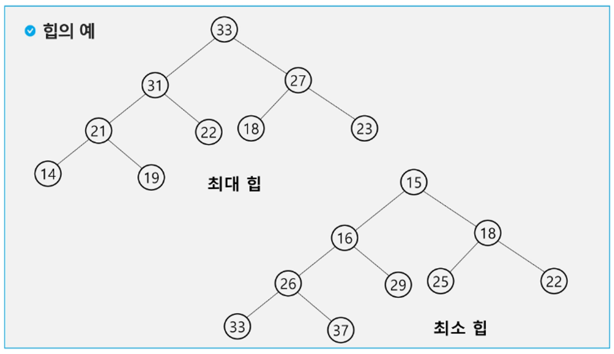

<!-- TOC start (generated with https://github.com/derlin/bitdowntoc) -->

- [Heap](#heap)
  - [최대 힙](#최대-힙)
  - [최소 힙](#최소-힙)
  - [특징](#특징)
  - [구현 특징](#구현-특징)
    - [삽입](#삽입)
    - [삭제](#삭제)

<!-- TOC end -->

# Heap
📍 힙(heap)은 최댓값 및 최솟값을 찾아내는 연산을 빠르게 하기 위해 고안된 `완전 이진 트리`를 기본으로 한 자료구조  

A과 B의 부모노드이면 A의 key값과 B의 key값 사이에는 대소관계가 성립한다는 힙의 속성을 만족한다

우선순위 큐(우선순위가 가장 높은 데이터를 가장 먼저 삭제)를 구현하기 위하여 사용하는 자료구조 중 하나

|자료 구조|추출되는 데이터|
|---|---|
|stack|가장 나중에 삽입된 데이터|
|queue|가장 먼저 삽입된 데이터|
|priority queue|가장 우선순위가 높은 데이터|


📌 힙의 종류

<p style="text-align: center;"> </p>

- 최대 힙
- 최소 힙

## 최대 힙
📌 부모 노드의 키 값이 자식 노드의 키 값보다 항상 큰 힙
- 루트 노드 : 키 값이 가장 큰 노드
- 값이 큰 데이터가 먼저 삭제

## 최소 힙
📌 부모 노드의 키 값이 자식 노드의 키 값보다 항상 작은 힙
- 루트 노드 : 키 값이 가장 작은 노드
- 값이 낮은 데이터가 먼저 삭제
- 파이썬 라이브러리에서는 기본적으로 최소 힙 구조를 이용함 

## 특징
- 키 값의 대소관계는 오로지 부모노드와 자식노드 간에만 성립하며, 특히 여제사이에는 대소관계가 정해지지 않는다.
- 각 노드의 자식노드의 최대개수는 힙의 종류에 따라 다르지만, 대부분의 경우는 자식 노드의 개수가 최대 2개인 이진 힙(binary heap)을 사용한다
- 힙에서는 가장 높은(가장 낮은) 우선순위를 가지는 노드가 항상 뿌리노드에 오게되는 특징이 있으며, 이를 응용하면 우선순위 큐와 같은 추상적 자료형을 구현할 수 있음
  - 힙을 이용한 우선순위 큐
    - 힙은 완전 이진 트리로 구현된 자료구조로서, 키 값이 가장 큰 노드나 가장 작은 노드를 찾기에 적합한 자료구조
    - 힙의 키를 우선순위로 활용하여 우선순위 큐를 구현할 수 있음


## 구현 특징
- 파이썬에서는 우선순위 큐가 필요할 때 `PriorityQueue` 혹은 `heapq`를 사용하는 것을 권장함
  - 일반적으로 `heapq`가 더 빠르게 동작하기 때문에 수행 시간이 제한된 상황에서는 `heapq`를 사용하는 것을 권장함
- 우선순위 값을 표현할 때는 일반적으로 `정수형 자료형`의 변수가 사용됨
  - 예를 들어, 물건의 (가치, 물건의 무게)으로 묶어서 우선순위 큐 자료구조에 넣으면, 우선순위 큐에서 물건을 꺼내게 될 때, 항상 가치가 높은 물건이 먼저 나오게 됨
  - 대부분의 프로그래밍 언어에서는 우선순위 큐 라이브러리에 데이터의 묶음을 넣으면, 첫 번째 원소를 기준으로 우선순위를 설정함
    - 따라서 '가치'가 우선순위 값이 됨
- 우선순위 큐를 구현할 때 내부적으로 최소힙 구조 이용
  - `다익스트라 최단 경로 알고리즘`에서는 비용이 적은 노드를 우선하여 방문하므로 최소 힙 구조를 기반으로 하는 파이썬의 우선 순위 큐 라이브러리를 그대로 사용하면 적합함
  - 최대 힙처럼 사용하기 위해서 일부러 우선순위에 해당하는 값에 음수 부호를 붙여서 넣었다가, 나중에 우선순위 큐에서 꺼낸 다음에 다음 음수 부호를 붙여서 원래의 값으로 돌리는 방식을 사용할 수 있음
- 우선순위 큐를 구현하는 방식
    |우선순위 큐 구현 방식|삽입  시간|삭제 시간|
    |---|---|---|
    |리스트|$O(1)$|$O(n)$|
    |힙|$O(\log n)$|$O(\log n)$|

### 삽입
- 새 요소 추가: 새 요소를 힙의 가장 아래 레벨의 왼쪽부터 차례로 추가합니다.
- 힙 속성 유지: 새로 추가된 요소가 부모 요소보다 클 경우, 부모와 자식을 교환합니다. 이 과정을 새 요소가 힙 속성을 만족할 때까지 반복합니다. 이 과정을 "up-heap" 또는 "bubble-up"이라고도 합니다.
- 시간 복잡도: 삽입 연산의 최악의 경우 시간 복잡도는 $O(logn)$입니다. 이는 힙의 높이에 비례합니다

최대 힙에 새로운 요소를 삽입하는 과정
```cs
    50
   /  \
  30  40
 / \  /
20 15 10
```

📌 35 삽입
1. 새 요소를 힙의 마지막 위치에 추가합니다
  ```cs
         50
        /  \
       30  40
      / \  / \
     20 15 10 35
  ```
2. 새로 추가된 요소(35)를 부모 노드(40)와 비교합니다. 35 < 40이므로 교환하지 않습니다.
3. 힙 속성이 만족되었으므로 삽입 과정이 완료됩니다.

📌 55 삽입
1. 새 요소를 힙의 마지막 위치에 추가합니다
   ``` Cs
       50
      /  \
     30  40
    / \  / \
   20 15 10 35
             \
             55
   ```

2. 55를 부모 노드(35)와 비교합니다. 55 > 35이므로 교환합니다

    ```cs
           50
          /  \
         30  40
        / \  / \
       20 15 10 55
                 \
                 35
    ```
3. 55를 새 부모 노드(40)와 비교합니다. 55 > 40이므로 다시 교환합니다

    ```cs
         50
        /  \
       30  55
      / \  / \
     20 15 10 40
               \
               35
    ```

5. 55를 새 부모 노드(40)와 비교합니다. 55 > 40이므로 다시 교환합니다

    ```cs
         55
        /  \
       30  50
      / \  / \
     20 15 10 40
               \
               35
    ```


6. 힙 속성이 만족되었으므로 삽입 과정이 완료됩니다.
  

### 삭제
- 루트 요소 삭제: 힙에서 삭제는 일반적으로 루트 노드에서 이루어집니다.
- 마지막 요소 이동: 힙의 마지막 요소를 루트 위치로 이동시킵니다.
- 힙 속성 유지: 루트에서 시작하여 힙 속성을 만족할 때까지 아래로 이동하며 자식 노드와 비교하여 필요시 교환합니다. 이 과정을 "down-heap" 또는 "heapify"라고 합니다.
- 시간 복잡도: 삭제 연산의 시간 복잡도도
$O(logn)$입니다


삭제는 일반적으로 루트 노드에서 이루어짐
```Cs
    44
   /  \
  42   35
 / \   / \
33 31 19 27
/ \
10 26
```

1. 루트 노드 삭제: 루트 노드(44)를 삭제합니다.
2. 마지막 요소 이동: 힙의 마지막 요소(26)를 루트 위치로 이동합니다.
  ```Cs
       26
      /  \
     42   35
    / \   / \
   33 31 19 27
   /
  10
  ```
3. 힙 속성 복원: 루트에서 시작하여 자식 노드들과 비교하며 힙 속성을 유지합니다. 26은 42보다 작으므로 교환합니다.

```Cs
      42
     /  \
    26   35
   / \   / \
  33 31 19 27
  /
 10
```

4. 힙 속성 복원 계속: 26은 33보다 작으므로 교환합니다.

  ```cs
        42
       /  \
      33   35
     / \   / \
    26 31 19 27
    /
   10
  ```

5. 힙 속성 만족: 26은 자식 노드 10보다 크므로 더 이상 교환할 필요가 없습니다.
  ```cs
        42
       /  \
      33   35
     / \   / \
    26 31 19 27
    /
   10
  ```
