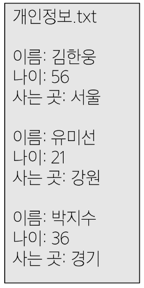

# Many to on relationships

## 모델 관계
- Many  to one relationships (N:1 or 1:N)
  - 한 테이블의 0개 이상의 레코드가 다른 테이블의 레코드 한 개와 관련된 관계
- Comment - Article
  - 0개 이상의 댓글은 1개의 게시글에 작성될 수 있다.
  - Comment(N) - Article(1) : 0개 이상의 댓글은 1개의 게시글에 작성될 수 있다.  
    

## 댓글 모델 정의
## 댓글 생성 연습

# 관계 모델 참조
## 역참조

# 댓글 구현
## 댓글 CREATE
## 댓글 READ
## 댓글 DELETE

# 참고
## 데이터 무결성
## admin site 댓글 등록
## 댓글 추가 구현