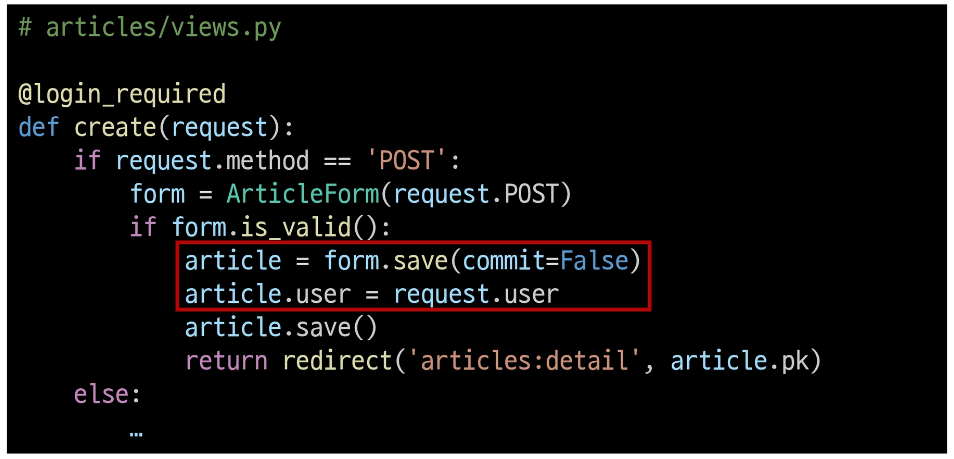
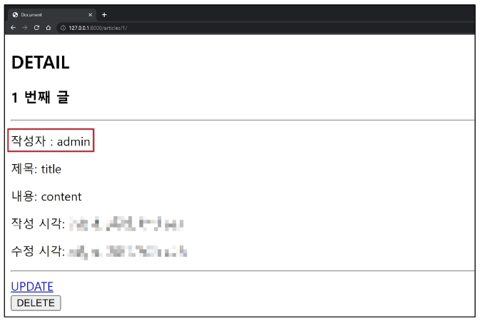

<!-- TOC start (generated with https://github.com/derlin/bitdowntoc) -->

- [Many to on relationships](#many-to-on-relationships)
  - [모델 관계](#모델-관계)
  - [댓글 모델 정의](#댓글-모델-정의)
  - [댓글 생성 연습](#댓글-생성-연습)
- [관계 모델 참조](#관계-모델-참조)
  - [역참조](#역참조)
- [댓글 구현](#댓글-구현)
  - [댓글 CREATE](#댓글-create)
  - [댓글 READ](#댓글-read)
  - [댓글 DELETE](#댓글-delete)
- [참고](#참고)
  - [데이터 무결성](#데이터-무결성)
  - [admin site 댓글 등록](#admin-site-댓글-등록)
  - [댓글 추가 구현](#댓글-추가-구현)
- [Many to one relationship 2](#many-to-one-relationship-2)
- [Article \& User](#article--user)
  - [모델 관계 설정](#모델-관계-설정)
  - [게시글 CREATE](#게시글-create)
  - [게시글 READ](#게시글-read)
  - [게시글 UPDATE](#게시글-update)
  - [게시글 DELETE](#게시글-delete)
- [Comment \& User](#comment--user)
  - [모델 관계 설정](#모델-관계-설정-1)
  - [댓글 CREATE](#댓글-create-1)
  - [댓글 READ](#댓글-read-1)
  - [댓글 DELETE](#댓글-delete-1)
- [View decorators](#view-decorators)
  - [Allowed HTTP methods](#allowed-http-methods)
- [ERD](#erd)
  - [ERD 구성 요소](#erd-구성-요소)
  - [ERD 제작 사이트](#erd-제작-사이트)
- [참고](#참고-1)
  - [추가 기능 구현](#추가-기능-구현)

<!-- TOC end -->

# Many to on relationships
## 모델 관계
- Many  to one relationships (N:1 or 1:N)
  - 한 테이블의 0개 이상의 레코드가 다른 테이블의 레코드 한 개와 관련된 관계
- Comment - Article
  - 0개 이상의 댓글은 1개의 게시글에 작성될 수 있다.
  - Comment(N) - Article(1) : 0개 이상의 댓글은 1개의 게시글에 작성될 수 있다.  
      
    

## 댓글 모델 정의
- 📌ForeignKey()
  - 한 모델이 다른 모델을 참조하는 관계를 설정하는 필드
    - N:1 관계 표현
    - 데이터베이스에서 외래 키로 구현
- 📌 댓글 모델 정의  
      
    
  - ForeignKey 클래스의 인스턴스 이름은 참조하는 모델 클래스 이름의 `단수형`으로 작성하는 것을 권장
  - 외래키는 ForeignKey 클래스르 작성하는 위치와 관계없이 테이블의 마지막 필드로 생성됨
- 📌 ForeignKey(to, on_delete)
  - to : 참조하는 모델 class 이름
  - on_delete : 외래 키가 참조하는 객체(1)가 사라졌을 때, 외래키를 가진 객체(N)를 어떻게 처리할 지를 정의하는 설정(데이터 무결성)
    - `CASCADE` : 참조된 객체(부모 객체)가 삭제 될 때 이름 참조하는 모든 객체도 삭제되도록 지정
    - 기타 on_delete 설정 값 참고 : https://docs.djangoproject.com/en/4.2/ref/models/fields/#arguments
- Migration 이후 댓글 테이블 확인
  - 댓글 테이블의 article_id 외래키 필드 확인
  - 만들어 지는 필드 이름
    - `참조 대상 클래스 이름`+`_`+`클래스 이름`
  - 참조하는 클래스 이름의 소문자(단수형)로 작성하는 것이 권장 되었던 이유  
        

## 댓글 생성 연습
- step1 : shell_plus 실행 및 게시글 작성  
       
- step2 : 댓글 생성  
       
- step3 : shell_plus 실행 및 게시글 작성   
       
- step4 : comment 인스턴스를 통한 article 값 참조하기  
       
- step5 : comment 인스턴스를 통한 article 값 참조하기  
       
- step6 : 두 번째 댓글 생성  
       
- step7 : 작성된 댓글 데이터 확인  
       

# 관계 모델 참조
## 역참조
- N:1 관계에서 1에서 N을 참조하거나 조회하는 것(1➡N)
- 모델 간의 관계에서 관계를 정의한 모델이 아닌, 관계의 대상이 되는 모델에서 연결된 객체들에 접근하는 방식
- N은 외래 키를 가지고 있어 물리적으로 참조가 가능하지만, 1은 N에 대한 참조 방법이 존재하지 않아 별도의 역참조 키워드가 필요
- 역참조 사용 예시
  - `article.comment_set.all()`  
         
  - 특정 게시글에 작성된 댓글 전체를 조회하는 요청
- related manager
  - N:1 혹은 M:N 관계에서 역참조 시에 사용하는 매니저
  - `Objects` 매니저를 통해 QuerySet API를 사용했던 것 처럼 related manager를 통해 QuerySet API를 사용할 수 있게 됨 
  - 이름 규칙
    - N:1 관계에서 생성되는 Related Manager의 이름은 `모델명_set`형태로 자동 생성됨
      - 관계를 직접 정의하지 않은 모델에서 연결된 객체들을 조회할 수 있게 함
    - 특정 댓글의 게시글 참조(Comment ➡ Article)
      - `comment.article`
    - 특정 게시글의 댓글 목록 참조(Article ➡ Comment)
      - `article.comment_set.all()`
  - 연습
    - shell_plus 실행 및 1번 게시글 조회  
         
    - 1번 게시글에 작성된 모든 댓글 조회하기 (역참조)  
         
    - 1번 게시글에 작성된 모든 댓글 내용 출력  
         

# 댓글 구현
## 댓글 CREATE
1. 댓글 CREATE 구현 : 사용자로부터 댓글 데이터를 입력 받기 위한 CommentForm 정의  
        
2. detail view 함수에서 CommentForm을 사용하여 detail 페이지에 렌더링  
        
3. Comment 클래스의 외래키 필드 article 또한 데이터 입력이 필요한 필드이기 때문에 출력 되는 것
   - 하지만, 외래키 필드 데이터는 사용자로부터 입력 받는 값이 아닌 view 함수 내에서 다른 방법으로 전달 받아 저장되어야 함  
        
4. CommentForm의 출력 필드 조정하여 외래키 필드가 출력되지 않도록 함  
        
5. 출력에서 제외된 외래 키 데이터는 어디서 받아와야 할까?  
   - detqail 페이지의 URL을 살펴보면 `path('<int:pk>/', views.detail, name='detail')`에서 해당 게시글의 pk 값이 사용되고 있음
   - 댓글의 외래 키 데이터에 필요한 정보가 바로 게시글의 pk 값
6. url 작성 및 action 값 작성  
        
7. comments_create view 함수 정의
   - url로 받은 pk 인자를 게시글을 조회하는 데 사용  
        
8. article 객체는 어떻게/언제 저장할 수 있을까?  
   - save(commit=False)
     - DB에 저장 요청을 보내지 않고 인스턴스만 반환
     - Create, but don't save the new instance.
9.  save의 commit 인자를 활용해 외래키 데이터 추가 입력  
        
10. 댓글 작성 후 테이블 확인   
        

## 댓글 READ
- 댓글 READ 구현
  - detail view 함수에서 전체 댓글 데이터를 조회  
          
  - 전체 댓글 출력 및 확인  
          

## 댓글 DELETE
- 댓글 DELETE 구현
  - 댓글 삭제 url 작성  
          
  - 댓글 삭제 view 함수 정의  
          
  - 댓글 삭제 버튼 작성  
          
  - 댓글 삭제 버튼 출력 확인 및 삭제 테스트  
          

# 참고
## 데이터 무결성
- 데이터베이스에 저장된 데이터의 정확성, 일관성, 유효성을 유지하는 것
- 데이터베이스에 저장된 데이터 값의 정확성을 보장하는 것
- 중요성
  1. 데이터의 신뢰성 확보
  2. 시스템 안정성
  3. 보안 강화

## admin site 댓글 등록
- Comment 모델을 admin site에 등록해 CRUD 동작 확인하기  
      

## 댓글 추가 구현
1. 댓글이 없는 경우 대체 콘텐츠 출력 : DTL의 'for empty' 태그 활용  
      
1. 댓글 개수 출력하기
   1. DTL filter - `length` 사용  
        
   2. QuerySet API - `count()` 사용  
        

# Many to one relationship 2
- User와 다른 모델 간의 모델 관계 설정
  1. User & Article
  2. User & Comment
- Article(N) - User(1) : 0개 이상의 게시글은 1명의 회원에 의해 작성 될 수 있다.
- Comment(N) - User(1) : 0개 이상의 댓글은 1명의 회원에 의해 작성 될 수 있다.

# Article & User
## 모델 관계 설정
- User 외래키 정의
- User 모델을 참조하는 2가지 방법
  - `get_user_model()`
  - `settings.AUTH_USER_MODEL`
  - django 프로젝트 '내부적인 구동 순서'와 '반환 값'에 따른 이유
  - 기억해야 할 것은 `User 모델은 직접 참조하지 않는 다는 것`
    ||get_user_model()|settings.AUTH_USER_MODEL|
    |:---:|:---:|:---:|
    |반환 값|User Object (객체)|'accounts.User'(문자열)|
    |사용 위치|<mark>models.py가 아닌 다른 모든 위치</mark>|<mark>models.py</mark>|
- Migration
  - step 1
    - 기존에 테이블이 있는 상황에서 필드를 추가 하려하기 때문에 발생하는 과정
    - 기본적으로 모든 필드에는 NOT NULL 제약조건이 있기 때문에 데이터가 없이는 새로운 필드가  추가되지 못함
    - '1'을 입력하고 Enter 진행(다음 화면에서 직접 기본값 입력)  
           
  - step 2
    - 추가하는 외래 키필드에 어떤 데이터를 넣을 것인지 직접 입력해야함
    - 마찬가지로 '1'을 입력하고 Enter 진행
    - 기존에 작성된 게시글이 있다면 모두 1번 회원이 작성한 것으로 처리됨  
           
  - step 3
    - migrations 파일 생성 후 migrate 진행  
           
  - step 4
    - articles_article 테이블에 user_id 필드 생성 확인  
           
  
## 게시글 CREATE
- step 1
  - 기존 ArticleForm 출력 변화 확인
  - User 모델에 대한 외래키 데이터 입력을 위해 불필요한 input이 출력됨  
         
- step 2
  - ArticleForm 출력 필드 수정  
         
- step 3
  - 게시글 작성 시 에러 발생
  - user_id 필드 데이터가 누락되었기 때문  
         
- step 4
  - 게시글 작성 시 작성자 정보가 함께 저장될 수 있도록 save의 commit 옵션 활용  
         
- step 5
  - 게시글 작성 후 테이블 확인  
         

## 게시글 READ 
- 각 게시글의 작성자 이름 출력  
  
      
- 각 게시글의 작성자 이름 출력  
  
      

## 게시글 UPDATE
- 게시글 수정 요청 사용자와 게시글 작성 사용자를 비교하여 본인의 게시글만 수정 할 수 있도록 하기  
    
- 해당 게시글의 작성자가 아니라면, 수정/삭제 버튼을 출력하지 않도록 하기  
    

## 게시글 DELETE
- 삭제를 요청하려는 사람과 게시글을 작성한 사람을 비교하여 본인의 게시글만 삭제 할 수 있도록 하기
    

# Comment & User
## 모델 관계 설정
- User 외래키 정의  
    
- Migration
  - step 1  
    - 이전에 Article와 User 모델 관계 설정 때와 동일한 상황
    - 기존 Comment 테이블에 새로운 필드가 빈 값으로 추가 될 수 없기 때문에 기본 값 설정 과정이 필요  
      
  - step 2  
    - Migration 후 articles_comment 테이블에 user_id 필드 확인  
      

## 댓글 CREATE
- step 1
  - 댓글 작성 시 이전에 게시글 작성 할 때와 동일한 에러 발생
  - 댓글의 user_id 필드 데이터가 누락되었기 때문    
      
- step 2
  - 댓글 작성 시 작성자 정보가 함께 저장할 수 있도록 작성  
      
- step 3
  - 댓글 작성 후 테이블 확인  
      

## 댓글 READ
- 댓글 출력 시 댓글 작성자와 함께 출력  
    
      

## 댓글 DELETE
- 댓글 삭제 요청 사용자와 댓글 작성 사용자를 비교하여 본인의 댓글만 삭제 할 수 있도록 하기   
    
- 해당 댓글의 작성자가 아니라면, 댓글 삭제 버튼을 출력하지 않도록 함   
      

# View decorators
- View 함수의 동작을 수정하거나 추가 기능을 제공하는 데 사용되는 Python 데코레이터
- 코드의 재사용성을 높이고 뷰 로직을 간결하게 유지
- View decorators 종류
  - Allowed HTTP methods
  - Conditional view processing
  - GZip compression
  - ...
  - 참고 자료 : https://docs.djangoproject.com/en/4.2/topics/http/decorators/

## Allowed HTTP methods
- 📌 Allowed HTTP methods
  - 특정 HTTP method로만 View 함수에 접근할 수 있도록 제한하는 데코레이터
- 주요 Allowed HTTP methods
   1. required_http_methods(["METHOD1", "METHOD2", ...]) : 지정된 HTTP method만 허용  
        
   2. require_safe() : GET과 HEAD method만 허용  
        
   3. require_POST() : POST method만 허용  
        

- Allowed HTTP methods 주요 특징
  - 지정되지 않은 HTTP method로 요청이 들어오면 HttpResponseNotAllowed (405)를 반환
  - 대문자로 HTTP method를 지정
- required_GET 대신 require_safe를 권장하는 주요 이유
  - 웹 표준 준수
    - GET과 HEAD는 '안전한(safe)' 메소드로 간주됨
  - 호환성
    - 일부 소프트웨어는 HEAD 요청에 의존
  - 웹 표준을 준수하고, 더 넓은 범위의 클라이언트와 호환되며, 안전한 HTTP 메소드만을 허용하는 view 함수를 구현할 수 있음

# ERD
- Entity-Relationship Diagram
- 데이터베이스의 구조를 시각적으로 표현하는 도구
- Entity(개체), 속성, 그리고 엔티티 간의 관계를 그래픽 형태로 나타내어 시스템의 논리적 구조를 모델링하는 다이어그램  
- https://www.lucidchart.com/pages/er-diagrams

    

## ERD 구성 요소
1. 엔티티 Entity
   - 데이터베이스에 저장되는 객체나 개념
   - 예시 : 고객, 주문, 제품
2. 속성 Attritube
   - 엔티티의 특성이나 성질
   - 예시 : 고객(이름, 주소, 전화번호)
3. 관계 Relationship
   - 엔티티 간의 연관성
   - 예시 : 고객이 '주문'한 제품

개체와 속성
- 개체 : 회원(User)
- 속성 : 회원번호(id), 이름(name), 주소(address) 등
  - 개체가 지닌 속성 및 속성의 데이터 타입  
        
- 관계 : 회;원과 댓글 간의 관계 
  - 회원이 "작성"한 댓글   
        

Cardinality
- 한 엔티티와 다른 엔티티 간의 수적 관계를 나타내는 표현
- 주요 유형
  - 일대일 1:1 one-to-one
  - 다대일 N:1 many-to-one
  - 다대다 M:N many-to-many
- 표현
  - 선의 끝부분에 표시되며 일반적으로 숫자나 기호(까마귀 발)로 표현됨  
      
- 적용
  - 회원은 여러 댓글을 작성한다
  - 각 댓글은 하나의 회원만 존재한다  
      

- ERD의 중요성
  - 데이터베이스 설계의 핵심 도구
  - 시각적 모델링으로 효과적인 의사소통 지원
  - 실제 시스템 개발 전 데이터 구조 최적화에 중요

## ERD 제작 사이트
- 무료 ERD 제작 사이트
  - Draw.io
    - 별도의 회원가입 없이 바로 사용 가능
    - 다양한 다이어그램 템플릿 제공
    - https://app.diagrams.net/
  - ERDCloud
    - 실시간 협업 기능 지원
    - https://www.erdcloud.com/

# 참고
## 추가 기능 구현
- 인증된 사용자만 댓글 작성 및 삭제  
      