# Intro and Design Pattern

<!-- TOC start (generated with https://github.com/derlin/bitdowntoc) -->

- [Intro and Design Pattern](#intro-and-design-pattern)
  - [Web Application](#web-application)
    - [클라이언트와 서버](#클라이언트와-서버)
    - [Frontend \& Backend](#frontend--backend)
  - [Framework](#framework)
    - [Web Framework](#web-framework)
    - [Django Framework](#django-framework)
    - [가상환경](#가상환경)
    - [Django 프로젝트](#django-프로젝트)
  - [Django Design Pattern](#django-design-pattern)
    - [Design Pattern](#design-pattern)
    - [Project \& App](#project--app)
  - [요청과 응답](#요청과-응답)
    - [Django에서의 요청과 응답](#django에서의-요청과-응답)
  - [참고](#참고)
    - [가상환경 생성 루틴](#가상환경-생성-루틴)
    - [Django 관련](#django-관련)
    - [render 함수](#render-함수)
    - [MTV 디자인 패턴 정리](#mtv-디자인-패턴-정리)
    - [Trailing Comma](#trailing-comma)
    - [프레임워크의 규칙 및 설계 철학](#프레임워크의-규칙-및-설계-철학)

<!-- TOC end -->


## Web Application
📌 Web application (web service) 개발
- 인터넷을 통해 사용자에게 제공되는 소프트웨어 프로그램을 구축하는 과정
- 다양한 디바이스(모바일, 태블릿, PC 등)에서 웹 브라우저를 통해 접근하고 사용할 수 있음


### 클라이언트와 서버

- 웹의 동작 방식
  - 우리가 컴퓨터 혹은 모바일 기기로 웹 페이지를 보게 될 때까지 무슨 일이 일어날 까?
  - `클라이언트-서버` 구조  
    <p style = "text-align:center;"> 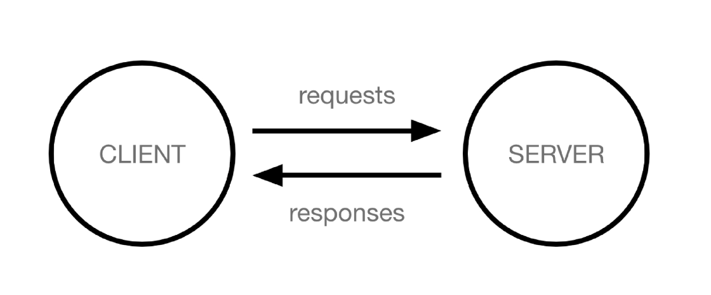 </p>

    - `클라이언트 client` : 서비스를 요청하는 주체 (웹 사용자의 인터넷이 연결된 장치, 웹 브라우저)
    - `서버 server` : 클라이언트의 요청에 응답하는 주체(웹 페이지, 앱을 저장하는 컴퓨터)
  - 우리가 웹 페이지를 보게 되는 과정
    <p style = "text-align:center;"> 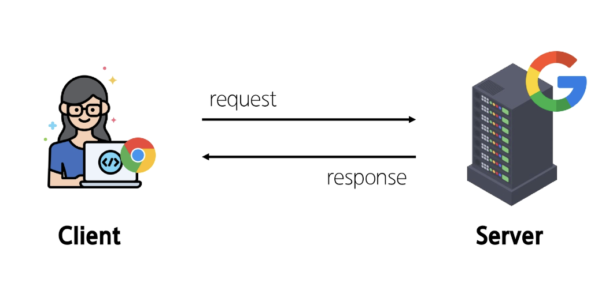 </p>
  
    1. 웹 브라우저(클라이언트)에서 'google.com'을 입력 후 엔터
    2. 웹 브라우저는 인터넷에 연결된 전세계 어딘 가에 있는 구글 컴퓨터(서버)에게 '메인 홈페이지.html'파일을 달라고 요청
    3. 요청을 받은 구글 컴퓨터는 데이터베이스에서 '메인 홈페이지.html' 파일을 찾아 응답
    4. 웹 브라우저는 전달받은 '메인 홈페이지.html' 파일을 사람이 볼 수 있도록 해석해주고 사용자는 구글의 메인 페이지를 보게 됨
  
### Frontend & Backend
웹 개발에서의 frontend와 backend
- frontend
  - 사용자 인터페이스(UI)를 구성하고, 사용자가 애플리케이션과 상호작용할 수 있도록 함
  - HTML, CSS, JavaScript, 프론트엔트 프레임워크 등
- backend
  - 서버 측에서 동작하며, 클라이언트의 요청에 대한 처리와 데이터베이스와의 상호작용 등을 담당
  - 서버 언어(Python, Java 등) 및 백엔드 프레임웤, 데이터베이스, API, 보안 등  

<p style = "text-align:center;"> 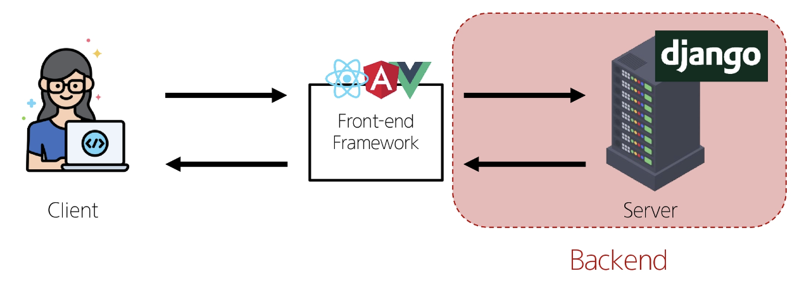 </p>

## Framework
### Web Framework
📌 웹 서비스 개발에는 무엇이 필요할까?
- 웹 서비스 개발에 필요한 다양한 기술
  - 로그인/로그아웃, 회원관리, 데이터베이스, 보안 등
- 모든 기능을 직접 개발하기에는 현실적으로 어려움 존재
- 현대 웹 개발의 핵심
  - 잘 만들어진 도구를 효과적으로 활용하는 능력
  - '거인의 어깨 위에서 프로그래밍하기'
  
📌 Web Framework
- 웹 애플리케이션을 빠르게 개발할 수 있도록 도와주는 도구
  - 개발에 필요한 기본 구조, 규칙, 라이브러리 등을 제공

### Django Framework
- django
  - python 기반의 대표적인 웹 프레임워크
- 왜 Django를 사용할까?
  - 다양성
    - python 기반으로 웹, 모바일 앱 백엔드, API 서버 및 빅데이터 관리 등 광범위한 서비스 개발에 적합
  - 확장성
    - 대량의 데이터에 대해 빠르고 유연하게 확장할 수 있는 기능을 제공
  - 보안
    - 취약점으로부터 보호하는 보안 기능이 기본적으로 내장되어 있음
  - 커뮤니티 지원
    - 개발자를 위한 지원, 문서 및 업데이트를 제공하는 활성화 된 커뮤니티
- 검증된 웹 프레임워크
  - 대규모 트래픽 서비스에서도 안정적인 서비스를 제공
  - 예시 : spotify, instagram, dropbox, delivery hero ...
- [가장 인기있는 backend framework(2024)](https://daily.dev/blog/top-10-backend-frameworks-2024#top-10-backend-frameworks-in-2024)
  - 1~2등을 차지
- django를 사용해서 서버를 구현할 것

### 가상환경
- `가상환경`
  - python 애플리케이션과 그에 따른 패키지들을 격리하여 관리할 수 있는 `독립적인` 실행 환경
- 가상 환경이 필요한 시나리오
  - case 1.
    1. 한 개발자가 2개의 프로젝트 (A와 B)를 진행해야 한다.
    2. 프로젝트 A는 requests 패키지 버전 1을 사용해야 한다.
    3. 프로젝트 B는 requests 패키지 버전 2를 사용해야 한다.
    4. 하지만, 파이썬 환경에서는 패키지 1개의 버전만 존재할 수 있다.
    5. A, B 프로젝트의 다른 패키지 버전 사용을 위한 `독립적인 개발` 환경이 필요하다.
  - case 2.
    1. 한 개발자가 2개의 프로젝트 (A와 B)를 진행해야 한다.
    2. 프로젝트 A는 water 패키지를 사용해야 한다.
    3. 프로젝트 B는 fire 패키지를 사용해야 한다.
    4. 하지만, 파이썬 환경에서 water 패키지와 fire 패키지를 함께 사용하면 충돌이 발생하기 때문에 설치할 수 없다고 한다.
    5.  A, B 프로젝트의 패키지 충돌을 피하기 위해 각각 `독립적인 개발 환경`이 필요하다.

📌 Python 환경 구조 예시
<p style = "text-align:center:"> 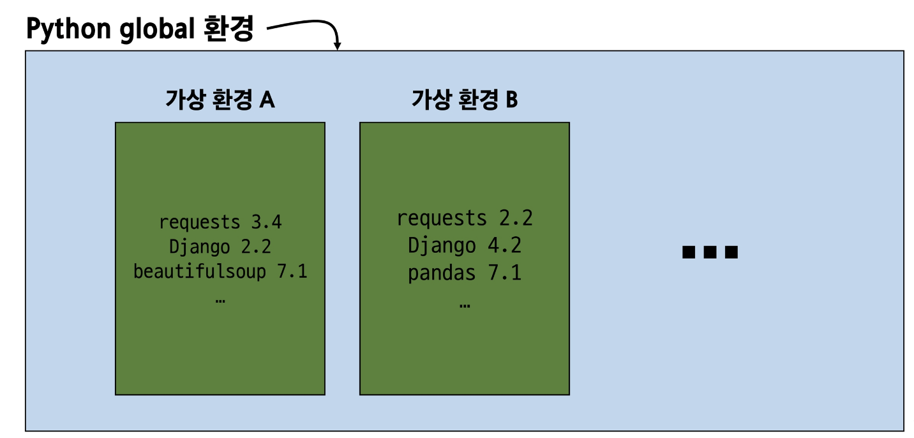 </p>

1. 가상 환경 `venv` 생성:
   ```bash
   python -m venv venv
   ```
   - `venv`라는 이름의 가상환경 생성
   - 임의 이름으로 생성이 가능하나 관례적으로 venv 이름을 사용

2. 가상 환경 활성화:
   - 활성화 명령어가 OS에 따라 다름
   - Windows:
     ```bash
     source venv/Scripts/activate
     ```
   - macOS/Linux:
     ```bash
     source venv/bin/activate
     ```

3. 환경에 설치된 패키지 목록 확인
   ```bash
   pip list
   ```
   ```bash
   Package    Version
   ---------- -------
   pip        24.2
   setuptools 58.1.0
   ```

4. 설치된 패키지 목록 생성
   ```bash
   pip freeze > requirements.txt
   ```
   - 현재 python 환경에 설치된 모든 패키지와 그 버전을 텍스트 파일로 저장
   - requirements.txt : 생성된 파일 이름(관례적으로 사용)
   - 패키지 목록이 필요한 이유
     - 만약 2명(A와 B)의 개발자가 하나의 프로젝트를 함께 개발한다고 하자.
     - 팀원 A가 먼저 가상 환경을 생성 후 프로젝트를 설정하고 관련된 패키지를 설치하고 개발하다가 협업을 위해 github에 프로젝트를 push한다.
     - 팀원 B는 해당 프로젝트를 clone 받고 실행해보려 하지만 실행되지 않는다.
     - 팀원 A가 이 프로젝트를 위해 어떤 패키지를 설치했고, 어떤 버전을 설치했는지 A의 가상 환경 상황을 알 수 없다.
     - 가상 환경에 대한 정보 즉 패키지 목록이 공유되어야 한다.
  
📌 의존성 패키지
- requests 설치 후 설치되는 패키지 목록 변화
  - 단순히 1개만 설치되는 것이 아님  <p style = "text-aling:center;">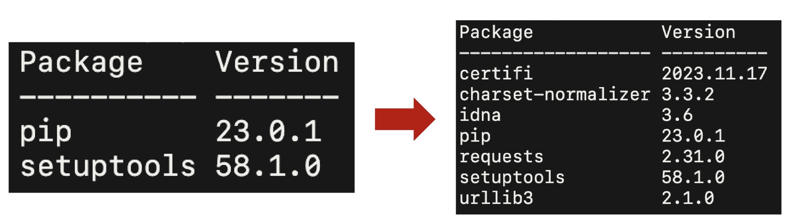</p>
- 의존성 패키지
  - 한 소프트웨어 패키지가 다른 패키지의 기능이나 코드를 사용하기 때문에 그 패키지가 존재해야만 제대로 작동하는 관계
  - 사용하려는 패키지가 설치되지 않았거나, 호환되는 버전이 아니면 오류가 발생하거나 예상치 못한 동작을 보일 수 있음
- 패키지 목록 파일 특징 및 주의사항
  - 주요 특징
    - 가상환경의 패키지 목록을 쉽게 공유 가능
    - 프로젝트의 의존성을 명확히 문서화
    - 동일한 개발 환경을 다른 시스템에서 재현 가능
  - 사용시 주의 사항
    - 활성화된 가상환경에서 실행해야 정확한 패키지 목록 생성
    - 시스템 전역 패키지와 구분 필요

📌 [번외] 패키지 목록 기반 설치
- 생성된 requirements.txt로 다른 환경에서 동일한 환경 구성하기
- 가상환경 활성화 후 requirements.txt에 작성된 목록을 기반으로 설치

```bash
pip install -r requirements.txt
```

📌 [번외] 가상환경 비활성화
```bash
deactivate
```

📌 가상환경 주의사항 및 권장사항
1. 가상 환경에 `들어가고 나오는` 것이 아니라 활성할 Python 환경을 `On/Off`로 전환하는 개념
   - 가상환경 활성화는 현재 터미널 환경에만 영향을 끼침
   - 새 터미널 창을 열면 다시 활성화해야 함
2. 가상환경은 `방`이 아니라 `도구 세트`
   - 활성화는 특정 도구 세트를 선택하는 것
3. 프로젝트마다 별도의 가상환경 사용
4. 일반적으로 가상환경 폴더 venv는 관련된 프로젝트와 동일한 경로에 위치
5. 가상환경 폴더 venv는 `gitignore`에 작성되어 원격 저장소에 공유되지 않음
   - 저장소 크기를 줄여 효율적인 협업과 배포를 가능하게 하기 위함(requirements.txt를 공유)


📌 의존성 패키지 관리의 중요성
- 개발 환경에서는 각각의 프로젝트가 사용하는 패키지와 그 버전을 정확히 관리하는 것이 중요
- 가상 환경 & 의존성 패키지 관리
  - 앞으로 의존성 패키지 관리의 중요성을 알아가며 가상 환경을 만들어서 진행

### Django 프로젝트

1. Django 프로젝트 생성 및 서버 실행
   1. 프로젝트 생성 `$ django-admin startproject firstpjt .`
      1. firstpjt라는 이름의 프로젝트를 생성
   2. 서버 실행 `$ python manage.py runserver`
      1. manage.py와 동일한 경로에서 진행
2. 서버 확인
   1. http://127.0.01:8000/ 접속 후 확인

## Django Design Pattern

### Design Pattern
📌 디자인 패턴
- 소프트웨어 설계에서 발생하는 문제를 해결하기 위한 일반적인 해결책(공통적인 문제를 해결하는 데 쓰이는 형식화 된 관행)
- 예: '애플리케이션의 구조는 이렇게 구성하자'라는 관행

📌 MVC 디자인 패턴
- Model, View, Controller
- 애플리케이션을 구조화하는 대표적인 패턴
- '데이터' & '사용자 인터페이스' & '비즈니스 로직'을 분리
- 시각적 요소와 뒤에 실행되는 로직을 서로 영향 없이, 독립적으로 쉽게 유지 보수할 수 있는 애플리케이션을 만들기 위함

📌 MTV 디자인 패턴
- Model, Template, View
- Django에서 애플리케이션을 구조화하는 패턴
- 기존 MVC 패턴과 동일하나 단순히 명칭을 다르게 정의한 것
  - View ➡️ Template
  - Cotroller ➡️ View


### Project & App
<p style = "text-align:center;"> 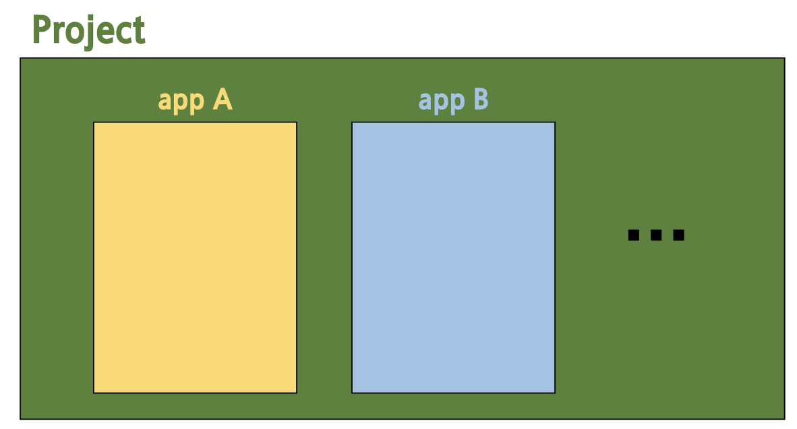 </p>

📌 Django project
- 애플리케이션의 집합
- DB 설정, URL 설정, 전체 앱 설정 등을 처리

📌 Django application
- 독립적으로 작동하는 기능 단위 모듈
- 각자 특정한 기능을 담당하며 다른 앱들과 함께 하나의 프로젝트를 구성

📌 만약 온라인 커뮤니티 카페를 만든다면?
|프로젝트|앱|
|:---:|:---:|
|카페| 게시글, 댓글, 회원 관리 등|
|전체 설정 담당| DB, 인증, 화면|

📌 앱을 사용하기 위한 순서
1. 앱 생성
   ```bash
   python manage.py startapp articles
   ```
   - 앱의 이름은 `복수형`으로 저장하는 것을 권장
2. 앱 등록
   ```python
    INSTALLED_APPS = [
        'articles',
        "django.contrib.admin",
        "django.contrib.auth",
        "django.contrib.contenttypes",
        "django.contrib.sessions",
        "django.contrib.messages",
        "django.contrib.staticfiles",
    ]
   ``` 
   - 반드시 앱을 생성(1)한 후에 등록(2)해야 함
   - 등록 후 생성은 불가능

📌 프로젝트 구조
<p style = "text-align:center;"> 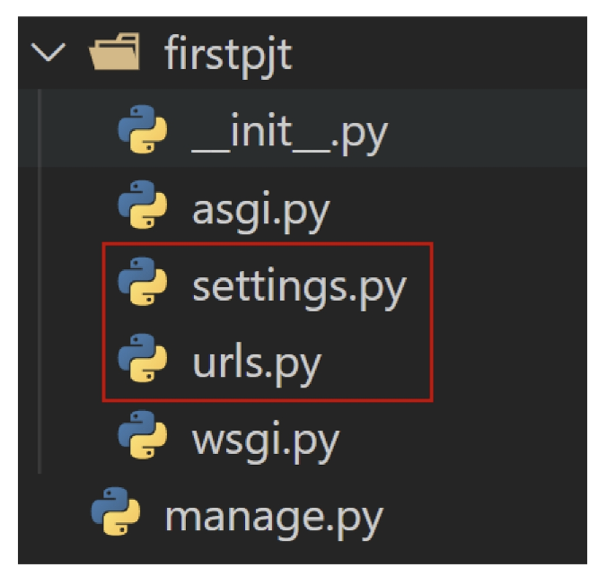 </p>

- `settings.py`
  - 프로젝트의 모든 설정을 관리
- `urls.py`
  - 요청 들어오는 url에 따라 이에 해당하는 적절한 views를 연결

<p style = "text-align:center;"> 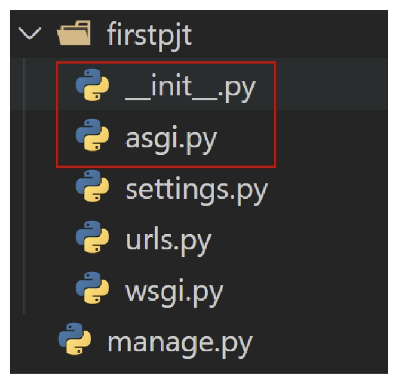  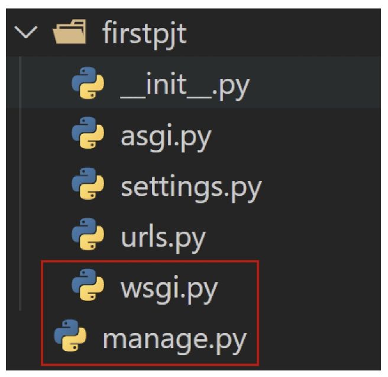</p>

- 수업 과정에서 수정할 일 없는 것들
  - `__init__.py`
    - 해당 폴더를 패키지로 인식하도록 설정하는 파일
  - `asgi.py` 
    - 비동기식 웹 서버와의 연결 관련 설정
  - `wsgi.py`
    - 웹 서버와의 연결 관련 설정
  - `manage.py`
    - Django 프로젝트와 다양한 방법으로 상호작용 하는 커맨드라인 유틸리티

📌 앱 구조
<p style = "text-align:center;"> 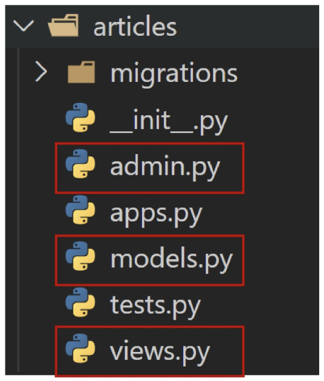 </p>

- `admin.py`
  - 관리자용 페이지 설정
- `models.py`
  - DB와 관련된 Model을 정의
  - MTV 패턴의 M
- `views.py`
  - HTTP 요청을 처리하고 해당 요청에 대한 응답을 반환 (url, model, template와 연계)
  - MTV 패턴의 V

<p style = "text-align:center;"> 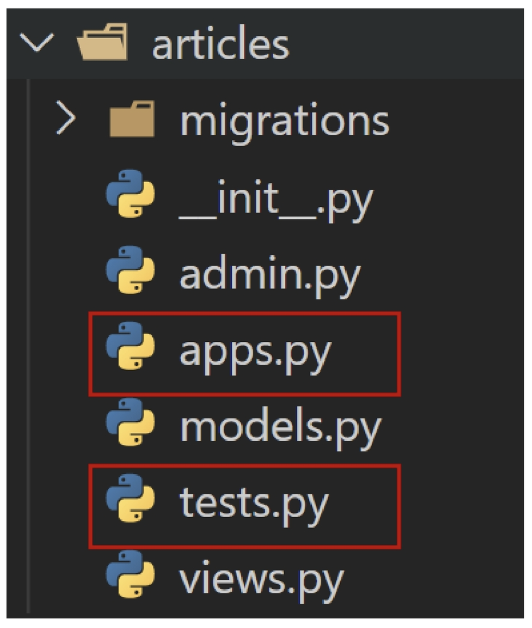 </p>

- 수업 과정에서 수정할 일 없는 것
  - `apps.py`
    - 앱의 정보가 작성된 곳
  - `tests.py`
    - 프로젝트 테스트 코드를 작성하는 곳


## 요청과 응답
### Django에서의 요청과 응답
<p style = "text-align:center;"> 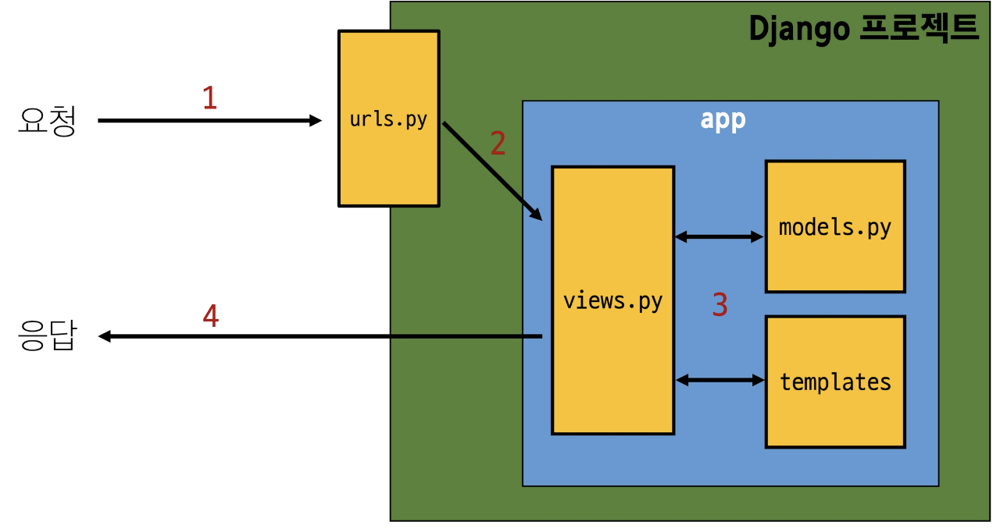 </p>
<p style = "text-align:center;"> 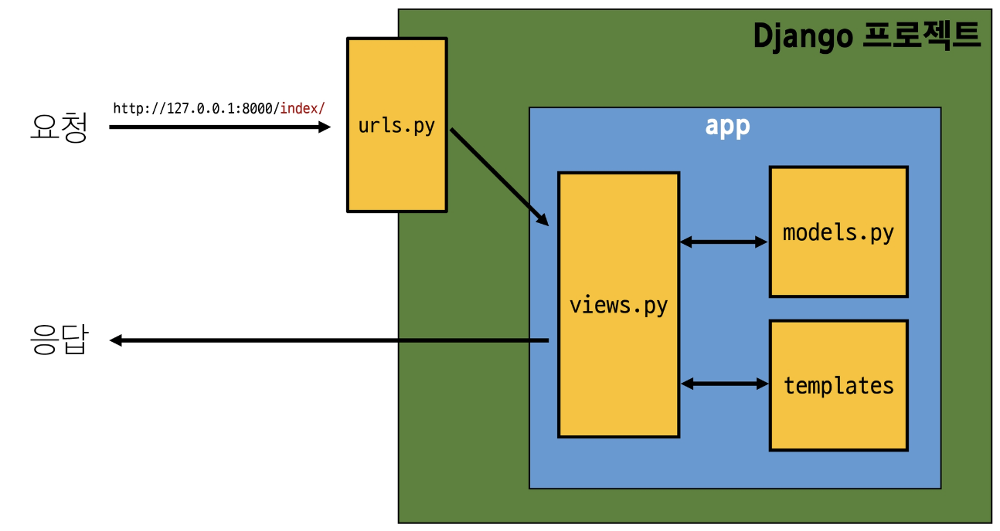 </p>

1. URLs  
   <p style = "text-align:center;"> 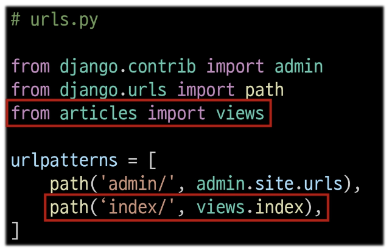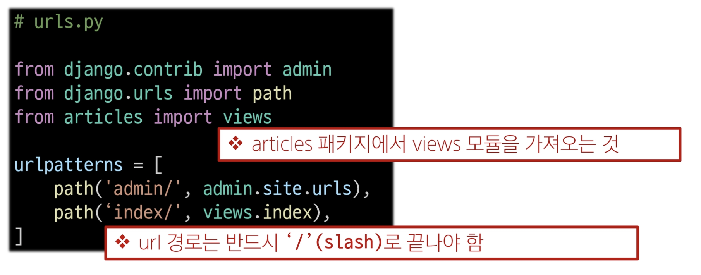 </p>

   - http://127.0.0.1:8000/index/로 요청이 왔을 때 request 객체를 views 모듈의 index view 함수에게 전달하며 호출

2. View
   <p style = "text-align:center;"> 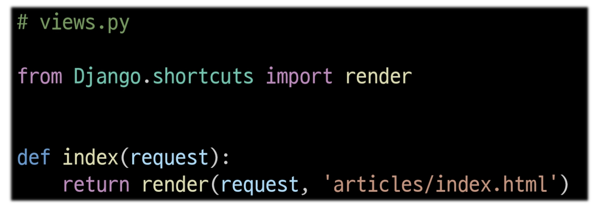</p>

   - view 함수가 정의 되는 곳
   - 특정 경로에 있는 template과 request 객체를 결합해 응답 객체를 반환
   - 모든 view 함수는 첫번째 인자로 요청 객체를 필수적으로 받음
   - 매개변수 이름이 request가 아니어도 되지만 그렇게 작성하지 않음
3. Template
   <p style = "text-align:center;"> 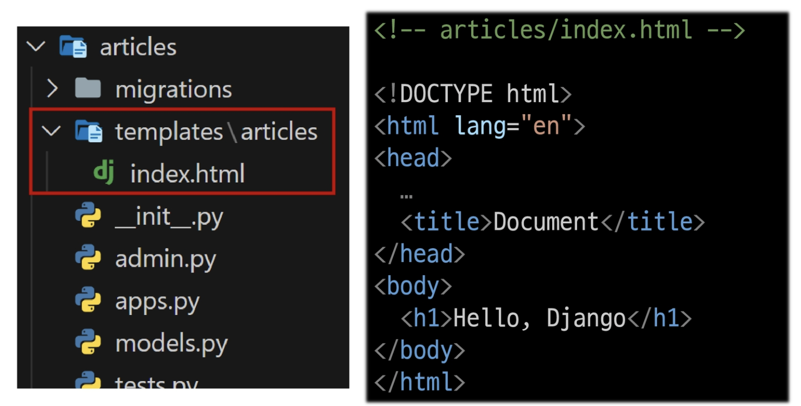</p>

   1. articles 앱 폴더 안에 templates 폴더 생성
   2. templates 폴더 안에 articles 폴더 생성
   3. articles 폴더 안에 템플릿 파일 생성
   4. 폴더명은 반드시 templates여야 하며 개발자가 직접 생성해야 함

📌 Django에서 template을 인식하는 경로 규칙
- `app폴더 / templates / articles / index.html`
- `app폴더 / templates / example.html`
- 'app폴더 / templates /`이 지점까지는 기본 경로로 인식하기 때문에 view 함수에서 template 경로 작성 시 이 지점 이후의 경로를 작성해야 함
   <p style = "text-align:center;"> 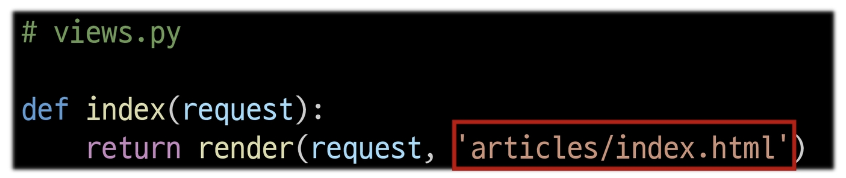</p>


📌 요청 후 응답 페이지 확인  
http://127.0.0.1:8000/articles/  

📌 요청과 응답 과정 정리
<p style = "text-align:center;"> 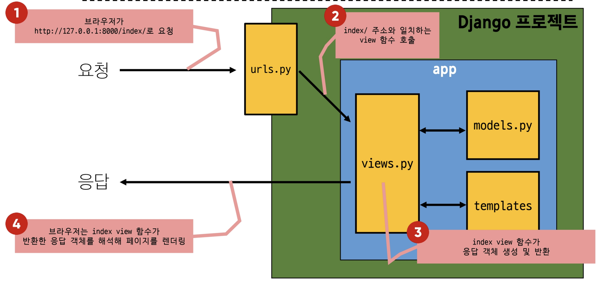</p>


📌 데이터 흐름에 따른 코드 작성
<p style = "text-align:center;"> 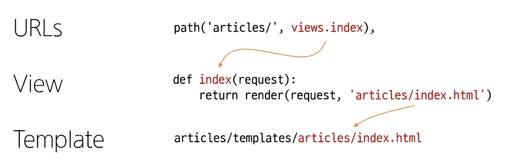</p>

  

## 참고
### 가상환경 생성 루틴
📌 Django 프로젝트 생성 `전` 루틴
<p style = "text-align:center;"> 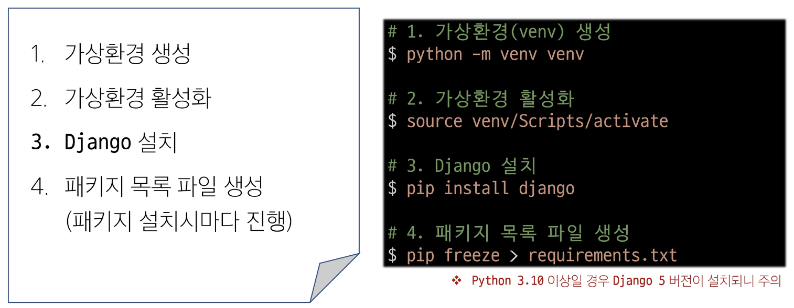</p>

📌 Django 프로젝트 생성 루틴 정리 + git 
1. 가상 환경 생성
2. 가상 환경 활성화
3. django  설치
4. 패키지 목록 파일 생성 (패키지 설치시마다 진행)
5. `.gitignore 파일 생성 (첫 add 전)`
6. `git 저장소 생성 (git init)`
7. django 프로젝트 생성 

📌 가상 환경을 사용하는 이유
- 의존성 관리
  - 라이브러리 및 패키지를 각 프로젝트마다 독립적으로 사용 가능
- 팀 프로젝트 협업
  - 모든 팀원이 동일한 환경과 의존성 위에서 작업하여 버전간 충돌을 방지

### Django 관련
- LTS(Long-Term Support)
  - 프레임워크나 라이브러리 등의 소프트웨어에서 장기간 지원되는 안정적인 버전을 의미할 때 사용
  - 기업이나 대규모 프로젝트에서는 소프트웨어 업그레이드에 많은 비용과 시간이 필요하기 때문에 안정적이고 장기간 지원되는 버전이 필요
  - https://www.djangoproject.com/download/
- Django는 Full stack framework 인가요?
  - 네
  - 하지만 Django가 제공하는 Frontend 기능은 다른 전문적인 frontend framework들에 비해서는 매우 미흡하다.
  - 엄밀히 하자면 full stack 영역에서 backend에 속한다.
  - full stack 혹은 backend framework라 부른다.

### render 함수
```python
render(request, template_name, context)
```
- 주어진 템플릿을 주어진 컨텍스트 데이터와 결합하고 렌더링 된 텍스트와 함께 HttpResponse 응답 개체를 반환하는 함수

1. request : 응답을 생성하는 데 사용되는 요청 객체
2. template_name : 탬플릿 이름의 경로
3. context : 템플릿에서 사용할 데이터 (딕셔너리 타입으로 작성)

### MTV 디자인 패턴 정리
- Model
  - 데이터와 관련된 로직을 관리
  - 응용프로그램의 데이터 구조를 정의하고 데이터베이스의 기록을 관리
- Template
  - 레이아웃과 화면을 처리
  - 화면상의 사용자 인터페이스 구조와 레이아웃을 정의
- View
  - Model & Template과 관련한 로직을 처리해서 응답을 반환
  - 클라이언트의 요청에 대해 처리를 분기하는 역할
  - 예시
    - 데이터가 필요하다면 Model에 접근해서 데이터를 가져오고, 가져온 데이터를 template로 보내 화면을 구성하고, 구성된 화면을 응답으로 만들어 클라이언트에게 반환

<p style = "text-align:center;"> 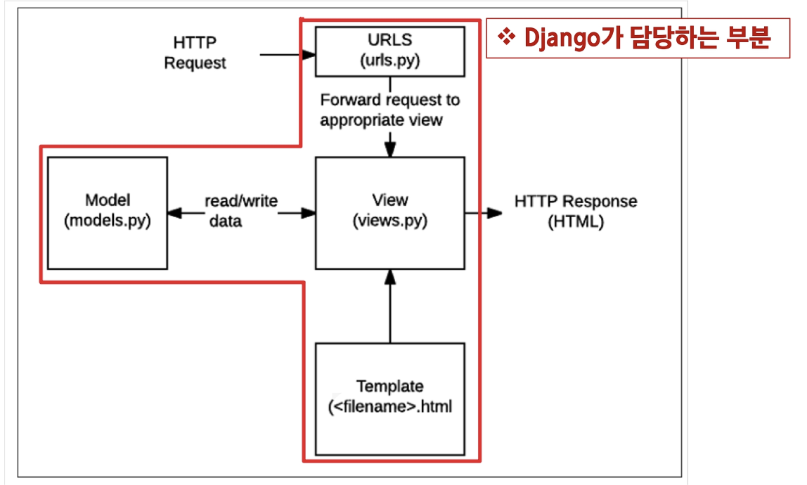</p>

📌 Django는 왜 MTV라고 부를까? (Django의 해석)
- `뷰`는 사용자에게 보여지는 데이터들을 섦명
  - 데이터가 '어떻게' 데이터가 '보이는'지가 아니라 '어떤' 데이터를 보여주는지로 볼 수 있음
  - '뷰'는 '당신이 어떤 데이터를 보는지'를 설명하지 '당신이 어떻게 보는지'를 설명하지 않는다.
  - 따라서 '뷰'는 특정 URL에 대한 파이썬 콜백 함수. 왜냐하면, 콜백함수는 어떤 데이터를 보여주는지 설명하기 때문.
- 또한, 내용과 표시를 구분하는 것이 현명.
  - 여기서 템플릿이 등장
  - 장고에서는 '뷰'는 어떤 데이터를 보여줄지를 구현하고
  - 그러나 뷰는 일반적으로 템플릿에 어떻게 데이터가 보여질 지를 위임함


### Trailing Comma
- Trailing Comma 정의
  - '후행 쉼표'
  - 리스트, 딕셔너리, 튜플 등의 자료구조에서 마지막 요소 뒤에 쉼표를 추가하는 것
  - 문법적으로 아무런 영향을 주지 않음
  - 일반적으로 선택 사항 (단일 요소 튜플을 만들 때는 예외)
- 사용하는 이유
  - 새로운 요소를 추가하거나 순서를 변경할 때 편리
  - 값의 목록, 인자, 또는 import 항목들이 시간이 지남에 따라 확장될 것으로 예상되는 경우에 주로 사용
  - 여러 줄에 걸쳐 작성된 데이터 구조에서 유용하며, 코드의 가독성과 유지보수성을 향상시키는 데 도움
  - 일반적인 패턴은 각 값(등)을 별도의 줄에 배치하고, 항상 후행 쉼표를 추가한 뒤, 닫는 괄호/대괄호/중괄호를 다음 줄에 배치하는 것
  - 닫는 구분 기호와 같은 줄에 후행 쉼표를 두는 것은 권장하지 않음

<p style = "text-align:center;"> 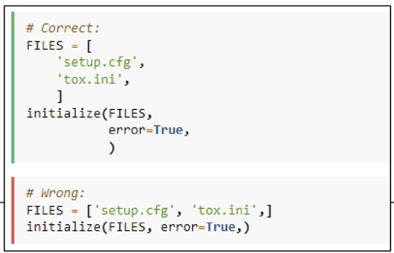</p>

### 프레임워크의 규칙 및 설계 철학
- 지금까지 등장한 django의 규칙
  - urls.py에서 각 url 문자열 경로는 반드시 '/'로 끝남
  - views.py에서 모든 view 함수는 `첫번째 인자로 요청 객체`를 받음
    - 매개변수 이름은 반드시 request로 지정하기
  - django는 `특정 경로`에 있는 template 파일만 읽어올 수 있음
    - 특정 경로 : app폴더/templates/
- 프레임워크의 규칙
  - 프레임워크를 사용할 때는 일정한 규칙을 따라야 하며 이는 저마다의 설계 철학이나 목표를 반영하고 있음
    - 일관성 유지, 보안 강화, 유지보수성 향상, 최적화 등과 같은 이유
  - 프레임워크는 개발자에게 `도움을 주는 도구와 환경을 제공하기 위해 규칙을 정해 놓은 것`이며 우리는 이를 잘 활용하여, 특정 기능을 구현하는 방법을 표준화하고 개발 프로세스를 단순화할 수 있도록 해야 함
- Django의 설계 철학
  - https://docs.djangoproject.com/ko/4.2/misc/design-philosophies/
