# Template & URLs

## Template System
### Django Template system
📌 데이터 `표현`을 제어하면서, `표현`과 관련된 부분을 담당

HTML의 콘텐츠를 변수 값에 따라 변경하기

  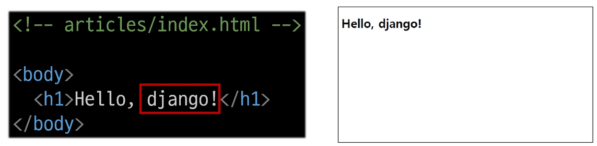
  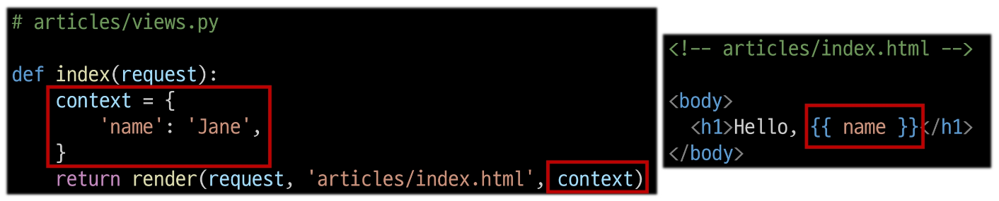

✏ urls.py, index.html, views.py를 사용할 예정

### Django Template Language
📌DTL; Django Template Language
Template에서 조건, 반복, 변수 등의 프로그래밍적 기능을 제공하는 시스템

📌 DTL Syntax
1. Variable
   - render 함수의 세번째 인자로 딕셔너리 데이터를 사용
   - 딕셔너리 key에 해당하는 문자열이 template에서 사용 가능한 변수명이 됨
   - dot(`.`)를 사용하여 변수 속성에 접근할 수 있음

  

2. Filters
   - 표시할 변수를 수정할 때 사용 (변수 + | + 필터)
   - chained(연결)이 가능하며 일부 필터는 인자를 받기도 함
   - 약 60개의 built-in template filters를 제공

  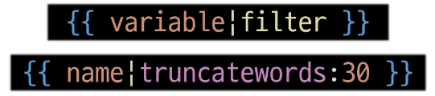

3. Tags
   - 반복 또는 논리를 수행하여 제어 흐름을 만듦
   - 일부 태그는 시작과 종료 태그 필요
   - 약 24개의 built-in template tags를 제공

  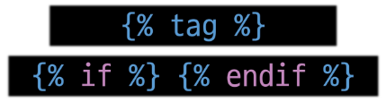

4. Comments
   - DTL에서의 주석
  

  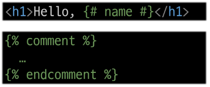

📌 DTL 예시
  

  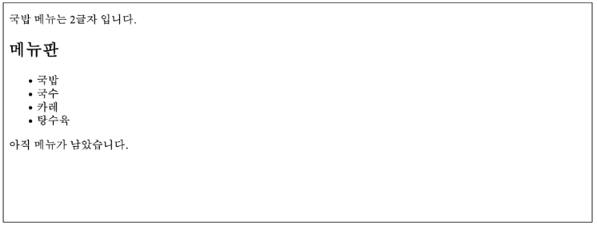
  

## 템플릿 상속
📌 기본 템플릿 구조의 한계
- 만약 모든 템플릿에 bootstrap을 적용하려면? ➡ 모든 템플릿에 bootstrap CDN을 작성해야 할까?

📌 템플릿 상속 Template inheritance
- `1️⃣페이지의 공통요소를 포함`하고, `2️⃣하위 템플릿이 재정의 할 수 있는 공간`을 정의하는 기본 `skeleton` 템플릿을 자것아형 상속 구조를 구축

📌 상속 구조 만들기
- skeleton 역할을 하게 되는 상위 템플릿(base.html) 작성

  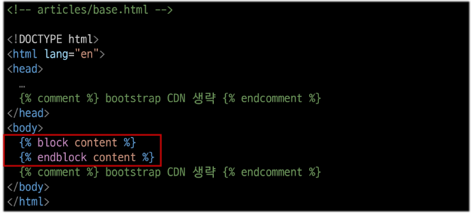

- 기존 하위 템플릿의 변화

  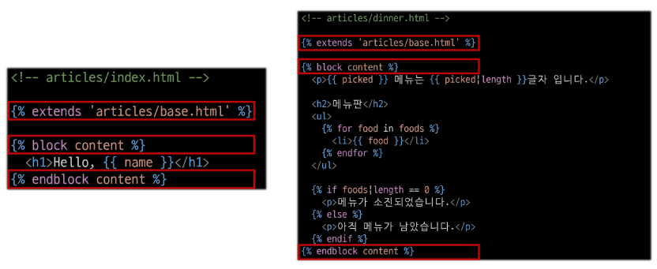

### 상속 관련 DTL 태그
#### extends
📌 `extends` tag
- ``
- 자식(하위) 템플릿이 부모 템플릿을 확장한다는 것을 알림
- 반드시 자식 템플릿  최상단에 작성되어야 함(2개 이상 사용 불가)

#### block
📌 `block` tag
- ``
- 하위 템플릿에서 재정의 할 수 있는 블록을 정의
- 상위 템플릿에 작성하며 하위 템플릿이 작성할 수 있는 공간을 지정하는 것

  

## HTML form
브라우저 URL을 통해 요청을 보냈음.  
a 태그로 요청을 보낼 수 있으나, 데이터를 전송할 수 없음. ➡ 나온 것이 form 태그  
데이터를 왜 전송하지? `검색`과 `로그인`이 대표적으로 서버에 요청을 보내는 행위.  

### 요청과 응답
📌 데이터를 보내고 가져오기(Sending and Retrieving form data)
- HTML `form` element를 통해 사용자와 애플리케이션 간의 상호작용 이해하기

> 📌 HTML `form`은 HTTP 요청을 서버에 보내는 가장 편리한 방법

  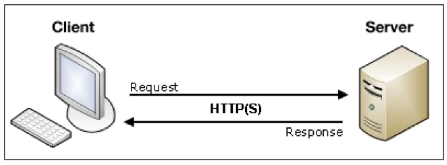
  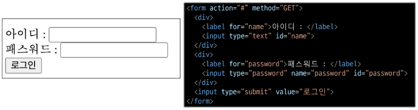
  
 form과 input 태그에 집중

📌 실제 웹 서비스에서 form이 사용되는 예시  
네이버 & 구글의 로그인 화면에서 사용하는 HTML form 요소

  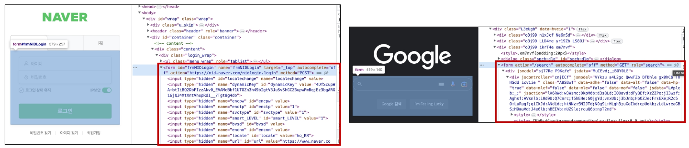

> ⭐ 페이지 `이동`이 아닌 `요청`이라는 것을 알아두기 ⭐

📌 `form` element
- 사용자로부터 할당된 데이터를 서버로 전송 ➡ 웹에서 사용자 정보를 입력하는 여러 방식(text, password, checkbox 등)을 제공

📌 fake Naver 실습

  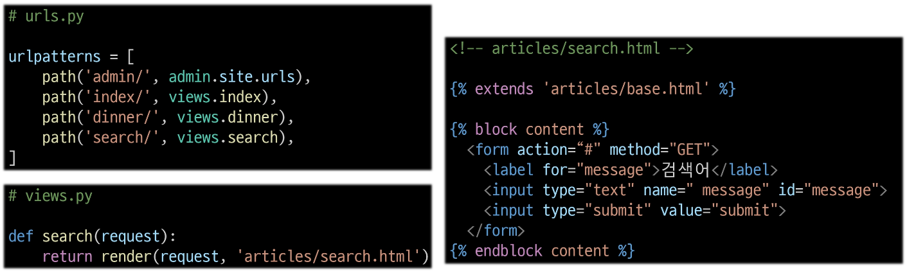
  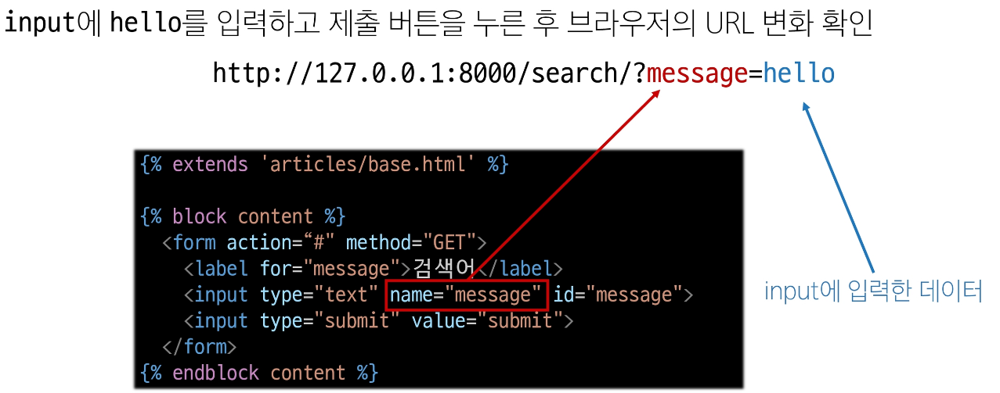
  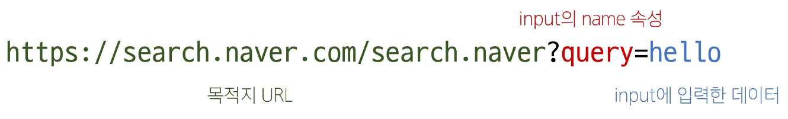
  
 3번 이미지 : 실제 naver에서 검색 후 URL 확인

  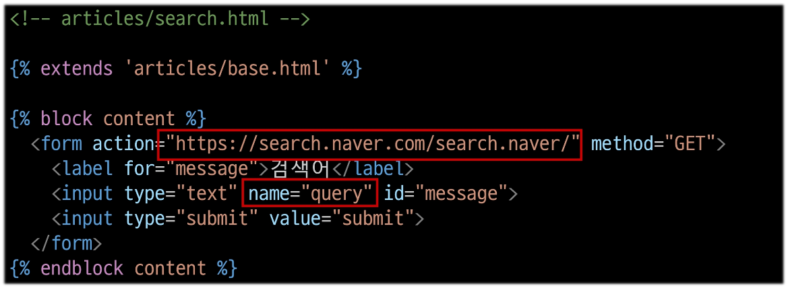

https://search.naver.com/search.naver?where=nexearch&sm=top_hty&fbm=0&ie=utf8&query=싸피

- query=싸피 : key-value 상태로 서버로 보내지고 있음
- 개발자 도구에서 name이 가장 중요함, 이 값이 key 이름

📌 form의 핵심 속성 2가지 = `action` & `method`  
데이터를 어디(action)로 어떤 방식(method)으로 요청할지
- action
   - 입력 데이터가 전송될 URL을 지정(목적지)
   - 요청을 보낼 서버의 주소
   - 만약 이 속성을 지정하지 않으면 데이터는 현재 form이 있는 페이지의 URL로 보내짐
   - https://search.naver.com/search.naver (슬래시를 넣어도 안넣어도 됨, 알아서 처리해줌, 그러나 장고에서는 슬래시를 넣는 것을 권장함(근데 네이버는 안됨))
- method
   - 데이터를 어떤 방식으로 보낼 것인지 정의
   - 데이터의 HTTP request methods (GET, POST)를 지정
      - get은 기본값 (url에 노출) ➡ 기본값이어도, 웬만하면 써주는 것을 권장
      - post는 로그인 할 때 사용 (url에 노출되지 않음)

#### input element
📌 `input` element
- 사용자의 데이터를 입력받을 수 있는 요소
- type 속성 값에 따라 다양한 유형의 입력 데이터를 받음
- ⭐ 핵심 속성 = 'name'
- `name` attribute
   - input의 핵심 속성
   - 사용자가 입력한 데이터에 붙이는 이름(key)
   - 데이터를 제출했을 때 서버는 name 속성에 설정된 값을 통해서만 사용자가 입력한 데이터에 접근할 수 있음

#### Query String Parameters
📌 Query String Parameters
- 사용자의 입력 데이터를 URL 주소에 파라미터를 통해 서버로 보내는 방법
- 문자열은 앰퍼샌드(`&`)로 연결된 key=value 쌍으로 구성되며, 기본 URL과는 물음표(`?`)로 구분됨
- 예시 : http://host:port/path?key=value&key=value

### form 활용
📌 사용자 입력 데이터를 받아 그대로 출력하는 서버 만들기  
❓ View 함수는 몇 개가 필요할까? 2️⃣개

  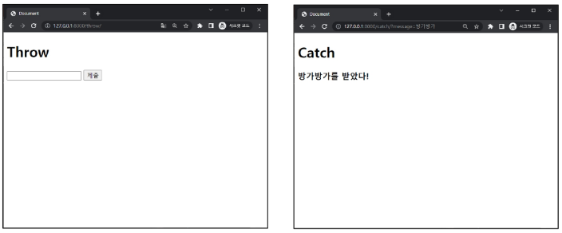

  
 1. throw 로직 작성

  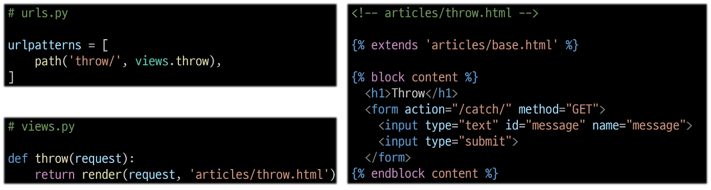
  
 2. catch 로직 작성

  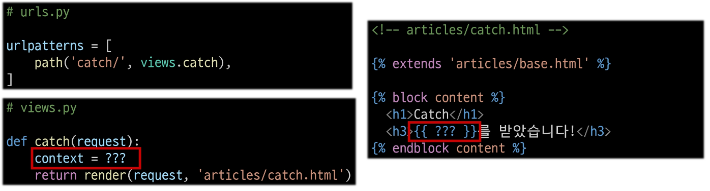

📌 HTTP request 객체
- form으로 전송한 데이터뿐만 아니라, django로 들어오는 모든 요청 관련 데이터가 담겨 있음
- view 함수의 첫번째 인자로 전달됨

  
 request 객체 살펴보기

  
  
 request 객체에서 form 데이터 추출

  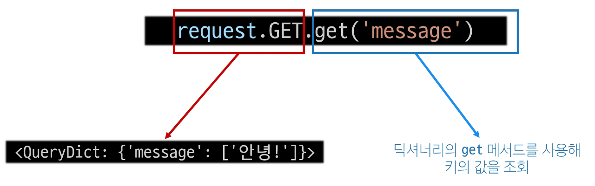
  
 3. catch 로직 마무리

  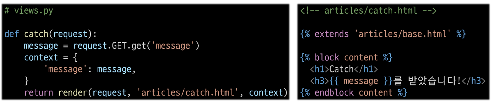

📌 throw-catch간 요청과 응답 정리  

  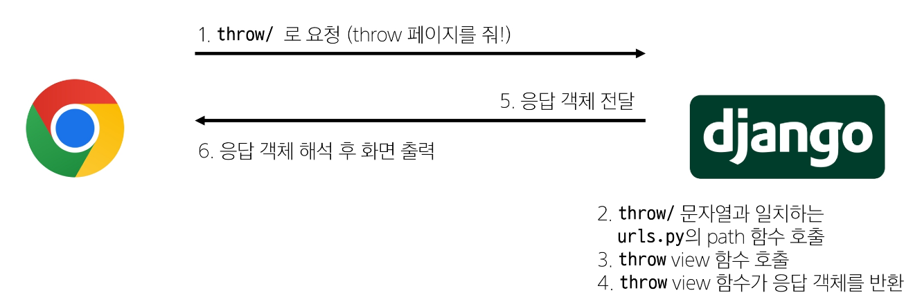
  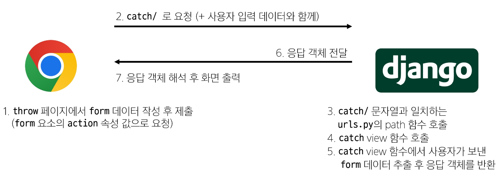

## Django URLs
📌 요청과 응답에서 django URLs의 역할

  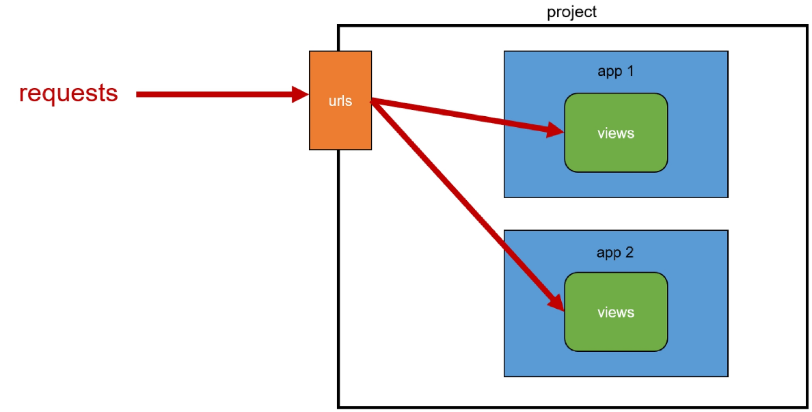

📌 URL dispatcher 운항 관리자, 분배기  
- URL 패턴을 정의하고 해당 패턴이 일치하는 요청을 처리할 view 함수를 연결(매핑)

### Variable Routing
📌 현재 URL 관리의 문제점
- 템플릿의 많은 부분이 중복되고, URL의 일부만 변경되는 상황이라면 계속해서 비슷한 URL과 템플릿을 작성해 나가야 할까?

  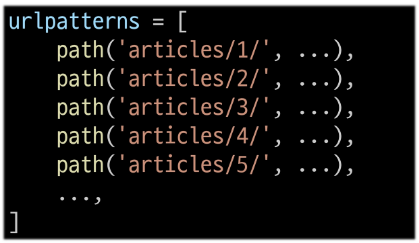

📌 Variable Routing
- URL 일부에 변수를 포함시키는 것
- 변수는 view 함수의 인자로 전달 할 수 있음

📌 Variable Routing 작성법
- `<path_converter:variable_name>`
    

      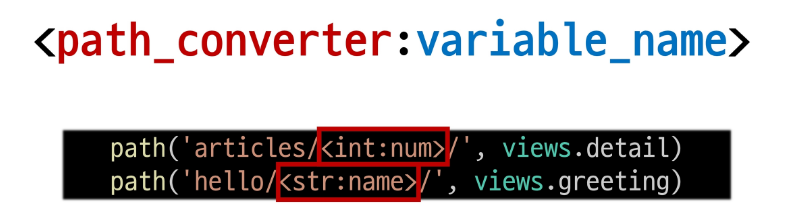
    

   - Path converters
      - URL 변수의 타입을 지정
      - str, int 등 5가지 타입 지원

  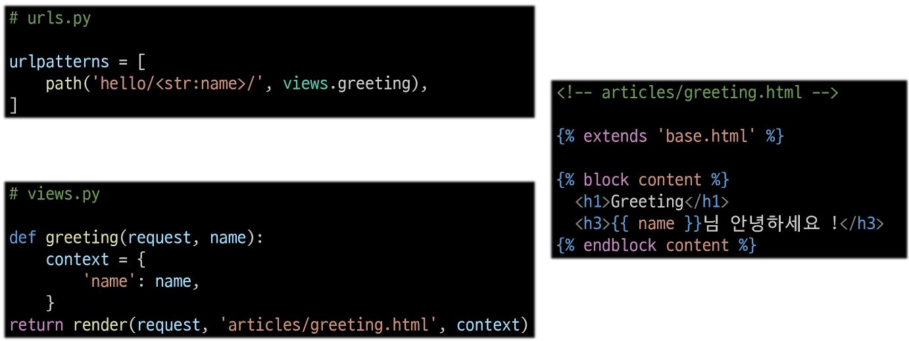
  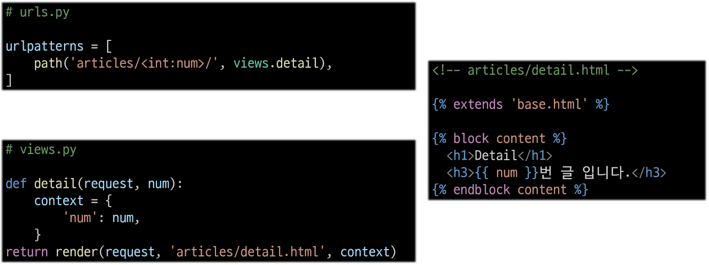

### App과 URL
📌 App URL mapping  
- 각 앱에 URL을 정의하는 것
- 프로젝트와 각 앱이 URL을 나누어 관리를 편하게 하기 위함

📌 2번째 앱 pages 생성 후 발생할 수 있는 문제
- view 함수 이름이 같거나 같은 패턴의 URL 주소를 사용하게 되는 경우
- 아래 코드와 같이 해결해 볼 수 있으나 더 좋은 방법이 필요
> "URL을 각자 app에서 관리하자"

  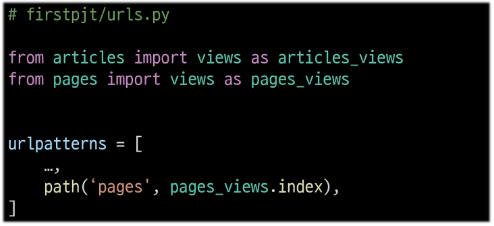

|기존 url 구조| 변경 url 구조|
|:---:|:---:|
|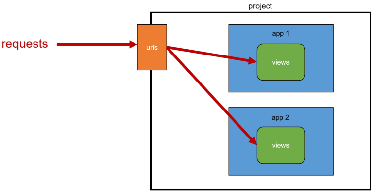|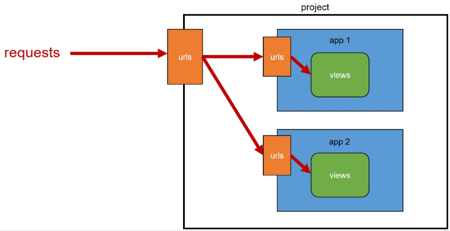|

  
url 구조 변화

  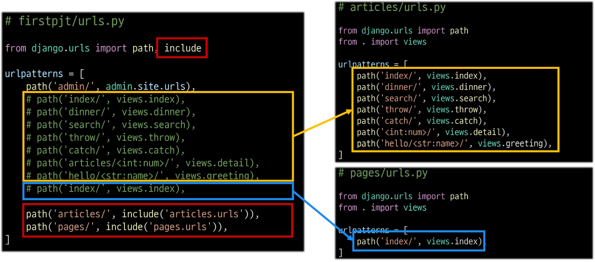

#### include
📌 `include()`
- 프로젝트 내부 앱들의 URL을 참조할 수 있도록 매핑하는 함수
- URL의 일치하는 부분까지 잘라내고, 남은 문자열 부분은 후속 처리를 위해 include된 URL로 전달
- include 적용
   - 변경된 프로젝트의 urls.py  
       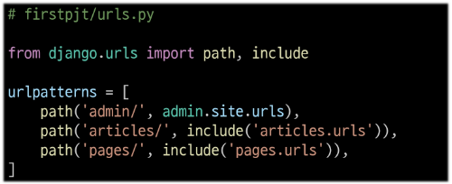

## URL 이름 지정
### Naming URL patterns
📌 url 구조 변경에 따른 문제점
- 기존 'articles/' 주소가 'articles/index/'로 변겨오딤에 따라 해당 url을 사용하는 모든 위치를 찾아가 변경해야 함
> URL에 이름을 지어주면 이름만 기억하면 되지 않을까?

  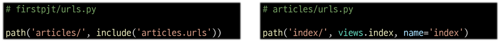

📌 Naming URL patterns
- URL에 이름을 지정하는 것
- Path 함수의 name 인자를 정의해서 사용

  
 path 함수의 name 키워드 인자를 정의

  
  
 URL 표기 변화   url을 작성하는 모든 곳에서 변경   (a 태그의 href 속성 값 뿐만 아니라 form의 action 속성 등도 포함)

  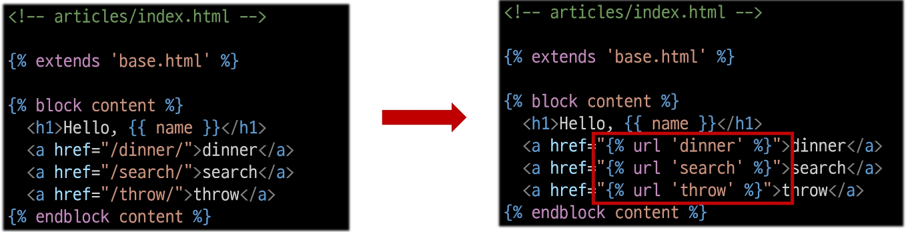

### DTL URL tag
#### url tag
📌 `url` tag

  
 주어진 URL 패턴의 이름과 일치하는 절대 경로 주소를 반환

  
  
 url tag 적용 후 브라우저 출력 확인

  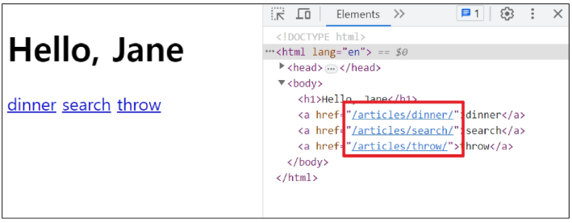

## URL 이름 공간
### app_name 속성
📌 URL 이름 지정 후 남은 문제
- articles 앱의 url 이름과 pages 앱의 url 이름이 같은 상황
- 단순히 이름만으로는 완벽하게 분리할 수 없음
> 이름에 성(key)을 붙이자

  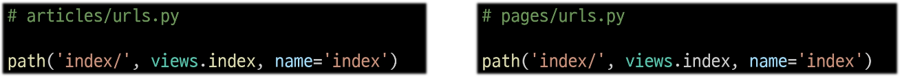
  
'app-name' 속성 지정   app-name 변수 값 설정

  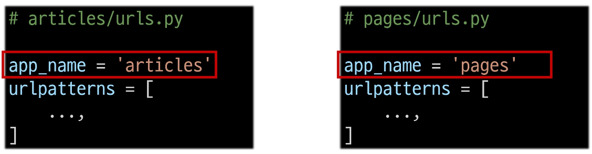
  
 URL tag의 최종 변화   마지막으로 url 태그가 사용하는 모든 곳의 표기 변경하기

  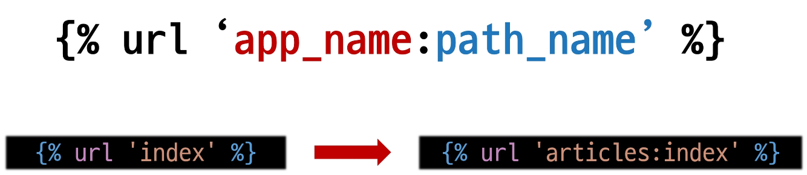

## 참고
### 추가 템플릿 경로
📌 템플릿 기본 경로 외 커스텀 경로 추가하기

  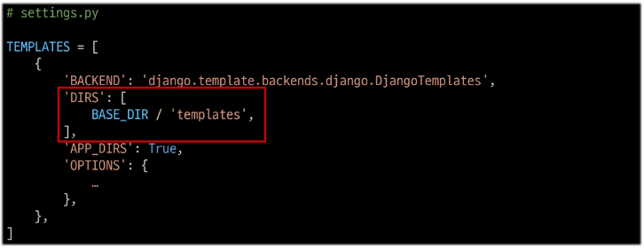
  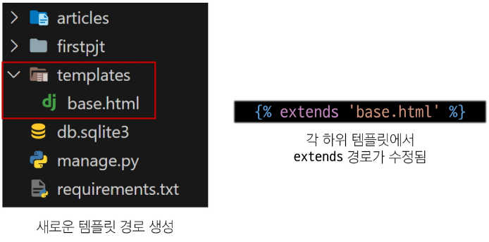

📌 BASE_DIR  
- settings에서 경로지정을 편하게 하기 위해 최상단 지점을 지정해 둔 변수

  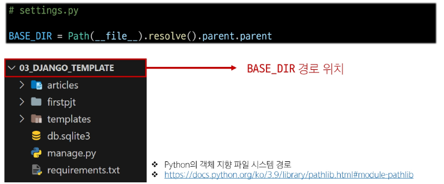

### DTL 주의사항
- Python처럼 일부 프로그래밍 구조(if, for 등)를 사용할 수 있지만 명칭을 그렇게 설계 했을 뿐이지 Python 코드로 실행되는 것이 아니며 Python과는 관련 없음
- 프로그래밍적 로직이 아니라 표현을 위한 것임을 명심하기
- 프로그래밍적 로직은 되도록 view 함수에서 작성 및 처리할 것
- 공식문서를 참고해 다양한 태그와 필터 사용해보기 [링크](https://docs.djangoproject.com/en/4.2/ref/templates/builtins/)

### Trailing Slashes
- django는 url끝에 '/'가 없다면 자동으로 붙임
- 기술적인 측면에서, foo.com/bar와 foo.com/bar/는 서로 다른 url
   - 검색 엔진 로봇이나 웹 트래픽 분석 도구에서는 이 두 주소를 서로 다른 페이지로 보기 때문
- 그래서 django는 검색 엔진이 혼동하지 않게 하기 위해 무조건 붙이는 것을 선택한 것
- 그러나 모든 프레임워크가 이렇게 동작하는 것은 아니니 주의
