<!-- TOC start (generated with https://github.com/derlin/bitdowntoc) -->

- [Model](#model)
  - [model class](#model-class)
- [Model Field](#model-field)
  - [Field types](#field-types)
    - [문자열 필드](#문자열-필드)
    - [숫자 필드](#숫자-필드)
    - [날짜/시간 필드](#날짜시간-필드)
    - [파일 관련 필드](#파일-관련-필드)
  - [Field options](#field-options)
    - [Constraint](#constraint)
- [Migrations](#migrations)
  - [추가 Migrations](#추가-migrations)
- [Admin site](#admin-site)
- [참고](#참고)
  - [데이터베이스 초기화](#데이터베이스-초기화)
  - [Migrations 관련](#migrations-관련)
  - [SQLite](#sqlite)

<!-- TOC end -->

# Model
📌 Model을 통한 DB(데이터베이스) 관리

  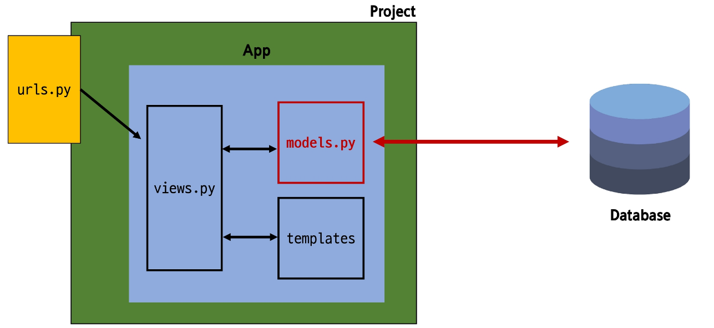

📌 Django Model
- DB의 테이블을 정의하고 데이터를 조작할 수 있는 기능들을 제공 ➡ 테이블 구조를 설계하는 청사진(blueprint)

## model class
📌 Model 클래스 작성

  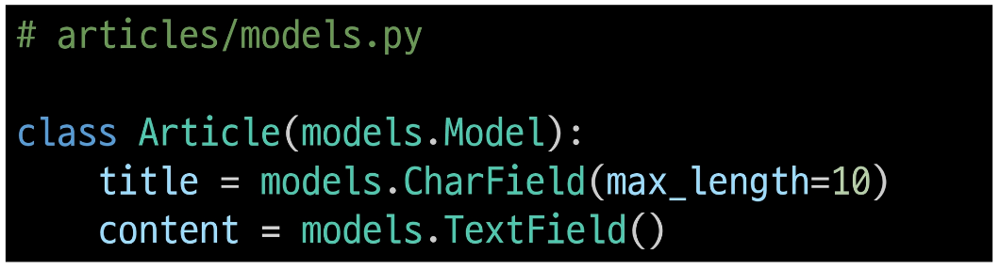

📌 Model 클래스 살펴보기

1. 작성한 모델 클래스는 최종적으로 DB에 다음과 같은 테이블 구조를 만듦
   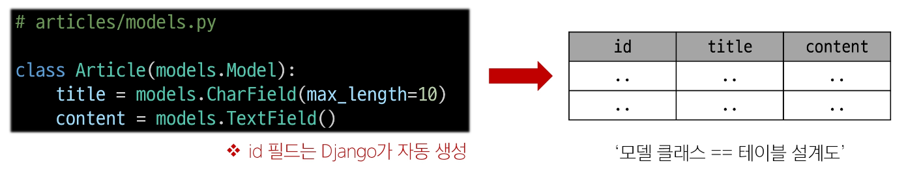

2. django.db.models 모듈의 Model이라는 부모클래스를 상속받음
   - Model은 model에 관련된 모든 코드가 이미 작성 되어있는 클래스
     - [링크](https://github.com/django/django/blob/main/django/db/models/base.py#L460)
   - 개발자는 가장 중요한 `테이블 구조를 어떻게 설계할지에 대한 코드만 작성하도록` 하기 위한 것(상속을 활용한 프레임워크의 기능 제공)  
     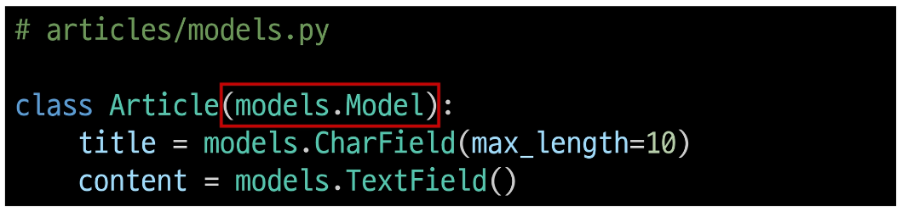

3. 클래스 변수명
   - 테이블의 각 "필드(열) 이름"  
     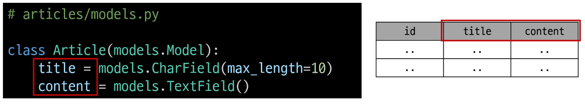

4. Model Field
   - 데이터베이스 테이블의 열(column)을 나타내는 중요한 구성 요소
   - "데이터의 유형"과 "제약 조건"을 정의  
     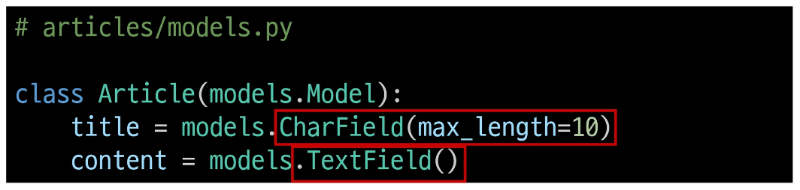

# Model Field
📌 Model Field
- DB 테이블의 `필드(열)`을 정의하며, 해당 필드에 저장되는 `데이터 타입(Field types)`과 `제약조건(Field options)`을 정의
   - Field types : 데이터 베이스에 저장될 "데이터의 종류"를 정의
   - Field options : 필드의 `동작`과 `제약 조건`을 정의

## Field types
📌 Field types 필드 유형
- 데이터 베이스에 저장될 "데이터의 종류"를 정의
- models 모듈의 클래스로 정의되어 있음

📌 주요 필드 유형
|필드 유형||
|:---:|----|
|문자열 필드| CharField, TextField|
|숫자 필드|IntegerField, FloatField|
|날짜/시간 필드|DateField, TimeField, DateTimeField|
|파일 관련 필드|FileField, ImageField|

### 문자열 필드
- `CharField()`
   - 제한된 길이의 문자열을 저장
   - 필드의 최대 길이를 결정하는 max_length는 필수 옵션
- `TextField()`
   - 길이 제한이 없는 대용량 텍스트를 저장
   - 무한대는 아니며 사용하는 시스템에 따라 달라짐

### 숫자 필드
- `IntegerField()`
- `FloatField()`

### 날짜/시간 필드
- `DateField()`
- `TimeField()`
- `DateTimeField()`

### 파일 관련 필드
- `FileField()`
- `ImageField()`

## Field options
📌 Field options 필드 옵션
- 필드의 `동작`과 `제약 조건`을 정의    
    

📌 주요 필드 옵션
|필드 옵션||
|:---:|----|
|null|데이터베이스에서 NULL 값을 허용할지 여부를 결정(기본값: False)|
|blank|form에서 빈 값을 허용할지 여부를 결정(기본값: False)|
|default|필드의 기본값을 설정|

### Constraint
📌 제약 조건 Constraint  
- 특정 규칙을 강제하기 위해 테이블의 열이나 행에 적용되는 규칙이나 제한사항
- 예시 : 숫자만 저장되도록, 문자가 100자 까지만 저장되도록 하는 등

# Migrations
📌 Migrations  
- model 클래스의 변경사항(필드 생성, 수정 삭제 등)을 DB에 최종 반영하는 방법  
    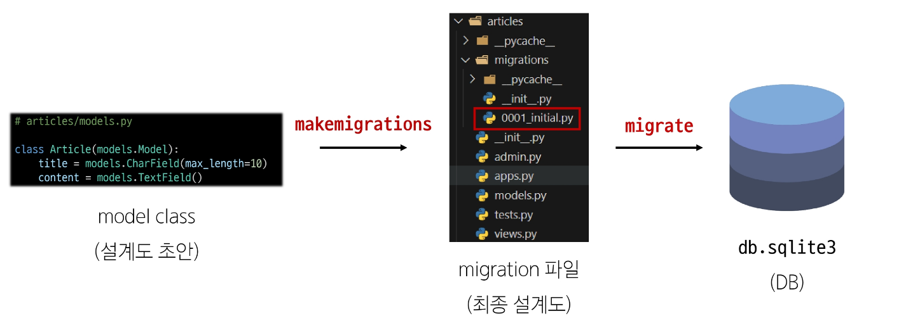
- 핵심 명령어  
    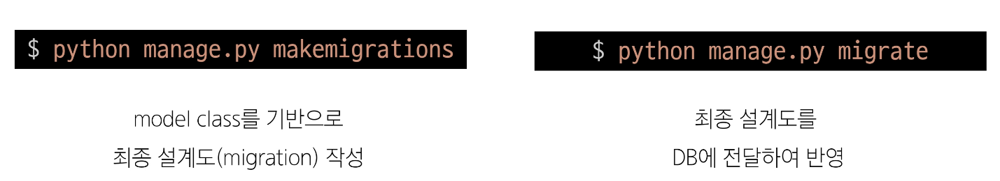
- migrate 후 DB 내에 생성된 테이블 확인
    - Article 모델 클래스로 만들어진 articles_article 테이블  
       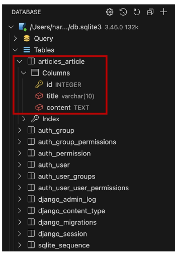 

    
    

## 추가 Migrations
이미 생성된 테이블에 필드를 추가해야 하는 경우  
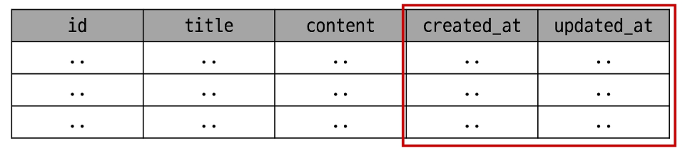 

📌 추가 모델 필드 작성  
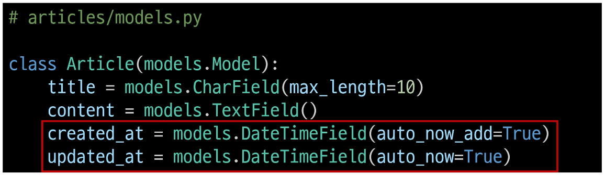 

- DateTimeField의 필드 옵션(optional)  
    

    - auto_now : 수정일
    - auto_now_add : 생성일/작성일

- 이미 기존 테이블이 존재하기 때문에 필드를 추가할 때 필드의 기본 값 설정이 필요
- 1번은 현재 대화를 유지하면서 직접 기본 값을 입력하는 방법
- 2번은 현재 대화에서 나간 후 models.py에 기본 값 관련 설정을 하는 방법
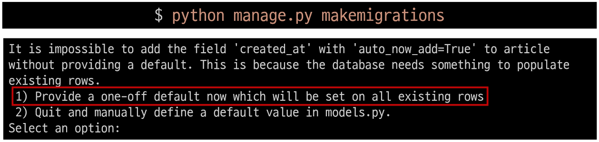 

- 추가하는 필드의 기본 값을 입력해야 하는 상황
- 날짜 데이터이기 때문에 직접 입력하기 보다 Django가 제안한느 기본 값을 사용하는 것을 권장
- 아무것도 입력하지 않고 enter를 누르면 Django가 제안하는 기본 값으로 설정 됨
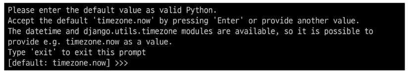 

- migrations 과정 종료 후 2번째 migration 파일이 생성됨을 확인
- 이처럼 Django는 설계도를 쌓아가면서 추후 문제가 생겼을 시 복구하거나 되돌릴 수 있도록 함(마치 `git commit`과 유사)
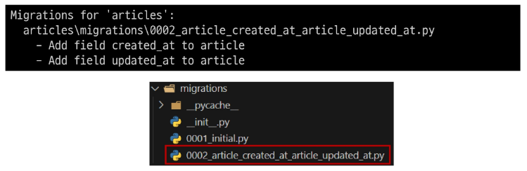 

- migrate 후 테이블 필드 변화 확인
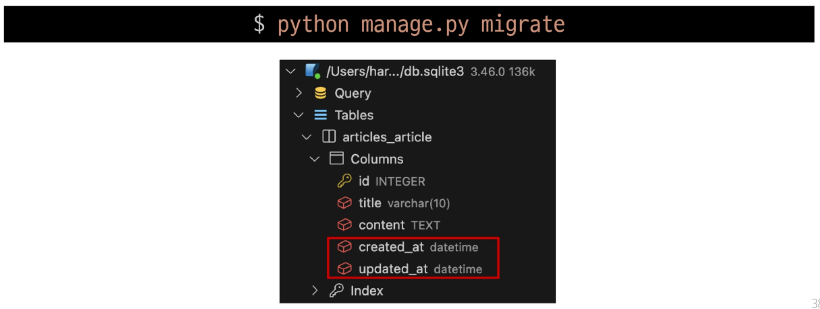 

- model class에 변경사항(1)이 생겼다면, 반드시 새로운 설계도를 생성(2)하고, 이를 DB에 반영(3)해야 한다.
1. model class 변경 
2. makemigrations
3. migrate

# Admin site
📌 Automatic admin interface
- Django가 추가 설치 및 설정 없이 자동으로 제공하는 관리자 인터페이스
- 데이터 확인 및 테스트 등을 진행하는데 매우 유용

1. admin 계정 생성
    - email은 선택사항이기 때문에 입력하지 않고 진행 가능
    - 비밀번호 입력 시 보완상 터미널에 출력되지 않으니 무시하고 입력 이어가기  
     
2. DB에 생성된 admin 계정 확인  
    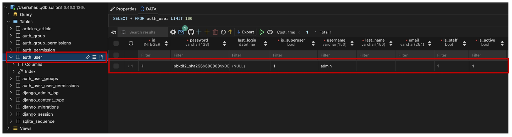  
3. admin에 모델 클래스 등록
    - admin.py에 작성한 모델 클래스를 등록해야만 admin site에서 확인 가능
      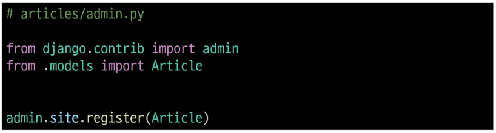  
4. admin site 로그인 후 등록된 모델 클래스 확인
   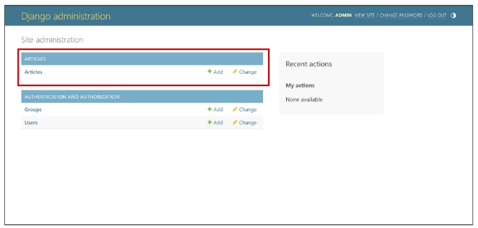
5. 데이터 생성, 수정, 삭제 테스트
   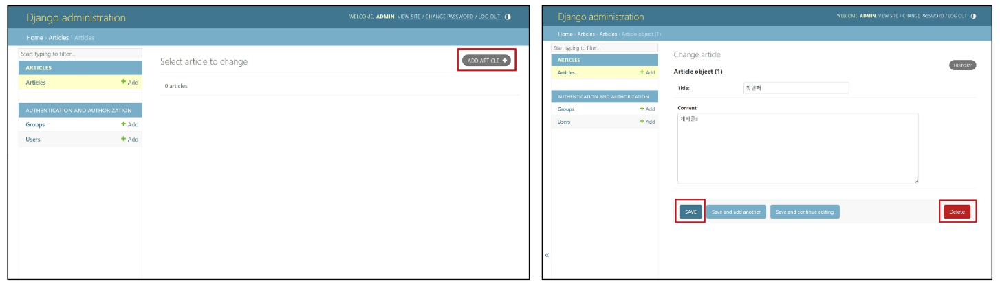
6. 테이블 확인
   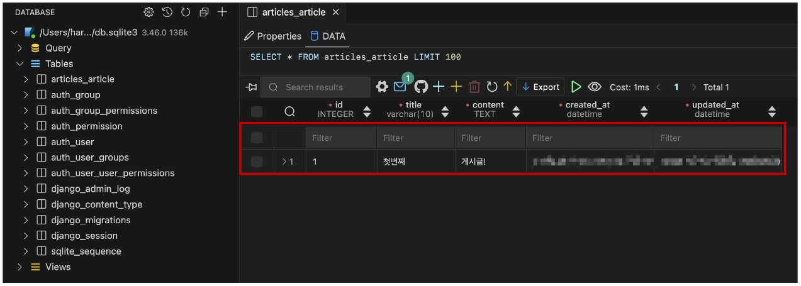

    

# 참고
## 데이터베이스 초기화 
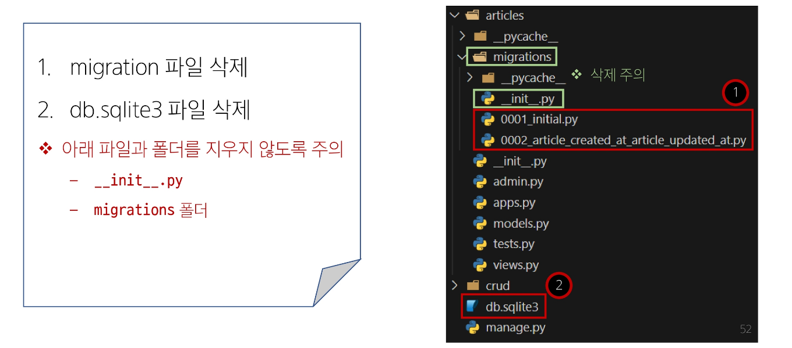

## Migrations 관련

- migrations 파일들이 migrate 됐는지 안됐는지 여부를 확인하는 명령어
- [X] 표시가 있으면 migrate가 완료되었음을 의미

- 해당 migrations 파일이 SQL 언어(DB에서 사용하는 언어)로 어떻게 번역되어 DB에 전달되는지 확인하는 명령어

📌 첫 migrate시 출력 내용이 많은 이유는?
- Django 프로젝트가 동작하기 위해 미리 작성되어 있는 기본 내장 app들에 대한 migration 파일들이 함께 migrate되기 때문  
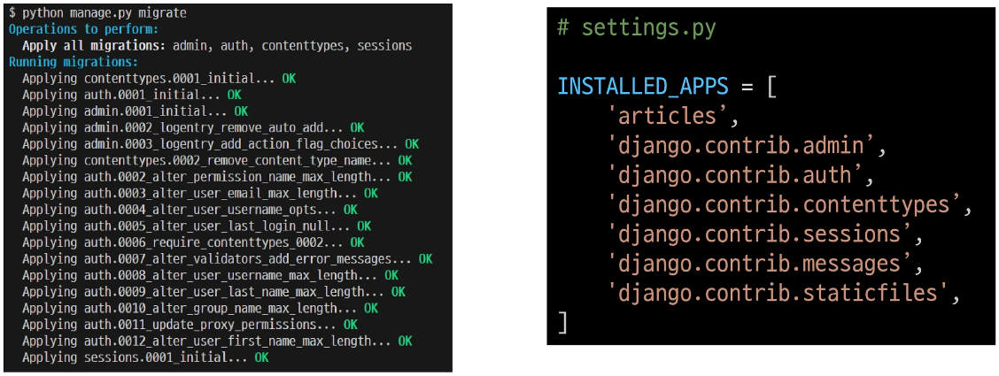

## SQLite
- 데이터베이스 관리 시스템 중 하나이며 Django의 기본 데이터베이스로 사용됨
- 파일로 존재하며 가볍고 호환성이 좋음
- 모바일에서 많이 사용(안드로이드)
