# ORM

<!-- TOC start (generated with https://github.com/derlin/bitdowntoc) -->

- [ORM](#orm)
  - [ORM](#orm-1)
  - [QuerySet API](#queryset-api)
    - [Query](#query)
    - [QuerySet](#queryset)
    - [CRUD](#crud)
  - [QuerySet API 실습](#queryset-api-실습)
    - [사전준비](#사전준비)
    - [Create](#create)
    - [Read](#read)
    - [Update](#update)
    - [Delete](#delete)
  - [ORM with view](#orm-with-view)
    - [전체 게시글 조회](#전체-게시글-조회)
  - [참고](#참고)
    - [Field lookups](#field-lookups)
    - [ORM, QuerySet API를 사용하는 이유](#orm-queryset-api를-사용하는-이유)

<!-- TOC end -->

## ORM
📌 ORM; Object-Relational-Mapping   
객체 지향 프로그래밍 언어를 사용하여 호환되지 않는 유형의 시스템 간에 데이터를 변환하는 기술
- mapping : 연결

📌 ORM의 역할
1. Django와 DB간에 사용하는 언어가 다르기 때문에 소통 불가  
   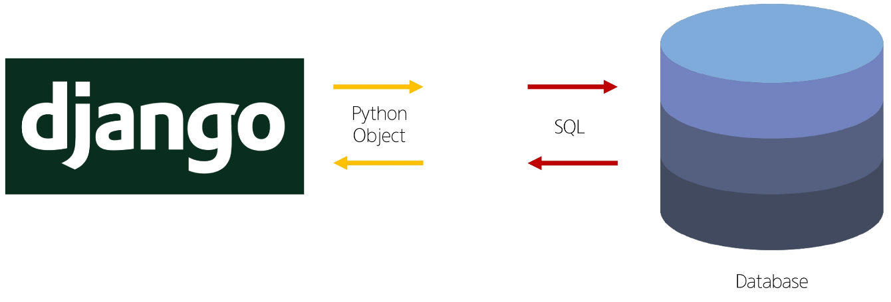

2. Django에 내장된 ORM이 중간에서 이를 해석  
   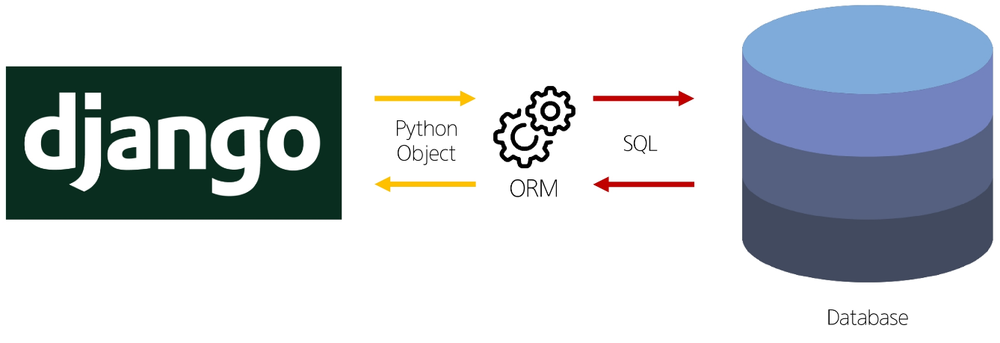  
   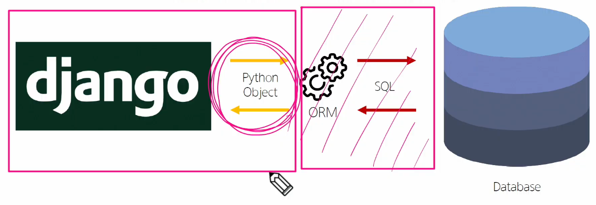  
      - 동그라미 친 곳만 집중 "어떻게 ORM 문법을 활용할 것인가"


## QuerySet API
📌 QuerySet API  
ORM에서 데이터를 검색, 필터링, 정렬 및 그룹화 하는 데 사용하는 도구  
➡ API를 사용하여 SQL이 아닌 Python 코드로 데이터를 처리

   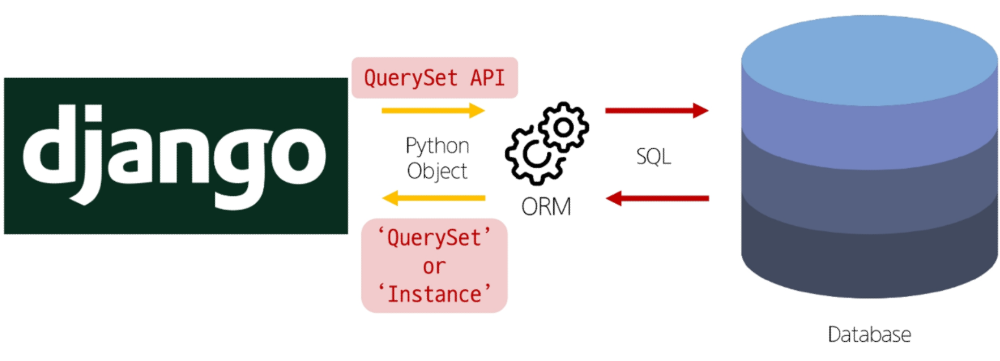

- queryset : 단일 객체가 아닐 때(여러 개)
- instance : 단일 객체일 때


📌 QuerySet API 구문  
   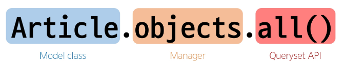

- model class : 조작하고자 하는 클래스
- manager : 뒤에 붙어있는 메서드를 제공하는 보관함
- QuerySet API : 메서드

📌 QuerySet API 구문 동작 예시  
   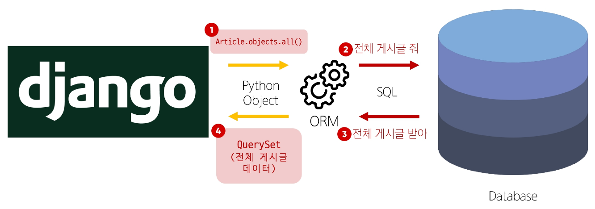

### Query
📌 Query  
- 데이터베이스에 특정한 데이터를 보여 달라는 요청
- "쿼리문을 작성한다." ➡ 원하는 데이터를 얻기 위해 데이터베이스에 요청을 보낼 코드를 작성한다.
- 파이썬으로 작성한 코드가 ORM에 의해 SQL로 변환되어 데이터베이스에 전달되며, 데이터베이스의 응답 데이터를 ORM이 QuerySet이라는 자료 형태로 변환하여 우리에게 전달

### QuerySet
📌 QuerySet
- 데이터베이스에게서 전달 받은 객체 목록(데이터 모음)
   - `순회가 가능`한 데이터로써 `1개 이상의 데이터`를 불러와 사용할 수 있음
- Django ORM을 통해 만들어진 자료형
- 단, 데이터베이스가 `단일한 객체를 반환` 할 때는 QuerySet이 아닌 `모델(Class)의 인스턴스`로 반환됨 (a = class())

> QuerySet API는 python의 모델 클래스와 인스턴스를 활용해 DB에 데이터를 저장, 조회, 수정, 삭제하는 것

### CRUD
- 소프트웨어가 가지는 기본적인 데이터 처리 기능
- `C`reat 저장
- `R`ead 조회
- `U`pdate 갱신
- `D`elete 삭제

## QuerySet API 실습
### 사전준비
- 외부 라이브러리 설치 및 설정  
   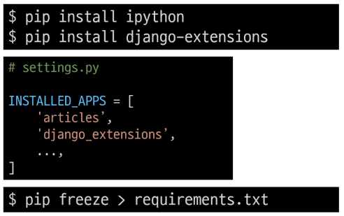

- DB 설계도는 gitignore에 들어가지 않으나 DB가 공유가 안됨
   - DB 구조를 외부 사람이 보면 안됨(데이터도 들어가 있음)
   - git에 들어가지 않기 때문에
   - makemigrations은 안해도 되지만 `migrate는 해야한다.`


- Django Shell 실행
   ```bash
   $ python manage.py shell_plus
   ```
  - Django Shell 
     - Django 환경 안에서 실행되는 python shell
     - 입력하는 QuerySet API 구문이 Django 프로젝트에 영향을 미침
     - settings.py에 app등록 해야함(일부 그런 라이브러리가 존재)
  - 그냥 Django shell은 기능이 적고 자동완성이 되지 않음 ➡ 그래서 라이브러리를 설치(shell_plus)
  - python manage.py shell_plus를 실행하게 되면 장고의 프로젝트안에서 idle 오픈한거랑 똑같음
- 끄기 `exit`

### Create
- 데이터 객체를 만드는(생성하는) 3가지 방법
   1. 첫번째 방법  
      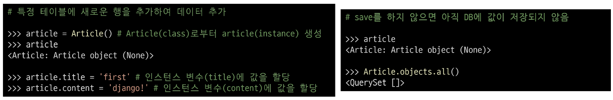
      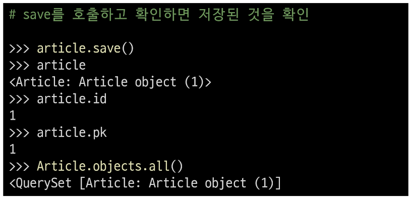
       
   2. 두번째 방법
      - save 메서드를 호출해야 비로소 DB에 데이터가 저장됨
      - 테이블에 한 행(레코드)이 쓰여진 것 
      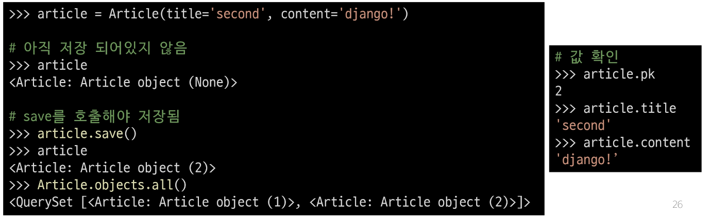
   3. 세번째 방법
      - QuerySet API 중 create() 메서드 활용
      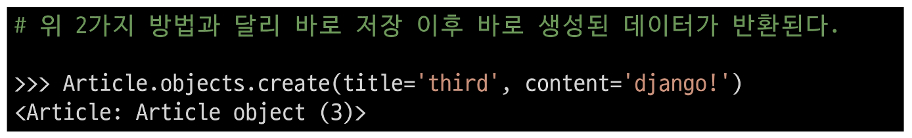

📌 `save()`
- 객체를 데이터베이스에 저장하는 인스턴스 메서드
- [참고](https://docs.djangoproject.com/en/4.2/ref/models/instances/#saving-objects)  
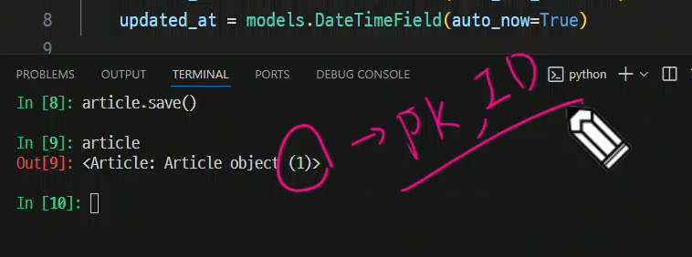
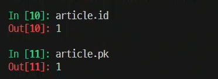

- 실제로는 id인데 pk라는 이름으로 접근할 수 있게함
   - pk를 권장
  
### Read
📌 대표적인 조회 메서드
- Return new QuerySets
   - `all()` ➡ 전체 데이터 조회
   - `filter()` ➡ 주어진 매개변수와 일치하는 객체를 포함하는 QuerySet 반환
- Do not reutrn QuertSets
   - `get()` ➡ 주어진 매개변수와 일치하는 객체를 반환
     - `객체를 찾을 수 없으면` `DoesnotExist 예외`를 `발생`시키고, 
     - `둘 이상의 객체`를 찾으면 `MultipleObjectsReturned 예외`를 발생시킴
     - 위와 같은 특징을 가지고 있기 때문에 `primary key`와 같이 `고유성`(uniqueness)을 `보장하는 조회`에서 사용해야 함


- all()  
   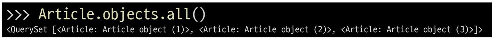
- filter()  
   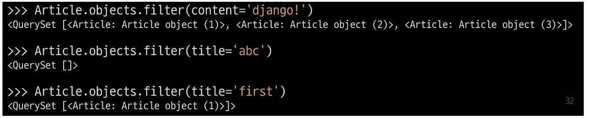
   - 조건이 일치하는 것만 줌
   - 없다고 안 주지 않음(*하나라도 항상 queryset을 반환)
   - list 형식으로 제공
- get()  
   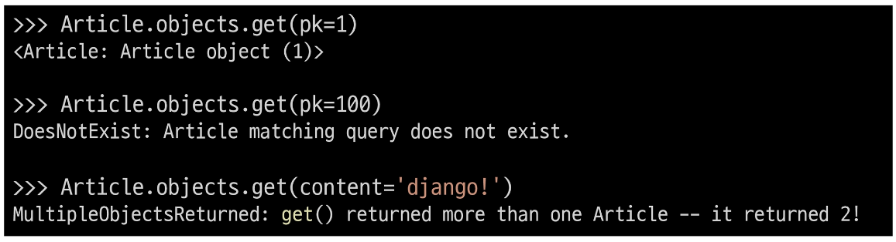


### Update
- 데이터 수정
  - 인스턴스 변수를 변경 후 save 메서드 호출
   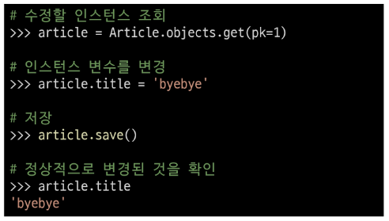

### Delete
- 데이터 삭제
   - 삭제하려는 데이터 조회 후 delete 메서드 호출
   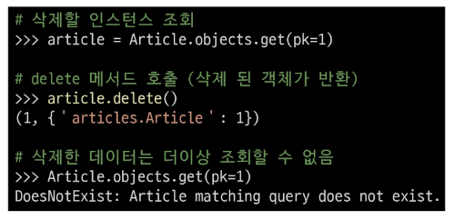

> ⭐ 지워진 pk는 다시 생성되지 않음(2, 3을 지우고 새로 create를 하면 pk=4) ⭐ 
> 장고에서 지워진 pk는 문제가 있는 pk라고 생각하는 것

## ORM with view
Django shell에서 연습했던 QuerySet API를 직접 view 함수에서 사용하기

### 전체 게시글 조회
- 2가지 Read(조회)
  1. 전체 게시글 조회 ✅  
   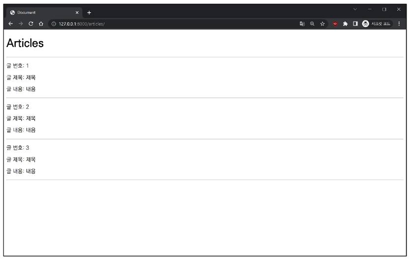  
   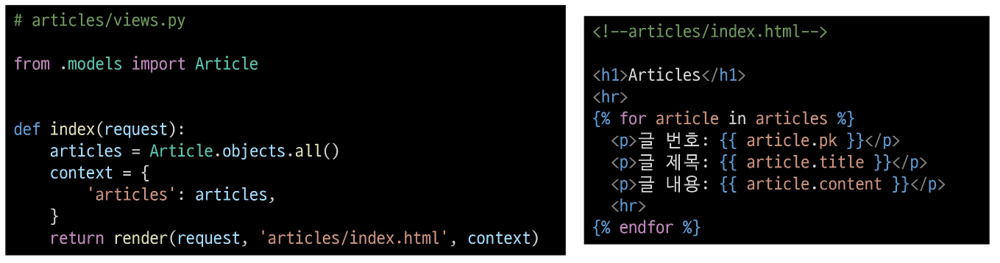
  2. 단일 게시글 조회
     - 조금 어려워서 다음 시간에


## 참고
### Field lookups
- Query에서 조건을 구성하는 방법
- QuerySet 메서드 filter(), exclude() 및 get()에 대한 키워드 인자로 지정됨  
   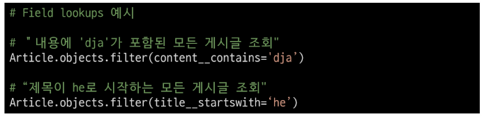
- [참고](https://docs.djangoproject.com/en/4.2/ref/models/querysets/#field-lookups)

### ORM, QuerySet API를 사용하는 이유
1. 데이터베이스 추상화
   - 개발자는 특정 데이터베이스 시스템에 종속되지 않고 일관된 방식으로 데이터를 다룰 수 있음
2. 생산성 향상
   - 복잡합 SQL 쿼리를 직접 작성하는 대신 Python 코드로 데이터베이스 작업을 수행할 수 있음
3. 객체 지향적 접근
   - 데이터베이스 테이블을 Python 객체로 다룰 수 있어 객체 지향 프로그래밍의 이점을 활용할 수 있음
- [참고 문서1](https://docs.djangoproject.com/en/4.2/ref/models/querysets)
- [참고 문서2](https://docs.djangoproject.com/en/4.2/topics/db/queries)
