# Form

## Django Form
📌 HTML 'form'  
- 지금까지 사용자로부터 데이터를 제출받기위해 활용한 방법
- 그러나 비정상적 혹은 악의적인 요청을 필터링 할 수 없음
- 유효한 데이터인지에 대한 확인이 필요

📌 유효성 검사
- 수집한 데이터가 정확하고 유효한지 확인하는 과정
- 우효성 검사 구현의 어려움
  - 유효성 검사를 구현하기 위해서는 입력 값, 형식, 중복, 범위, 보안 등 많은 것들을 고려해야 함
  - 이런 과정과 기능을 직접 개발하는 것이 아닌 django가 제공하는 form을 사용

### Form class
- django form
  - 사용자 입력 데이터를 수집하고, 처리 및 유효성 검사를 수행하기 위한 도구
  - 유효성 검사를 단수화하고 자동화 할 수 있는 기능을 제공  
    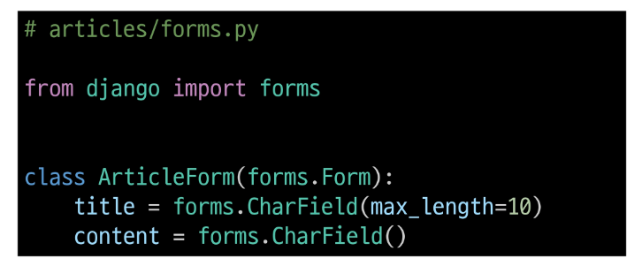
- form class를 적용한 new 로직
  - view 함수 new 변경  
     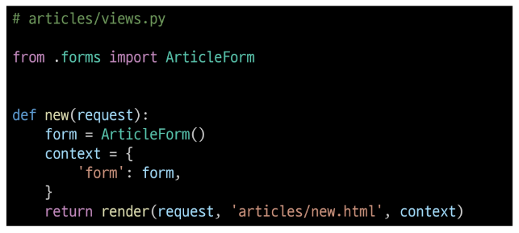  
  - new 페이지에서 form 인스턴스 출력  
     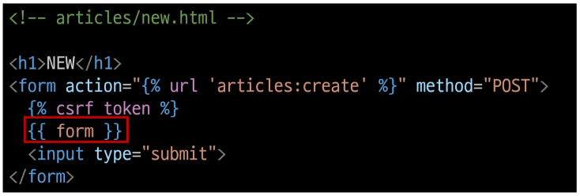  
   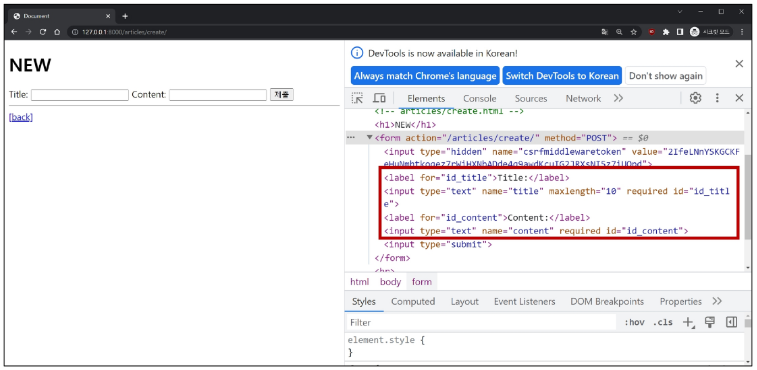

- [form rendering options](https://docs.djangoproject.com/en/4.2/topics/forms/#form-rendering-options)
  - label, input 쌍을 특정 HTML 태그로 감싸는 옵션  
     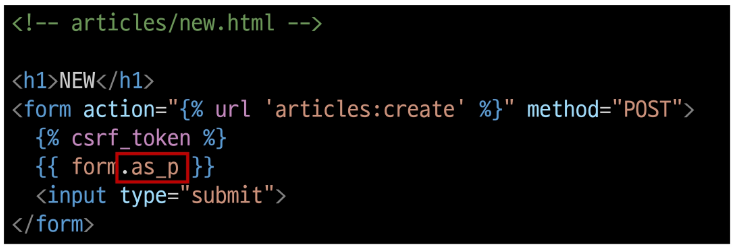  
  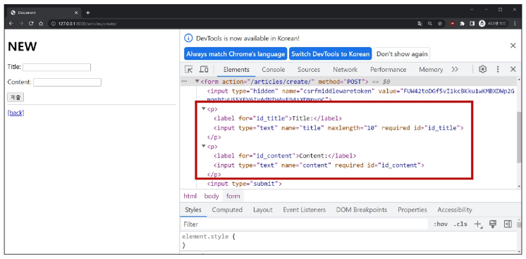  

- form class가 대체하는 것  
    

### Widgets
📌Widgets
- HTML `input` element의 표현을 담당  
- widget 적용  
  - widget은 단순히 input 요소의 속성 및 출력되는 부분을 변경하는 것  
     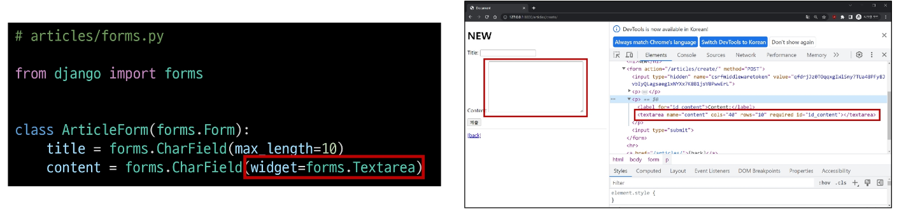  

## Django ModelForm
|Form|ModelForm|
|:----:|:----:|
|사용자 입력 데이터를 DB에 저장하지 않을 때| 사용자 입력 데이터를 DB에 저장해야 할 때|
|검색, 로그인|게시글 작성, 회원가입|

📌 ModelForm  
- Model과 연결된 Form을 자동으로 생성해주는 기능을 제공  
- Form + Model
- ModelForm class 정의
  - 기존 ArticleForm 클래스 수정  
     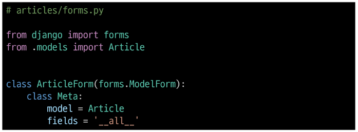  
- ModelForm class 적용  
   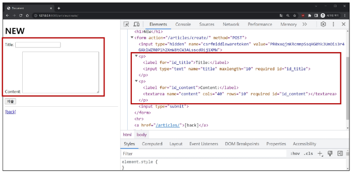
- ModelForm class가 대체하는 것  
   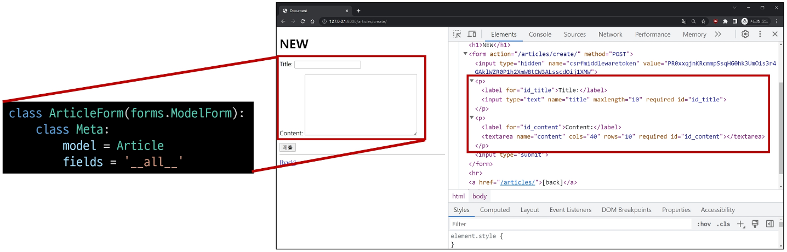

### Meta class
📌 Meta class
- ModelForm의 정보를 작성하는 곳
- `fields` 및 `exclude` 속성
  - exclude 속성을 사용하여 모델에서 포함하지 않을 필드를 지정할 수도 있음  
   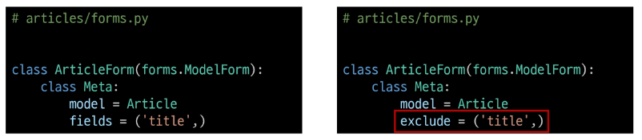
- Meta class 주의사항
  - Django에서 ModelForm에 대한 추가 정보나 속성을 작성하는 클래스 구조를 Meta 클래스로 작성 했을 뿐이며,
  - 파이썬의 inner class와 같은 문법적인 관점으로 접근하지 말 것

### ModelForm 적용
- ModelForm을 적용한 create 로직
  - step1   
    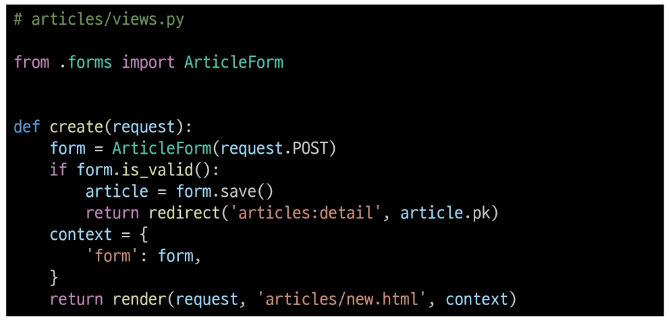
  - step2 : 제목 input에 공백을 입력 후 제출 시 에러 메시지 출력 확인 ➡ 유효성 검사의 결과  
    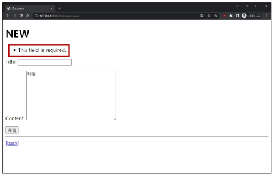
- `is_valid()`
  - 여러 유효성 검사를 실행하고, 데이터가 유효한지 여부를 Boolean으로 반환
  - 공백 데이터가 유효하지 않은 이유와 에러메시지가 출력되는 과정  
      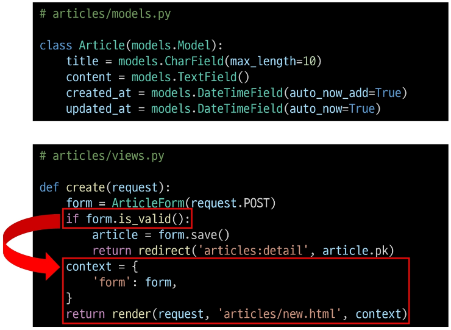
    - 별도로 명시하지 않았지만, 모델 필드에는 기본적으로 빈 값은 허용하지 않은 제약조건이 설정되어 있음
    - 빈 값은 is_valid()에 의해 False로 평가되고 form 객체에는 그에 맞는 에러 메시지가 포함되어 다음 코드로 진행됨
- ModelForm을 적용한 edit 로직  
    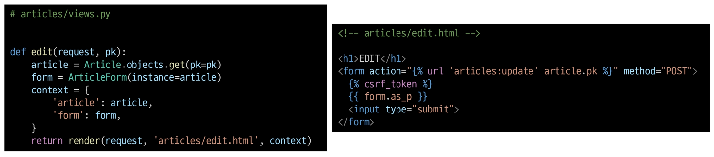
- ModelForm을 적용한 update 로직  
    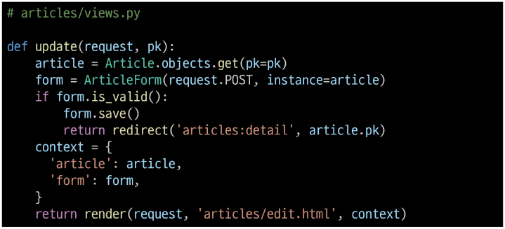

### save 메서드
📌 `save()`
- 데이터베이스 객체를 만들고 저장하는 ModelForm의 인스턴스 메서드
- save() 메서드가 생성과 수정을 구분하는 법
  - 키워드 인자 `instance 여부`를 통해 생성할 지, 수정할 지를 결정  
    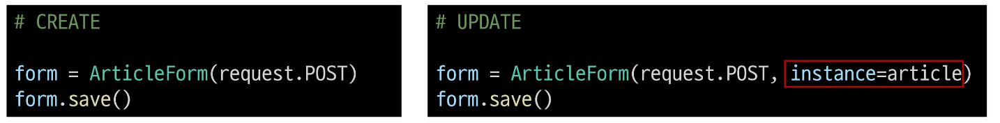

### django form 정리
- 사용자로부터 데이터를 수집하고 처리하기 위한 강력하고 유연한 도구
- HTML form의 생성, 데이터 유효성 검사 및 처리를 쉽게 할 수 있도록 도움

## HTTP 요청 다루기
### View 함수 구조 변화
📌 new&create view 함수간 공통점과 차이점
|공통점|차이점|
|:---:|:---:|
|데이터 생성을 구현하기 위함| new는 `GET` method 요청만을,   create는 `POST` method 요청만을 처리|

> 📌 HTTP request method 차이점을 활용해 동일한 목적을 가지는 2개의 view 함수를 하나로 구조화  

### new & create 함수 결합
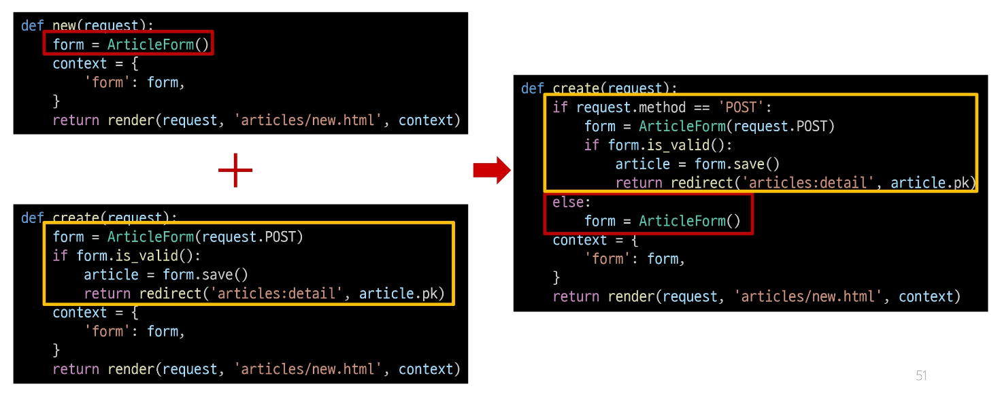

- 새로운 create view 함수
  - new와 create view 함수의 공통점과 차이점을 기반으로 하나의 함수로 결합    
     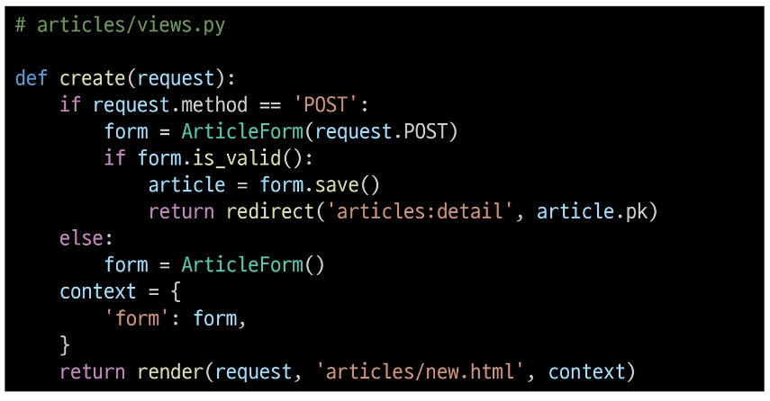
  - 두 함수의 유일한 차이점이었던 request method에 따른 분기  
     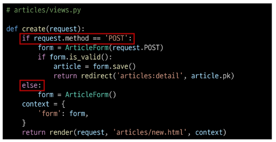
  - POST일 때는 과거 create 함수 구조였던 객체 생성 및 저장 로직 처리  
     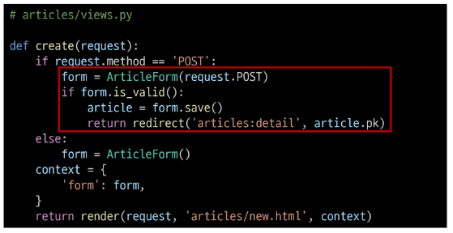
  - POST가 아닐 때는 과거 new 함수에서 진행 했던 form 인스턴스 생성  
     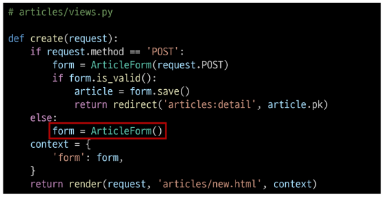
  - context에 담기는 form은
    1. is_valid()를 통과하지 못해 에러메시지를 담은 form이거나
    2. else문을 통한 form 인스턴스  
     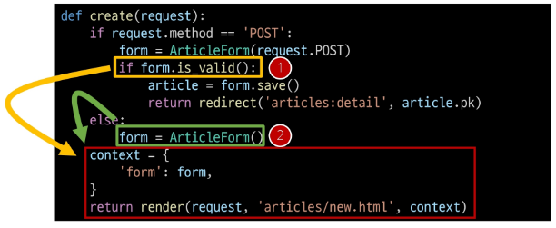
- 기존 new 관련 코드 수정 
  - 사용하지 않게 된 new url 제거  
     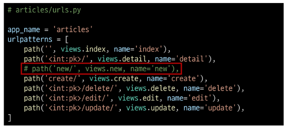
  - new 관련 키워드를 create로 변경  
     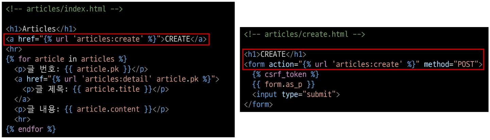
  - render에서 new 템플릿을 create 템플릿으로 변경  
     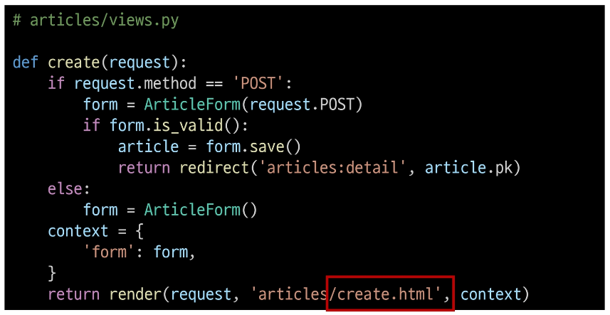
- request method에 따른 요청의 변화  
   
- 

### edit & update 함수 결합
- 새로운 update view 함수
  - 기존 edit과 update view 함수 결합    
     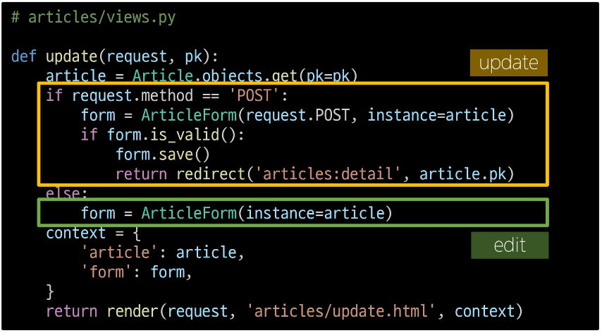
- 기존 edit 관련 코드 수정
  - 사용하지 않는 edit url 제거  
     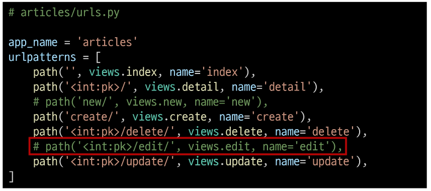
  - edit 관련 키워드를 update로 변경  
     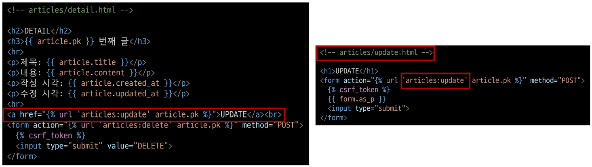

## 참고
### ModelForm의 키워드 인자 구성
- ModelForm 키워드 인자 data와 instance 살펴보기
  - data는 첫번째에 위치한 키워드 인자이기 때문에 생략 가능
  - instance는 9번째에 위치한 키워드 인자이기 때문에 생략할 수 없었음  
     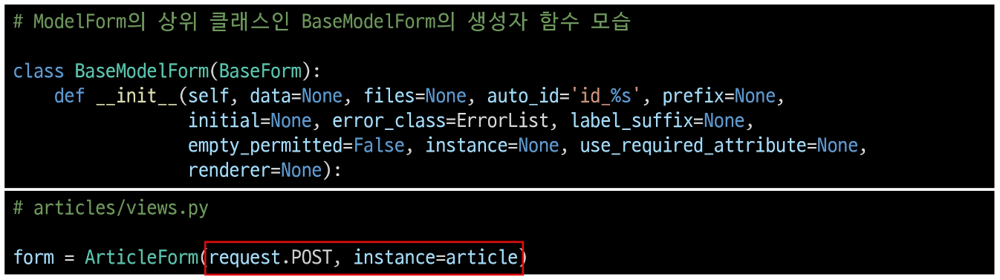

[참고 자료](https://github.com/django/django/blob/main/django/forms/models.py#L345)

### Widgets 응용
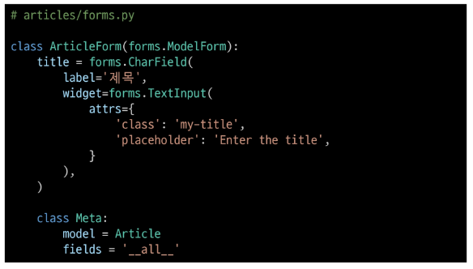
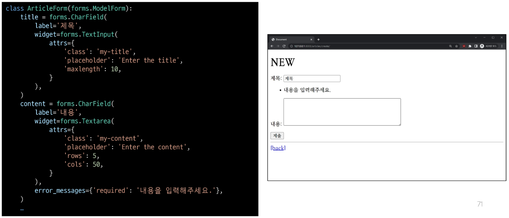

### 필드를 수동으로 렌더링
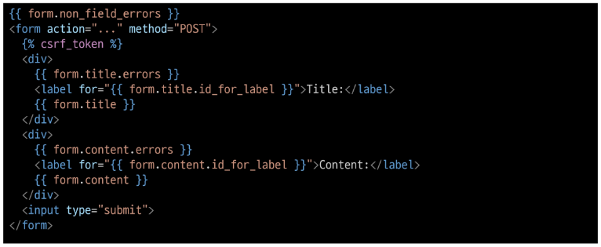 

[참고 자료](https://docs.djangoproject.com/en/4.2/topics/forms/#rendering-fields-manually)