# Static

<!-- TOC start (generated with https://github.com/derlin/bitdowntoc) -->

- [Static](#static)
  - [Static Files](#static-files)
    - [Static files 제공하기](#static-files-제공하기)
    - [Static files 기본 경로](#static-files-기본-경로)
    - [Static files 추가 경로](#static-files-추가-경로)
  - [Media files](#media-files)
    - [이미지 업로드](#이미지-업로드)
    - [업로드 이미지 제공](#업로드-이미지-제공)
    - [업로드 이미지 수정](#업로드-이미지-수정)
  - [참고](#참고)
    - [미디어 파일 추가 경로](#미디어-파일-추가-경로)
    - [BaseModelForm](#basemodelform)

<!-- TOC end -->

## Static Files
### Static files 제공하기
📌 Static Files 정적 파일
- 서버 측에서 변겨오디지 않고 고정적으로 제공되는 파일
- 이미지, JS, CSS 파일 등
  
📌 웹 서버와 정적 파일
- 웹 서버의 기본동작은 특정 위치(URL)에 있는 자원을 요청(HTTP request) 받아서 응답(HTTP response)을 처리하고 제공하는 것    
   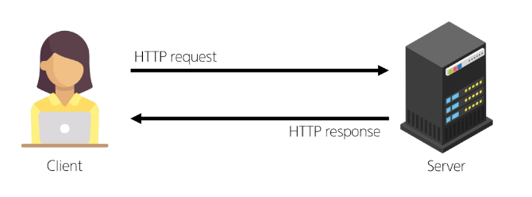
   - 이는 '자원에 접근 가능한 주소가 있다.'라는 의미
   - 웹 서버는 요청 받은 URL로 서버에 존재하는 정적 자원을 제공함
   - 💡 정적 파일을 제공하기 위한 경로(URL)가 있어야 함

📌 Static files 경로
1. 기본 경로
2. 추가 경로

### Static files 기본 경로
> app폴더/static

- step1 : articles/static/articles/경로에 이미지 파일 배치  
   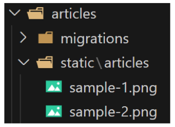
   - 없는 폴더이므로 직접 만들기
   - 폴더 만들고 이미지 넣기
- step2:
  - static files 경로는 DTL의 static tag를 사용해야 함
  - built-in tag가 아니기 때문에 `load tag를 사용해 import 후 사용 가능`  
     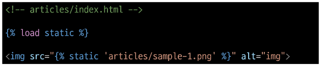
    - 맨 위에  넣고
    - ``
    - ⚠ 주의 사항
      - ``보다 위에 있으면 안 됨 (상속지원이 안됨)
      - base.html에서 load static을 한다면, 자식 템플릿에서는 load static이 안 된다.
- step3 : static_URL 확인 http://127.0.0.1:8000/static/articles/sample-1.png
     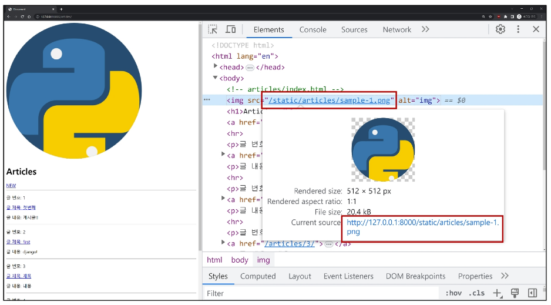
  - ⭐ STATIC_URL
    - 기본 경로 및 추가 경로에 위치한 정적 파일을 참조하기 위한 URL
    - ⭐ 실제 파일이나 디렉터리 경로가 아니며, URL로만 존재  
    - 처음에 작성되어 있으므로, 수정하지 않는 한 그대로 쓰면 된다.    
     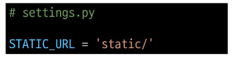  
     

### Static files 추가 경로
- Static files 추가 경로
  - STATICFILES_DIRS에 문자열 값으로 추가 경로 설정
  - STATICFILES_DIRS
    - 정적 파일의 기본 경로외에 추가적인 경로 목록을 정의하는 `리스트`
- 추가 경로 static files  제공하기
  - step1 : 임의의 추가 경로 설정  
    - Python 객체지향 경로 시스템에 따라 다음과 같이 작성(템플릿때 참고)   
     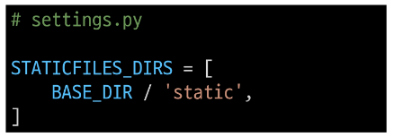 
  - step2 : 추가 경로에 이미지 파일 배치  
    - static 폴더를 만들어주고, 이미지 넣기   
     
  - step3 : static tag를 사용해 이미지 파일에 대한 경로 제공  
    - `` 
    - 따로 중간 경로를 넣어주지 않게 됨   
     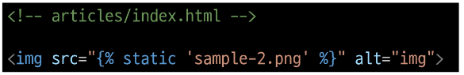
  - stpe4 : 이미지를 제공 받기 위해 요청하는 Request URL 확인  
    - 네트워크 탭 보기  
    - 요청을 보낸 것들을 볼 수 있음  
     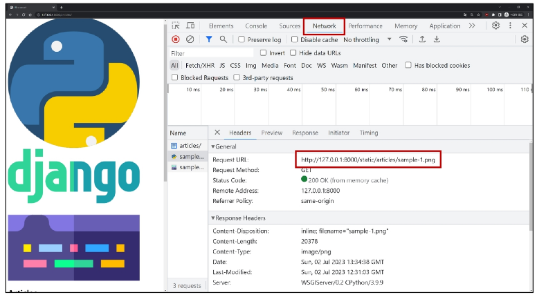

> 정적 파일을 제공하려면 요청에 응답하기 위한 URL이 필요

## Media files
📌 Media files  
- 사용자가 웹에서 업로드하는 `정적 파일`(User-uploaded)

### 이미지 업로드
- `ImageField()`
  - 이미지 업로드에 사용하는 모델 필드
  - 이미지 객체가 직접 DB에 저장되는 것이 아닌 `이미지 파일의 경로` `문자열이 저장`됨
- 미디어 파일을 제공하기 전 준비사항
  1. settings.py에 `MEDIA_ROOT`, `MEDIA_URL` 설정  
     - MEDIA_ROOT : 미디어 파일들이 위치하는 디렉터리의 절대 경로  
           
     - MEDIA_URL : MEDIA_ROOT에서 제공되는 미디어 파일에 대한 주소를 생성
       - STATIC_URL과 동일한 역할      
         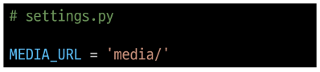  
  2. 작성한 `MEDIA_ROOT`와 `MEDIA_URL`에 대한 URL 지정   
    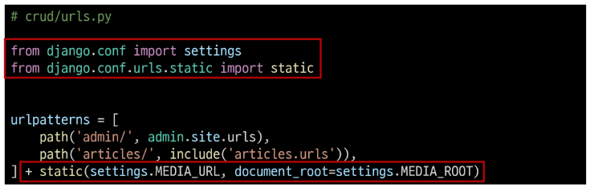  
    
     - 업로드 된 파일의 URL == settings.MEDIA_URL
     - MEDIA_URL을 통해 참조한느 파일의 실제 위치 == settings.MEDIA_ROOT
     - path() 형태가 아니기 때문에 보통 `+`로 붙여줌 (안에 넣어줘도 괜찮긴 함)
       - `+ static(URL 주소, 미디어 파일의 실제 위치)`
- 이미지 업로드
  - step1 : `blank=True` 속성을 작성해 빈 문자열이 저장될 수 있도록 제약 조건 설정
    - 게시글 작성 시 이미지 업로드 없이도 작성할 수 있도록 하기 위함 
    - 위치는 상관 없음(어차피 추가라 데이터베이스 맨 마지막에 붙음)
    - 모든 모델 필드들은 공백(빈 값)을 허용하지 않으므로, 옵션으로 선택으로 바꿔줌(blank=True)   
       
  - step2 : migration 진행  
    - `pip install pillow`
     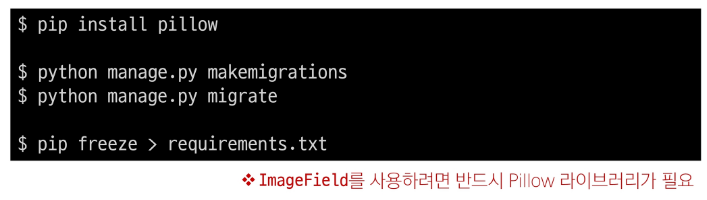
  - step3 : form 요소의 enctype 속성 추가 [참고 자료](https://developer.mozilla.org/en-US/docs/Web/HTML/Element/form)  
     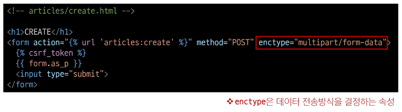
  - step4 : ModelForm의 2번째 인자로 요청 받은 파일 데이터 작성
    - ModelForm의 상위 클래스 BaseModelForm의 생성자 함수의 2번째 위치 인자로 파일을 받도록 설정되어 있음  
     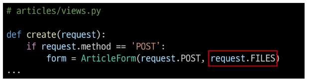
  - step5 : 이미지 업로드 input 확인  
     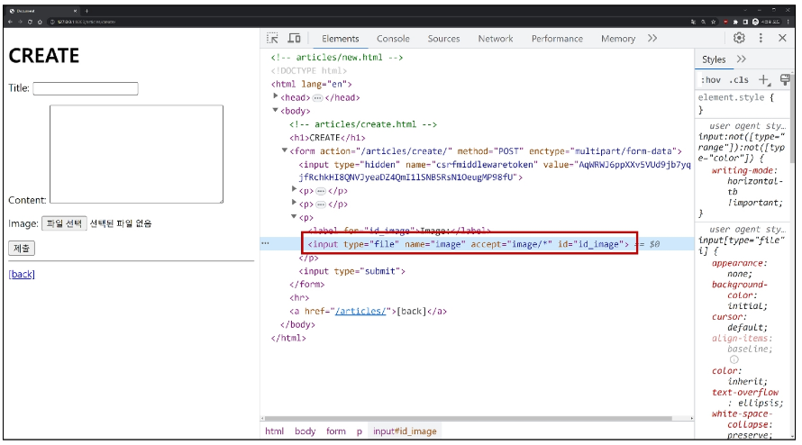
  - step6 : 이미지 업로드 결과 확인
     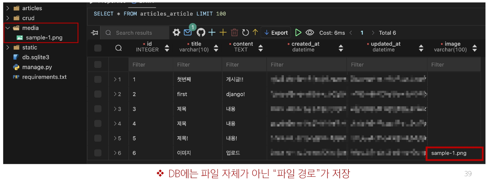
     - MEDIA_ROOT 이후의 경로로 저장됨

### 업로드 이미지 제공
- 업로드 이미지 제공하기
  - step1  
     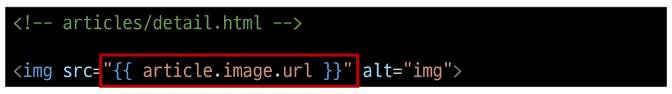
    - `url` 속성을 통해 업로드 파일의 경로 값을 얻을 수 있음
    - article.image.url
      - 업로드 파일의 경로
    - article.image
      - 업로드 파일의 파일 이름
  - step2
    - 업로드 이미지 출력 확인 및 MEDIA_URL 확인  
     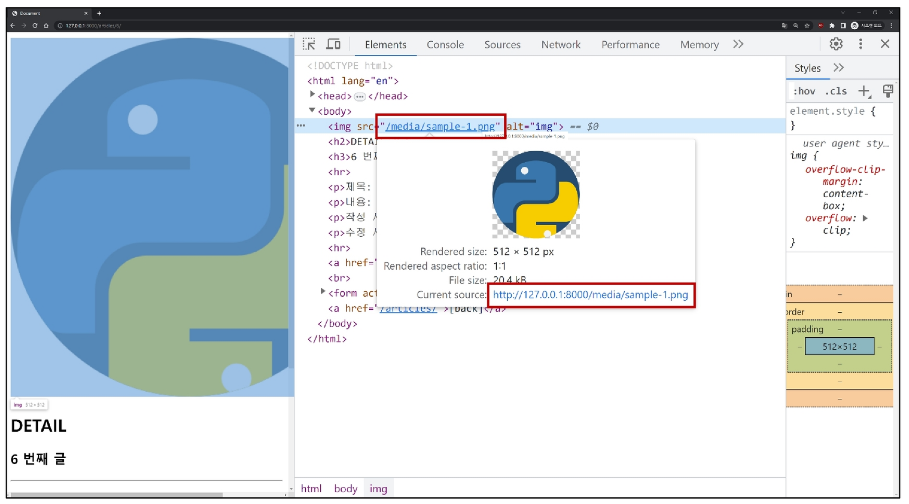
  - step3  
     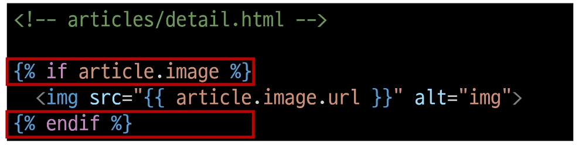
    - 이미지를 업로드 하지 않은 게시물은 detail 템플릿을 렌더링 할 수 없음
    - 이미지 데이터가 있는 경우만 이미지를 출력할 수 있도록 처리하기  
    - 아니면 기본 이미지를 넣어도 괜찮음
- 이미지 파일 이름이 같으면 장고가 알아서 이름 붙여줘서 (파일 이름이 같아도 됨)

### 업로드 이미지 수정
- 업로드 이미지 수정
  - step1 : 수정 페이지 form 요소에 enctype 속성 추가  
     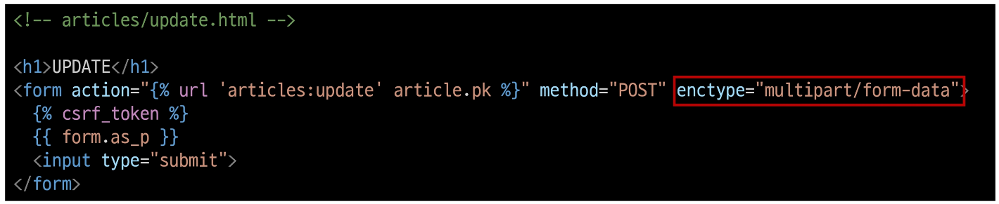
  - step2 : update view 함수에서 업로드 파일에 대한 추가 코드 작성  
     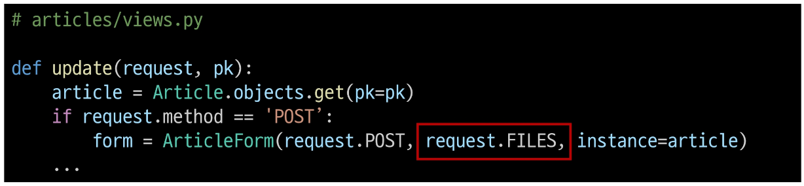

## 참고
### 미디어 파일 추가 경로
- `upload_to` argument
  - ImageField()의 upload_to 속성을 사용해 다양한 추가 경로 설정  
     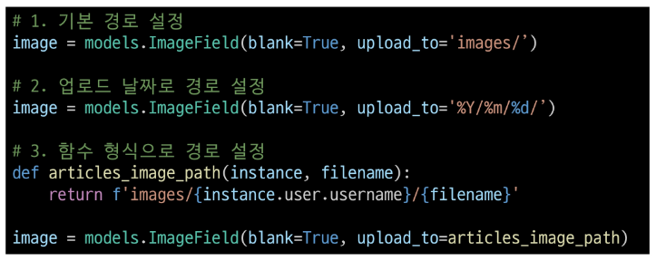

### BaseModelForm
- request.FILES가 두번째 위치 인지인 이유
- ModelForm의 상위 클래스 BaseModelForm의 생성자 함수 키워드 인자 참고  
   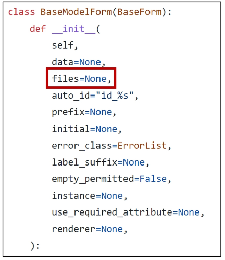
