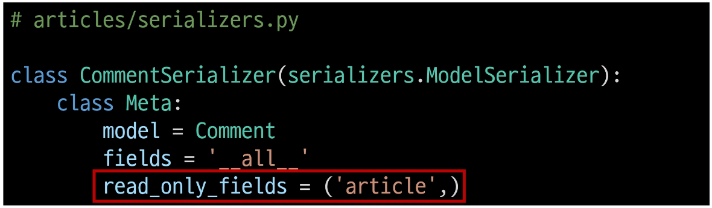
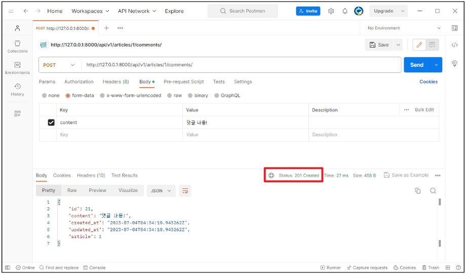

# DRF2

# DRF with N:1 Relation
## 사전 준비
- Comment 모델 정의
  - Comment 클래스 정의 및 데이터베이스 초기화  
       
  - Migration 및 fixtures 데이터 로드  
       
- URL 및 HTTP request method 구성   
      

## GET method
### GET - List
- 댓글 목록 조회를 위한 CommentSerializer 정의   
       
- url 작성  
       
- view 함수 작성  
       
- GET http://127.0.0.1:8000/api/v1/comments/ 응답 확인  
       
       

### GET - Detail
- 단일 댓글 조회를 위한 url 및 view 함수 작성  
       
- GET http://127.0.0.1:8000/api/v1/comments/1/ 응답 확인  
       
       

## POST method
### POST
- 단일 댓글 생성을 위한 url 및 view 함수 작성  
       
- serializeer 인스턴스의 save() 메서드는 특정 Serializer 인스턴스를 저장하는 과정에서 추가 데이터를 받을 수 있음  
       
- POST http://127.0.0.1:8000/api/v1/articles/1/comments/ 응답 확인
  - 상태코드 400 응답 확인  
         
  - CommentSerializer에서 외래 키에 해당하는 article field 또한 사용자로부터 입력 받도록 설정되어 있기 때문에 서버 측에서는 누락되었다고 판단한 것
  - 유효성 검사 목록에서 제외 필요
  - article field를 `읽기 전용 필드`로 설정하기
    - 읽기 전용 필드(read_only_fields)
      - 데이터를 전송 받은 시점에 "유혀성 검사에서 제외시키고, 데이터 조회 시에는 출력"하는 필드  
           
- POST http://127.0.0.1:8000/api/v1/articles/1/comments/ 재요청  
       

## DELETE & PUT method
- 단일 댓글 삭제 및 수정을 위한 view 함수 작성  
        
- DELETE http://127.0.0.1:8000/api/v1/comments/21/ 응답 확인  
        
- PUT http://127.0.0.1:8000/api/v1/comments/1/ 응답 확인  
        

## 응답 데이터 재구성
- 댓글 조회 시 게시글 출력 내역 변경
  - 댓글 조회 시 게시글 번호만 제공해주는 것이 아닌 `게시글의 제목까지 제공`하기  
          
  - 필요한 데이터를 만들기 위한 Serializer는 내부에서 추가 선언이 가능  
          
  - GET http://127.0.0.1:8000/api/v1/comments/1/ 응답 확인  
          

# 역참조 데이터 구성
- Article ➡ Comment 간 역참조 관계를 활용한 JSON 데이터 재구성
- 아래 2가지 사항에 대한 데이터 재구성하기
  1. 단일 게시글 조회 시 **해당 게시글에 작성된 댓글 목록**도 함께 붙여서 응답   
  2. 단일 게시글 조회 시 **해당 게시글에 작성된 댓글 개수**도 함께 붙여서 응답

## 단일 게시글 + 댓글 목록
- **Nested relationships** (역참조 매니저 활용)
  - 모델 관계 상으로 참조하는 대상은 참조되는 대상의 표현에 포함되거나 중첩될 수 있음
  - 이러한 중첩된 관계는 serializers를 필드로 사용하여 표현 가능  
        
  - GET httpL//127.0.0.1:8000/api/v1/articles/2/ 응답 확인   
        

## 단일 게시글 + 댓글 개수
- 댓글 개수에 해당하는 새로운 필드 생성  
      
- GET http://127.0.0.1:8000/api/v1/articles/3/ 응답 확인  
      

### source arguments
- 필드를 채우는 데 사용할 속성의 이름
- 점 표기법(dotted notation)을 사용하여 속성을 탐색할 수 있음  
      
- ⚠ 주의 ⚠ 읽기 전용 필드 지정 이슈
  - 특정 필드를 override 혹은 추가한 경우 read_only_fields는 동작하지 않음
  - 이런 경우 새로운 필드에 read_only 키워드 인자로 작성해야 함
      

## 읽기 전용 필드
- 사용하는 이유
  - 사용자에게 입력으로 받지 않지만 제공은 해야 하는 경우
  - 새로운 필드 값을 만들어 제공해야 하는 경우
- 특징 및 주의 사항
  - 유효성 검사에서 제외됨
  - 단, 유효성 검사에서 제외된다고 해서 반드시 "생성"로직에서만 사용이 국한되는 것은 아님
- `read_only_fields` 속성과 `read_only` 인자의 사용처
  - `read_only_fields`
    - 기존 외래키 필드 값을 그대로 응답 데이터에 제공하기 위해 지정하는 경우
  - `read_only`
    - 기존 외래키 필드 값의 결과를 다른 값으로 덮어쓰는 경우
    - 새로운 응답 데이터 값을 제공하는 경우

# API 문서화
- OAS; OpenAPI Specification
  - RESTful API를 설명하고 시각화하는 표준화된 방법
  - API에 대한 세부사항을 기술할 수 있는 공식 표준
- Swaager, Redoc  
     
  - OAS 기반 API에 대한 문서를 생성하는 데 도움을 주는 오픈소스 프레임워크
## 문서화 활용
- DRF 위한 OpenAPI 3.0 구조 생성을 도와주는 라이브러리
- drf-spectacular 라이브러리
  - 설치 및 등록 `$ pip install drf-spectacular`    
     
  - 관련 설정 코드 입력 (OpenAPI 구조 자동 생성 코드)    
     
  - swagger, redoc 페이지 제공을 위한 url 작성  
     
  - http://127.0.0.1:8000/api/schema/swagger-ui/ 페이지 확인  
     
  - http://127.0.0.1:8000/api/schema/redoc/ 페이지 확인  
     

- 설계 우선 접근법
  - OAS의 핵심 이점
  - API를 먼저 설계하고 명세를 작성한 후, 이를 기반으로 코드를 구현하는 방식
  - API의 일관성을 유지하고, API 사용자는 더 쉽게 API를 이해하고 사용할 수 있음
  - 또한, OAS를 사용하면 API가 어떻게 작동하는지를 시각적으로 보여주는 문서를 생성할 수 있으며, 이는 API를 이해하고 테스트하는 데 매우 유용
  - 이런 목적으로 사용되는 도구가 Swagger-UI 또는 ReDOc

# 참고
## 올바르게 404 응답하기
- Django shortcuts functions
  - render()
  - redirect()
  - get_object_or_404()
  - get_list_or_404()
- `get_obejct_or_404()`
  - 모델 manager objects에서 **get()**을 호출하지만, 해당 객체가 없을 땐 DoesNotExist 예외 대신 **Http404를 raise**함
  -  get_object_or_404 적용      
       
- `get_list_or_404()`
  - 모델 manager objects에서 **filter()**의 결과를 반환하고, 해당 객체 목록이 없을 땐 **http404를 raise**함 
  - get_list_or_404() 적용  
       
  - 적용 전/후 비교  
    - 존재하지 않는 게시글 조회 시 이전에는 상태 코드 500을 응답했지만 현재 404를 응답
        
  - 왜 사용해야 할까?
    - 클라이언트에게 "서버에 오류가 발생하여 요청을 수행할 수 없다(500)"라는 원인이 정확하지 않은 에러를 제공하기 보다는, 적절한 예외 처리를 통해 클라이언트에게 보다 정확한 에러 현황을 전달하는 것도 매우 중요한 개발 요소 중 하나이기 때문

## 복잡한 ORM 활용
- 복잡한 ORM 활용 시 권장 방식
  - 복잡한 query나 로직은 View 함수에서 진행
    - 여러 모델을 조인하거나 복잡한 집계가 필요한 경우 View 함수에서 처리
    - 필요한 경우 View 함수에서 select_related()나 prefetch_related()를 사용하여 query를 최적화
  - Serializer는 기본적인 데이터 변환을 담당
    - Serializer만으로는 복잡한 query를 처리하기 어려움