# Authentication System 02

## 회원 가입
- 📌회원 가입
  - User 객체를 Create 하는 과정
- `UserCreationForm()`
  - 회원 가입시 사용자 입력 데이터를 받는 built-in ModelForm
- 회원 가입 페이지 작성
  - step 1  
    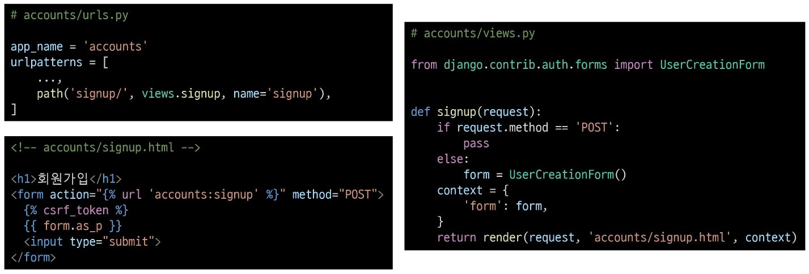   
  - step 2 : 회원 가입 페이지 확인  
    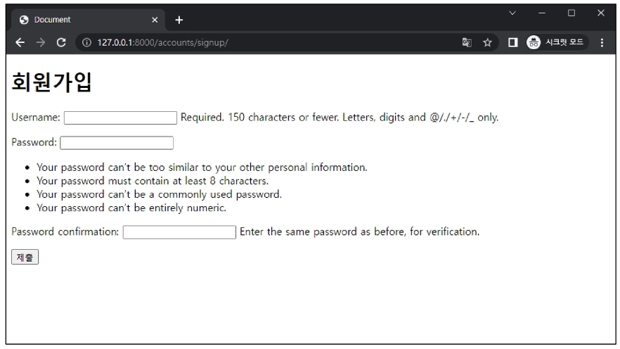   
- 회원 가입 로직 작성  
    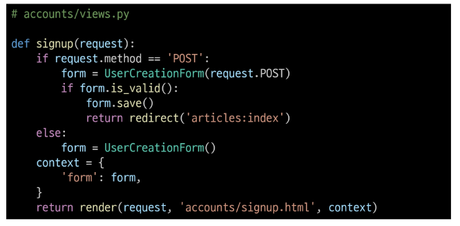   
- 회원 가입 로직 에러
  - 회원가입 시도 후 에러 페이지 확인
    - Manager isn't available; `auth.User` has been swapped for `accounts.User`     
    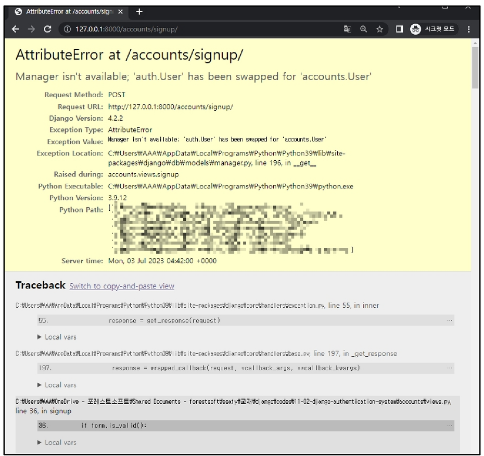   
  - 회원가입에 사용하는 `UserCreationForm`이 대체한 `커스텀 유저 모델`이 아닌 `과거 Django의 기본 유저 모델`로 인해 작성된 클래스이기 때문  
    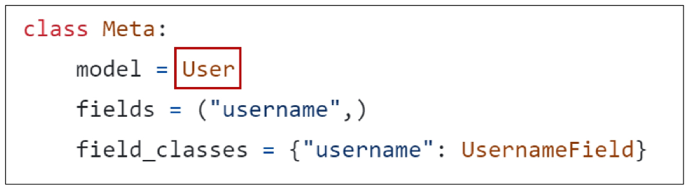   
    - 참고 자료 : https://github.com/django/django/blob/main/django/contrib/auth/forms.py#L205
    - 커스텀 유저 모델을 사용하려면 다시 작성해야 하는 From  
         
      - 두 Form 모두 `class Meta: model = User`가 작성된 Form이기 때문에 재작성 필요
      - 참고 자료 : https://docs.djangoproject.com/en/4.2/topics/auth/customizing/#custom-users-and-the-built-in-auth-forms 
- UserCreationFrom과 UserChangeForm 커스텀
  - Custom User model을 사용할 수 있도록 상속 후 일부분만 재작성  
    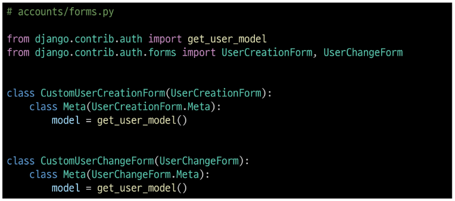   
  - `get_user_model()`
    - 현재 프로젝트에서 활성화된 사용자 모델(active user model)을 반환하는 함수
- User 모델을 직접 참조하지 않는 이유
  - `get_user_model()` 을 사용해 User 모델을 참조하면 커스텀 User 모델을 자동으로 반환해주기 때문
  - Django는 필수적으로 User 클래스를 직접 참조하는 대신 get_user_model()을 사용해 참조해야 한다고 강조하고 있음
  - User model 참조에 대한 자세한 내용은 추후 모델 관계에서 다룸
- 회원 가입 로직 완성
  - CustomUserCreationForm으로 변경  
    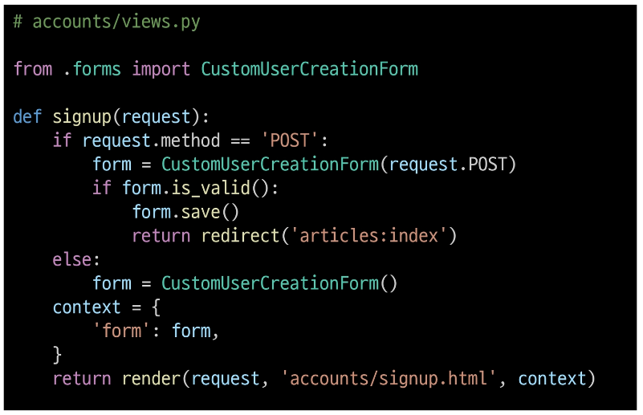    

|에러 발생하는 회원 가입 로직| 에러 해결한 회원 가입 로직(완성)|
|:---:|:---:|
|  ||

## 회원 탈퇴
- 📌 회원 탈퇴
  - User 객체를 Delete 하는 과정
- 회원 탈퇴 로직 작성
  - step 1   
    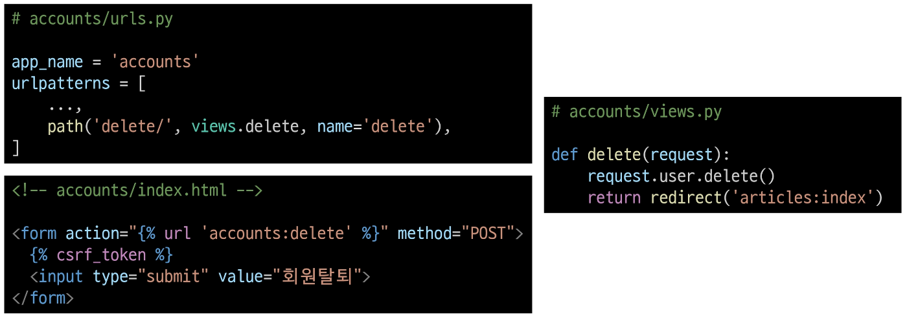   
  - step 2 : 회원 가입 페이지 확인    
    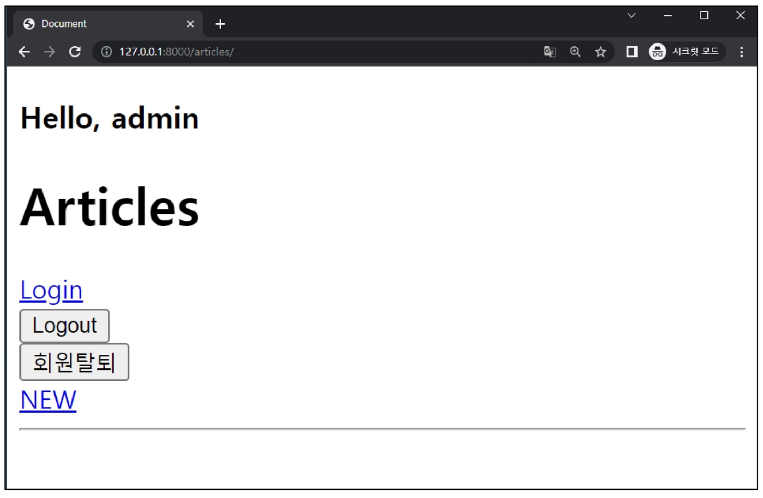  

## 회원정보 수정
- 📌 회원 탈퇴
  - User 객체를 Update 하는 과정
- `UserCreationForm()`
  - 회원정보 수정시 사용자 입력 데이터를 받는 built-in `ModelForm`
- 회원정보 수정 페이지 작성
  - step 1    
    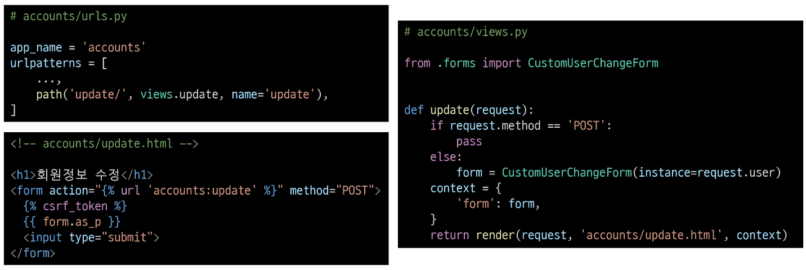   
  - step 2  
    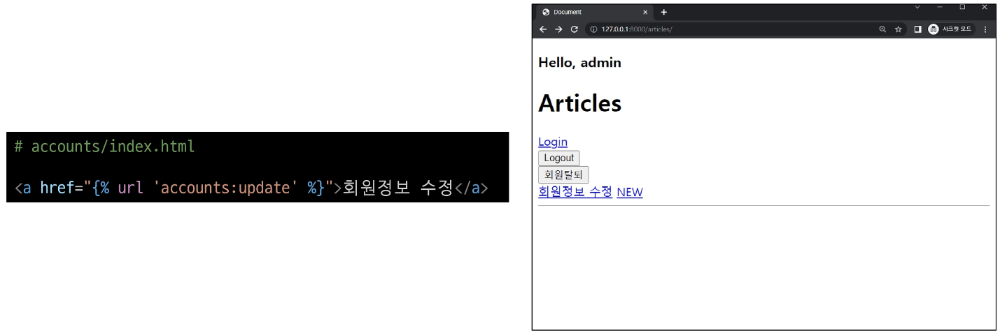   
  - step 3 : 회원정보 수정 페이지 확인  
    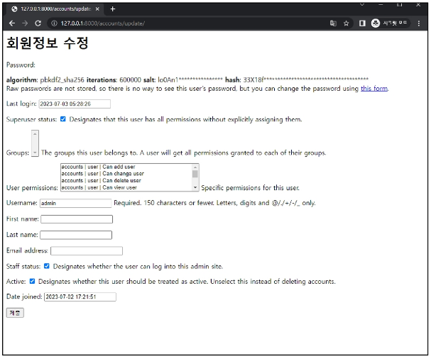   
- UserChangeForm 사용 시 문제점
  - User 모델의 모든 정보들(fields)까지 모두 출력됨
  - 일반 사용자들이 접근해서 안되는 정보를 출력하지 않도록 해야 함
  - CustomUserChangeForm에서 출력 필드를 다시 조정하기
  - CustomUserChangeForm 출력 필드 재정의
    - step 1 : User Model의 필드 목록 확인
      - https://docs.djangoproject.com/en/4.2/ref/contrib/auth/   
        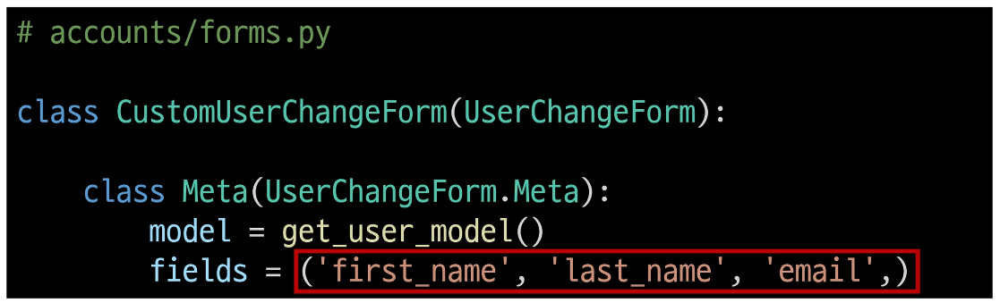
    - step 2 : 회원정보 수정 페이지 확인  
        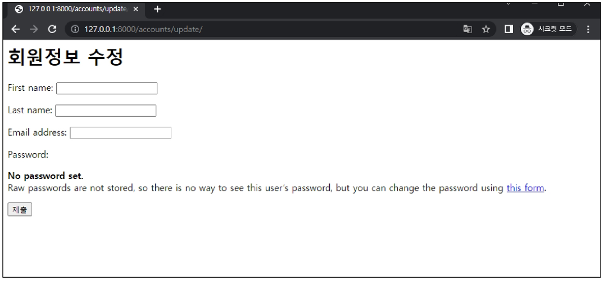
- 회원정보 수정 로직 완성  
  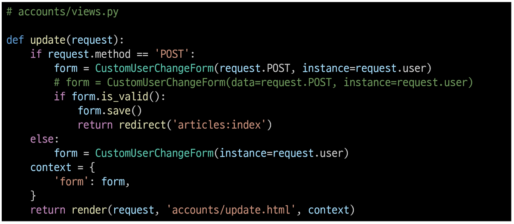

## 비밀번호 변경
- 📌 비밀번호 변경
  - 인증된 사용자의 Session 데이터를 Update 하는 과정
- `PasswordChangeFrom()`
  - 비밀번호 변경 시 사용자 입력 데이터를 받는 built-in `Form`
- 비밀번호 변경 페이지 작성
  - step 1 : django는 비밀번호 변경 페이지를 회원정보 수정 form 하단에 별도 주소로 안내
    - 📌 /user_pk/password/  
    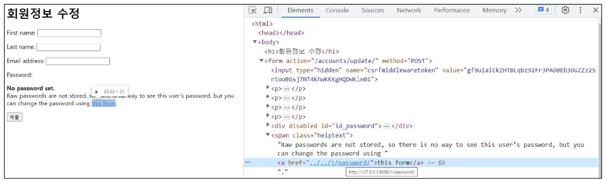   
  - step 2  
    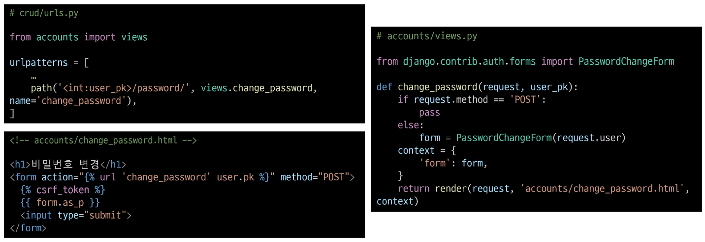   
  - step 3 : 비밀번호 변경 페이지 확인  
    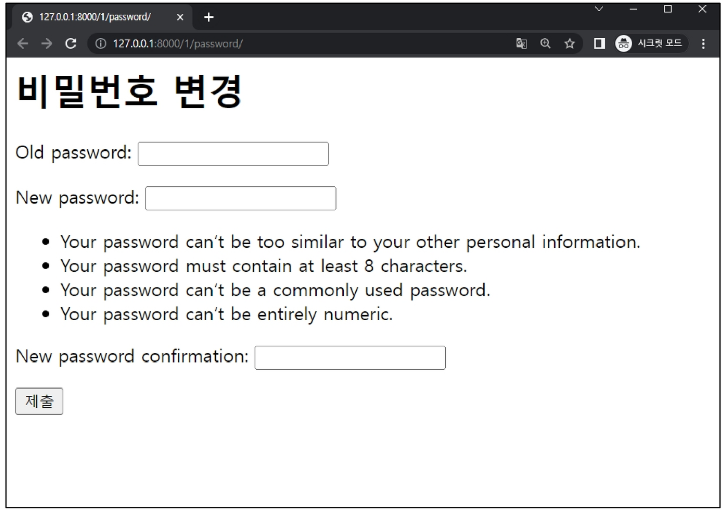   
- 비밀번호 변경 로직 완성  
  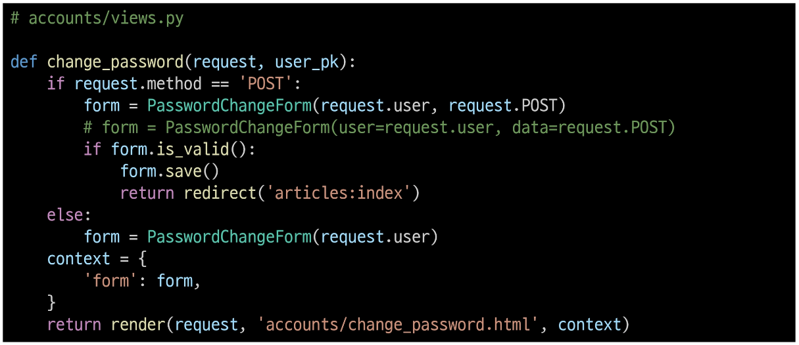   

### 세션 무효화 방지
- 암호 변경 시 세션 무효화
  - 비밀번호가 변경되면 기존 세션과의 회원 인증 정보가 일치하지 않게 되어 버려 로그인 상태가 유지되지 못하고 로그아웃 처리됨
  - 비밀번호가 변경되면서 기존 세션과의 회원 인증 정보가 일치하지 않기 때문
- `update_session_auth_hash(request, user)`
  - 암호 변경 시 세션 무효화를 막아주는 함수
  - 암호가 변경되면 새로운 password의 Session Data로 기존 session을 자동으로 갱신
  - update_session_auth_hash 적용  
    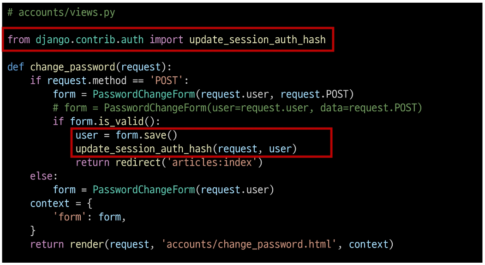   

 
## 인증된(로그인) 사용자에 대한 접근 제한
- 로그인 사용자에 대해 접근을 제한하는 2가지 방법
  - case 1. is_authenticated 속성
  - case 2. login_required 데코레이터

### is_authenticated 속성
- case 1. is_authenticated
  - 사용자가 인증 되었는지 여부를 알 수 있는 User model의 속성
  - 모든 User 인스턴스에 대해 항상 `True`인 `읽기 전용` 속성
  - `비인증 사용자`에 대해서는 항상 `False`
  - is_authenticated 적용하기
    - step 1 : 로그인과 비로그인 상태에서 화면에 출력되는 링크를 다르게 설정하기    
      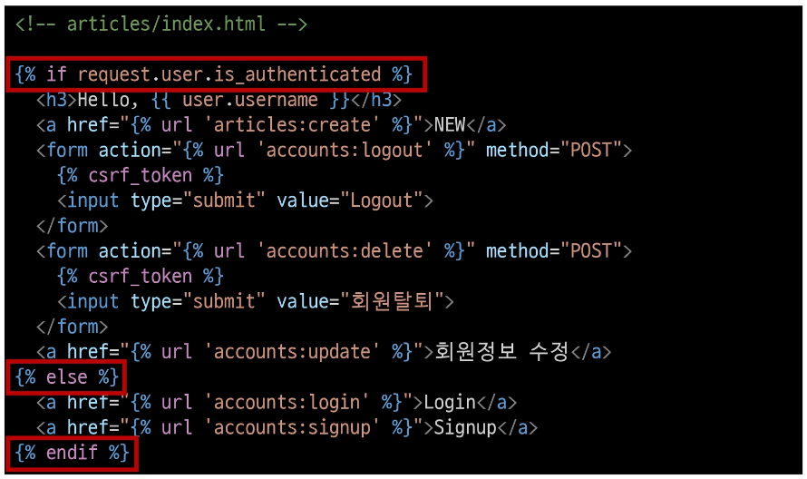   
    - step 2 : 인증된 사용자라면 로그인/회원가입 로직을 수행할 수 없도록 하기
      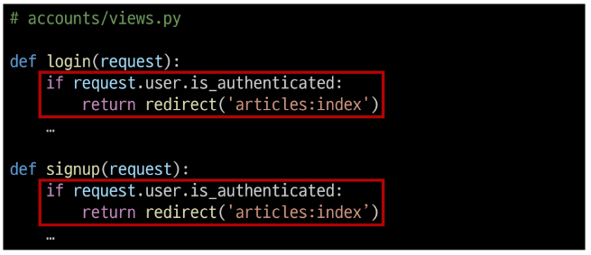   

### login_required 데코레이터
- case 2. login_required
  - `인증된 사용자`에 대해서만 `view 함수`를 실행시키는 데코레이터
  - `비인증 사용자`의 경우 `/accounts/login/` 주소로 `redirect` 시킴
  - login_required 적용하기
    - step 1 : 인증된 사용자만 게시글을 작성/수정/삭제 할 수 있도록 수정  
      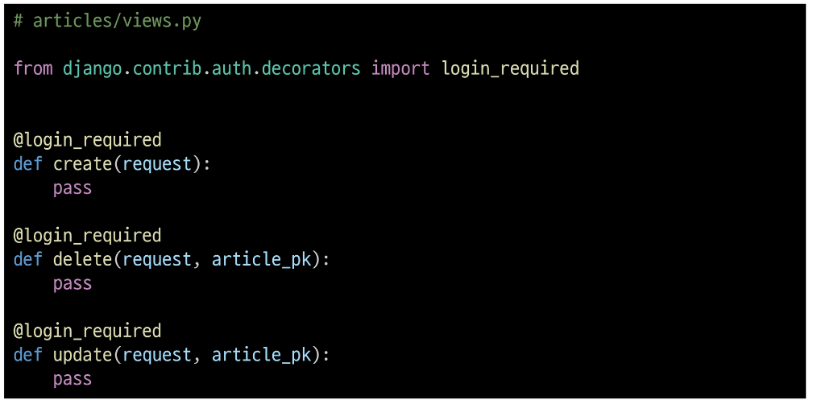   
    - step 2 : 인증된 사용자만 로그아웃/탈퇴/수정/비밀번호 변경 할 수 있도록 수정
      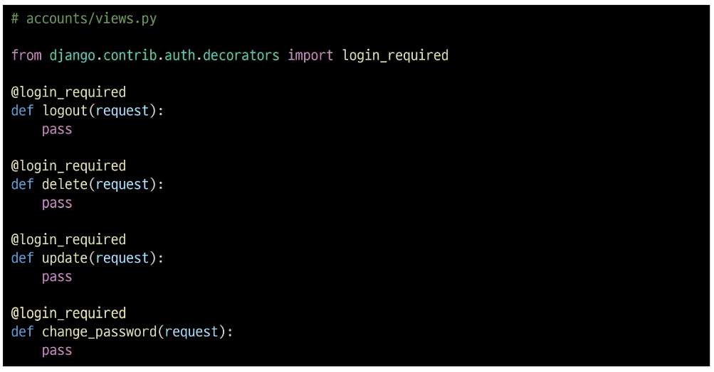   

|회원 가입  | 회원 탈퇴 | 
|:-----:|:-----:|
|  |  |
|회원정보 수정| 비밀번호 변경 |
||  |

|회원 가입  | 회원 탈퇴 | 회원정보 수정| 비밀번호 변경 |
|:----:|:----:|:----:|:----:|
|UserCreationForm()|request.user.delete()|UserChangeForm()|PasswordChangeForm()|
|built-in ModelForm||built-in ModelForm|built-in Form|
|model= User으로 재작성 필요||model= User으로 재작성 필요, 모든 fields 출력||
|CustomUserCreationForm||CustomUserChangeForm||

## 참고
### is_authenticated 코드
- is_authenticated 속성 코드
  - 메서드가 아닌 속성 값임을 주의
      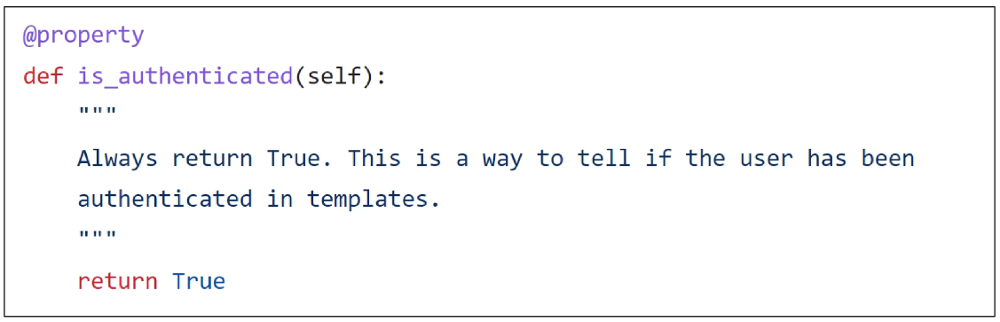  
- 참고 자료 : https://github.com/django/django/blob/main/django/contrib/auth/base_user.py#L85

### 회원가입 후 자동 로그인
- 회원가입 후 로그인까지 이어서 진행하려면?
  - 회원가입 성공한 user 객체를 활용해 login 진행
    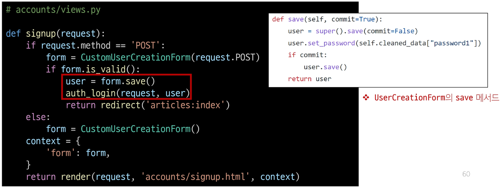  

### 회원 탈퇴 개선
- 탈퇴와 함께 기존 사용자의 Session Data 삭제 방법
  - 사용자 객체 삭제 이후 로그아웃 함수 호출
  - 단, '탈퇴(1) 후 로그아웃(2)'의 순서가 바뀌면 안됨
  - 먼저 로그아웃이 진행되면 해당 요청 객체 정보가 없어지기 때뭉네 탈퇴에 필요한 유저 정보 또한 없어지기 때문  
    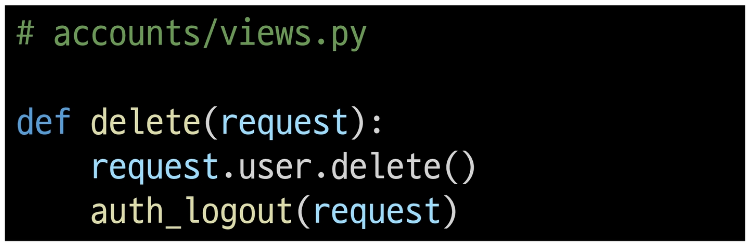  

### PasswordChangeForm 인자 순서
- PasswordChangeForm이 다른 Form과 달리 user 객체를 첫번째 인자로 받는 이유
- 부모 클래스인 SetPasswordForm의 생성자 함수 구성을 따르기 때문  
  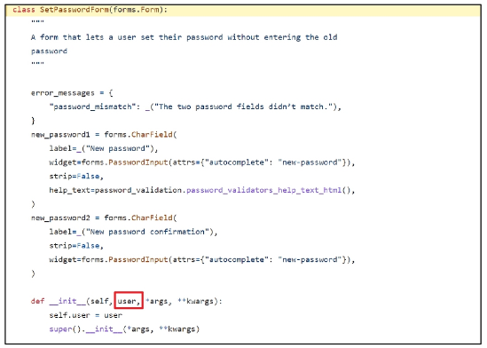  
- 참고 자료 : https://github.com/django/django/blob/4.2/django/contrib/auth/forms.py#L378 

### Auth built-in form 코드
- `UserCreationFrom()`
  - https://github.com/django/django/blob/4.2/django/contrib/auth/forms.py/#149 
- `UserChangeForm()`
  - https://github.com/django/django/blob/4.2/django/contrib/auth/forms.py/#170  
- `PasswordChangeFrom()`
  - https://github.com/django/django/blob/4.2/django/contrib/auth/forms.py/#422 