# git branch
## Branch
Git branch
- 나뭇가지처럼 여러 갈래로 작업 공간을 나누어 독립적으로 작업할 수 있도록 도와주는 Git의 도구
- 장점
  - 독립된 개발 환경을 형성하기 대문에 원본(master)에 대해 안전
    - 원본에서 개발을 진행하지 않는다.
  - 하나의 작업은 하나의 브랜치로 나누어 진행되므로 체계적으로 협업과 개발이 가능
  - 손쉽게 브랜치를 생성하고 브랜치 사이를 이동할 수 있음
- 꼭 사용해야 할까?
  - 만약 상용 중인 서비스에 발생한 에러를 해결하려면?
    1. 브랜치를 통해 별도의 작업 공간을 만든다
    2. 브랜치에서 에러가 발생한 버전을 이전 버전으로 되돌리거나 삭제한다.
    3. 브랜치는 완전하게 독립 되어 있어서 작업 내용이 master 브랜치에 아무런 영향을 끼치지 못한다.
    4. 이후 에러가 해결된다면? 그 내용을 master 브랜치에 반영할 수 있다.
- Master(main) 브랜치의 의미와 역할
  - 기본 브랜치(Default Branch)
    - 저장소의 초기 상태를 나타내며, 일반적으로 프로젝트의 가장 최신 버전 또는 배포 가능한 안정적인 코드를 포함
    - 항상 최신 버전을 가지고 있음
  - 기준점
    - 다른 브랜치가 파생되는 기준점으로 사용됨
  - 변경사항 통합
    - 다른 브랜치에서 작업한 기능이나 버그 수정을 완료한 후, 코드 리뷰와 테스트를 거쳐 master(또는 main) 브랜치에 병합
## Branch Command

### git branch
- 브랜치 조회, 생성, 삭제 등 브랜치와 관련된 git 명령어
- 📌 이동은 하지 않음
- 마스터에 합쳐지지 않은 브랜치는 `-d`로는 삭제되지 않고, `-D`를 사용하여 강제 삭제할 것
  
|명령어|기능|
|----|----|
|`git branch`|브랜치 목록 확인|
|`git branch -r`|원격 저장소의 브랜치 목록 확인|
|`git branch <브랜치 이름>`|새로운 브랜치 생성|
|`git branch -d <브랜치 이름>`|브랜치 삭제(병합된 브랜치만 삭제 가능)|
|`git branch -D <브랜치 이름>`|브랜치 삭제(강제 삭제)|

### git switch
- 현재 브랜치에서 다른 브랜치로 HEAD를 이동시키는 명령어

|명령어|기능|
|----|----|
|`git switch <다른 브랜치 이름>`|다른 브랜치로 전환|
|`git switch -c <다른 브랜치 이름>`|새 브랜치 생성 후 전환|
|`git switch -c <다른 브랜치 이름> <commit ID>`|특정 커밋에서 새 브런치 생성 후 전환|

- 주의사항
  - git switch 하기 전에, working directory 파일이 모두 버전 관리가 되고 있는지 반드시 확인해준다.
  - 상황 예시
    1. master 브랜치와 feature 브랜치가 존재
    2. Feature 브랜치에서 'article.txt'를 생성
    3. git add 하지 않고 git switch master 실행
  - 상황 결과 : feature 브랜치에서 생성한 article.txt가 master 브랜치에도 존재하게 됨
  - git의 브랜치는 독립적인 작업 공간을 갖지만, git이 관리하는 파일 트리에 제한됨
  - git add를 하지 않았던, 즉 staging area에 한 번도 올라가지 않은 새 파일은 git의 버전 관리를 받고 있지 않기 때문에 브랜치가 바뀌더라도 계속 유지
  - 그렇기 때문에 git switch를 하기 전, working directory의 모든 파일이 버전 관리 중 인지 확인 필요 

### HEAD
- 현재 브랜치나 commit을 가리키는 포인터
- 현재 내가 바라보는 위치


## Branch Scenario
- 사전준비
  1. git-branch-practice 폴더 생성 `$ mkdir git-branch-practice`
  2. 생성한 폴더로 이동 `$ cd git-branch-practice`
  3. VSCode 실행 `$ code .`
  4. Git 저장소 생성 `$ git init`
  5. article.txt 생성 `$ touch article.txt`
  6. 각각 master-1, master-2, master-3이라는 내용을 순서대로 입력하여 commit 3개 작성
     ```bash
     # article.txt에 master-1 작성
     $ git add .
     $ git commit -m "master-1"
     # article.txt에 master-2 작성
     $ git add .
     $ git commit -m "master-2"
     # article.txt에 master-3 작성
     $ git add .
     $ git commit -m "master-3"
     ``` 
  7. master 브랜치의 commit 목록 확인
     ```bash
     $ git log --oneline
     0604dcd (HEAD -> master) master 3
     9c22c89 master-2
     3d71510 master-1
     ``` 
- commit 진행 방향과 화살표 표기 방향이 다른 이유
  -  commit은 이전 commit 이후에 변경사항만을 기록한 것
  -  즉, 이전 commit에 종속되어 생성됨
  -  일반적으로 화살표 방향을 `이전 commit을 가리키도록 표기`
  -  변경사항만을 기록한 것이기 때문에 '종속성'이 있음

### Branch 생성 및 조회
- 현재 위치(master 브랜치의 최신 commit)에서 login 브랜치 생성 `$ git branch login`
- login 브랜치 생성 확인 `$ git branch`
  ```bash
  $ git branch login
  $ git branch
    login
  * master
  ```
    - master의 의미는 현재 HEAD가 가리키는 브랜치가 'master'라는 뜻
- master 브랜치에서 commit을 1개 더 작성
  ```bash
  # article.txt에 master-4 작성
  $ git add .
  $ git commit -m "master-4" 
  ```
- 현재 브랜치와 commit의 상태 확인
  ```bash
  $ git log --oneline
  5ca7701 (HEAD -> master) master 4
  0604dcd (login) master 3
  9c22c89 master-2
  3d71510 master-1
  ``` 

### Branch 이동
- 현재 브랜치와 commit의 상태 확인하기
  - 이때 Login 브랜치로 이동하면 article.txt에 어떤 일이 일어날까?
- master 브랜치에서 article.txt에 작성한 master-4가 사라짐
  - 삭제된 것이 아니라 login 기준으로 보이는 것
  - 만약 커밋 로그를 다 보고싶다면 `git log --online --all`

### Branch에서 Commit 생성
- login 브랜치에서 article.txt 파일 수정
- article.txt 파일에 login-1 작성
- 추가적으로 test_login.txt도 생성하고 login-1이라고 작성
- commit 생성  
   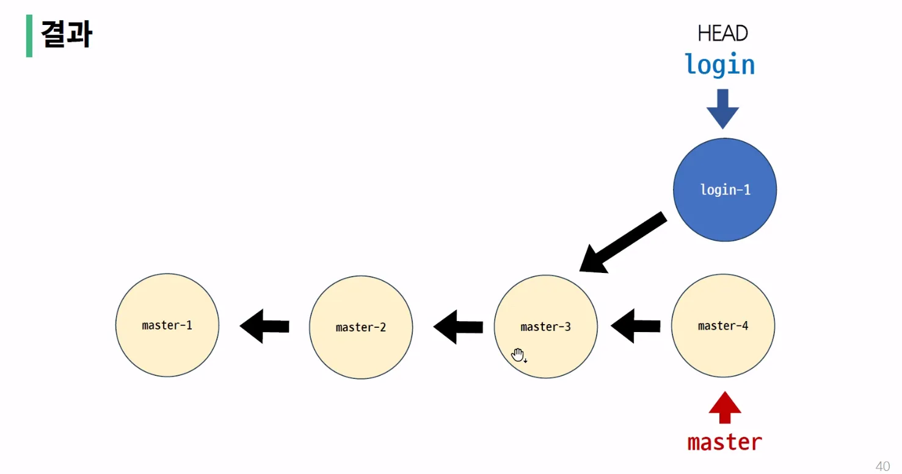
- `--graph` 옵션을 활용해 전체 commit 목록 확인
-  master 브랜치와 login 브랜치가 다른 갈래로 갈라진 것을 확인

### git branch 정리
- 브랜치의 이동은 HEAD가 특정 브랜치를 가리킨다는 것
- 브랜치는 가장 최신 commit을 가리키므로 HEAD가 해당 브랜치의 최신 commit을 가리킴
- 즉, working directory의 내용도 HEAD가 가리키는 브랜치의 최신 commit 상태로 변화하는 것

## Git Merge
- 두 브랜치는 하나로 병합(결합)
  - `git merge <병합 브랜치 이름>`
- 병합 전 확인 및 주의사항
  1. 수신 브랜치(병합 브랜치를 가져오고자 하는 브랜치) 확인하기
     - git branch 명령어를 통해 HEAD가 올바른 수신 브랜치를 가리키는지 확인
     - 병합 진행 위치는 반드시 `수신 브랜치`에서 진행되어야 함
  2. 최신 commit 상태 확인하기
     - 수신 브랜치와 병합 브랜치 모두 최신 상태인지 확인
- Merge 종류
  1. Fast-Forward Merge
  2. 3-Way Merge
  
### Fast-Forward Merge
- 브랜치를 '실제로' 병합하는 대신 현재 브랜치 상태를 대상 브랜치 상태로 이동시키는 작업(빨리 감기)
  - **merge 과정 없이 단순히 브랜치의 포인터가 앞으로 이동**
- 동작 원리  
  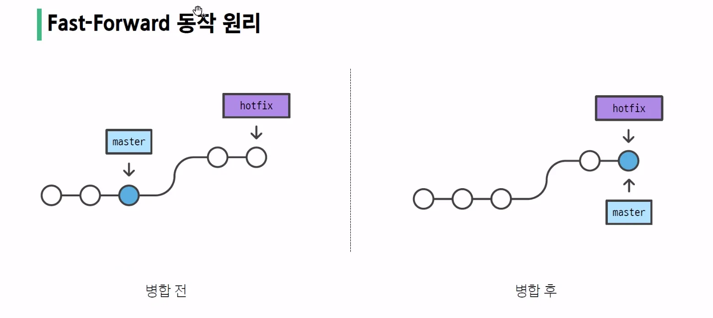
- 사전 준비
  - fast-forward-practice 폴더 생성 `$ mkdir fast-forward-practice`
  - 생성한 폴더로 이동 `$ cd fast-forward-practice`
  - VSCode 실행 `$ code .`
  - Git 저장소 생성 `$ git init`
  - article.txt 생성 `$ touch article.txt`
  - 각각 master-1, master-2 이라는 내용을 순서대로 입력하여 commit 2개 작성
     ```bash
     # article.txt에 master-1 작성
     $ git add .
     $ git commit -m "c1"
     # article.txt에 master-2 작성
     $ git add .
     $ git commit -m "c2"
     ``` 
- 사진의 왼쪽 상황을 만듦
  ```bash
  # c2 commit을 기준으로 hotfix 브랜치 생성
  $ git branch hotfix
  # hotfix 브랜치로 이동
  $ git switch hotfix
  # 혹은 생성 및 이동을 동시에 진행
  $ git switch -c hotfix
  # article.txt에 hotfix-3 작성
  $ git add .
  $ git commit -m "c3"
  # article.txt에 hotfix-4 작성
  $ git add .
  $ git commit -m "c4"
  ``` 
- 병합 과정
  ```bash
  # 수신 브랜치 : master
  # 병합 브랜치 : hotfix

  # 수신 브랜치로 이동
  $ git switch master

  # 병합 진행
  $ git merge hotfix

  Updating 41223a6..414f2f4
  Fast-forward
    article.txt | 4+++-
    1 files changed, 3 insertions(+), 1 deletions(-)
  ``` 
- 마무리 : 병합 완료된 브랜치는 삭제 `$ git branch -d hotfix`
  - 꼭 삭제 해줄것, 개발자의 암묵적 룩
  - 강제 삭제를 안해줘도 되기 때문에 대문자로 쓸 필요가 없음

### 3-way Merge
- 병합하는 각 브랜치의 commit 2개와 공통 조상 commit 하나를 사용하여 병합하는 작업
- 동작 원리  
  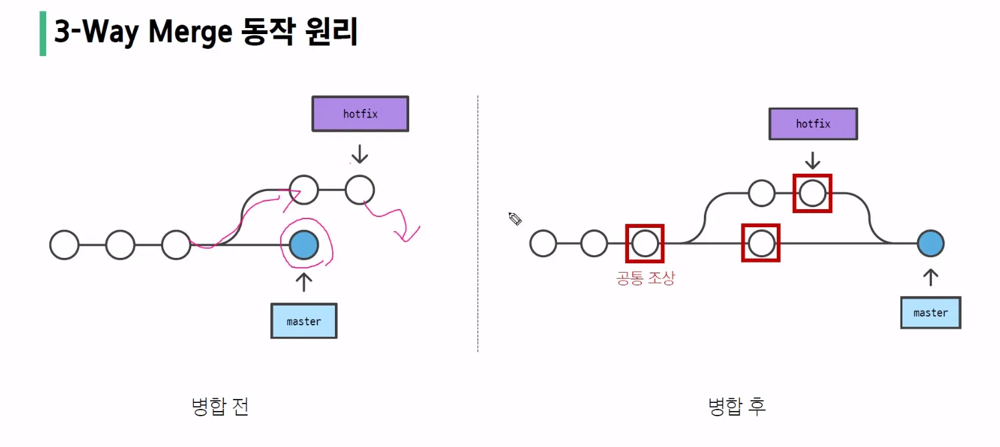
- 사전 준비
  - 3-way-merge-practice 폴더 생성 `$ mkdir 3-way-merge-practice`
  - 생성한 폴더로 이동 `$ cd 3-way-merge-practice`
  - VSCode 실행 `$ code .`
  - Git 저장소 생성 `$ git init`
  - article.txt 생성 `$ touch article.txt`
  - 각각 master-1, master-2 이라는 내용을 순서대로 입력하여 commit 2개 작성
     ```bash
     # article.txt에 master-1 작성
     $ git add .
     $ git commit -m "c1"
     # article.txt에 master-2 작성
     $ git add .
     $ git commit -m "c2"
     ``` 
- 사진의 왼쪽 상황을 만듦
  ```bash
  # hotfix 생성 및 이동
  $ git switch -c hotfix
  # article.txt에 hotfix-3 작성
  $ git add .
  $ git commit -m "c3"
  # article.txt에 hotfix-4 작성
  $ git add .
  $ git commit -m "c4"
  # master 브랜치로 이동
  $ git switch master
  # article.txt에 master-3 작성 후 commit 생성
  $ git add .
  $ git commit -m "c5"
  ``` 
- 병합
  - hotfix 브랜치를 master 브랜치로 병합 진행
    ```
    # 수신 브랜치 : master
    # 병합 브랜치 : hotfix
    # 병합 진행
    $ git merge hotfix
    Merge made by the 'ort' strategy.
      article.txt | 1 +
      1 file changed, 1 insertion(+)
      create mode 100644 article.txt
    ```
- vim editor가 뜨면 기본적으로 커밋 메세지를 추천해주기 때문에 입력하지 말고 종료해주면 됨
  - 입력 모드 : `i`
  - 입력 모드 -> 병합 모드 전환 : `esc` -> `:wq`
- 병합 결과     
  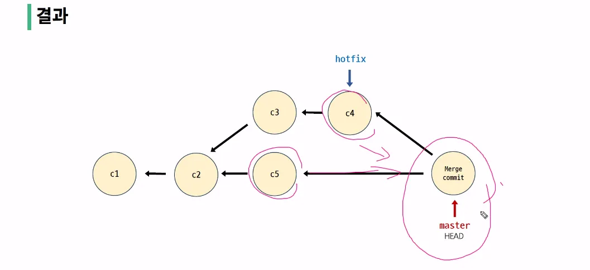
- 병합 완료된 브랜치는 삭제 `$ git branch -d hotfix`


### Merge Conflict
- 병합하려는 두 브랜치가 "동일한 파일의 동일한 부분"에서 변경된 후 병합 시 충돌이 발생하는 것
- git이 충돌을 표시하는 방식
  - 시각적 마커
    - <<<<<<<  
    - =======
    - >>>>>>> 
    ```py
    <<<<<<< master
    master 브랜치에서 작성한 부분 (수신 브랜치)
    =======
    hotfix 브랜치에서 작성한 부분 (병합 브랜치)
    >>>>>>> hotfix;
    ```
- git 충돌을 해결하는 과정 (병합 충돌은 3-way merge인 경우에만 발생)
  1. 충돌하는 부분을 확인한 후에는 원하는 대로 충돌 내용을 수정
  2. 병합을 완료할 준비가 되면 충돌하는 파일에서 `git add 명령`을 실행
  3. 그런 다음 `git commit을 실행`하여 `merge commit을 생성`
- 예시
  1. merge-conflict-practice 폴더 생성 `$ mkdir merge-conflict-practice`
  2. 생성한 폴더로 이동 `$ cd merge-conflict-practice`
  3. VSCode 실행 `$ code . `
  4. Git 저장소 생성
  5. article.txt 생성 `$ touch article.txt`
  6. 각각 master-1, master-2 이라는 내용을 순서대로 입력하여 commit 2개 작성  
      ```bash
      # article.txt에 master-1 작성
      $ git add .
      $ git commit -m "c1"
      # article.txt에 master-2 작성
      $ git add .
      $ git commit -m "c2"
      ```

     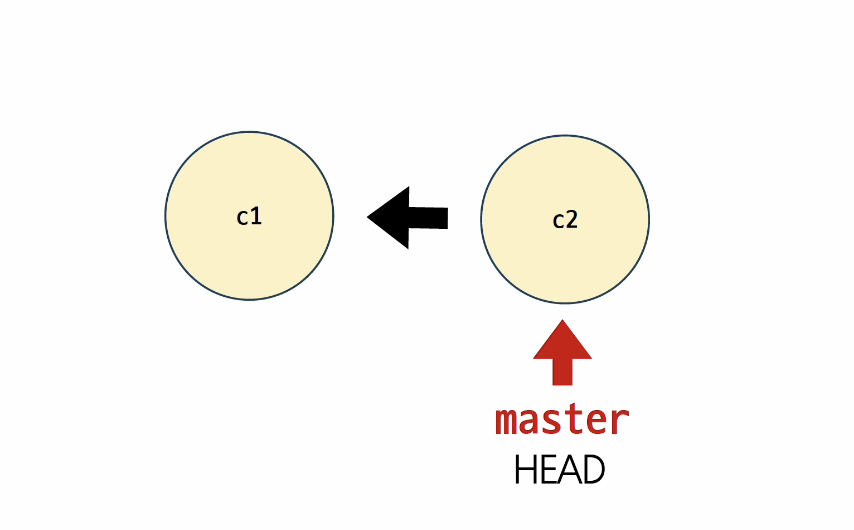  
  
  7. hotfix 생성 `git branch hotfix`  
     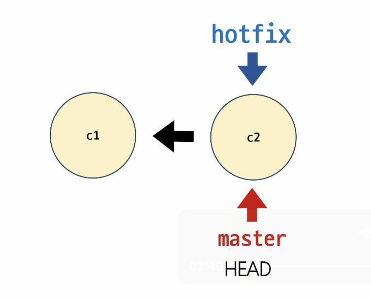   
  
  8. article.txt 생성 `$ touch article.txt`
  
  9. 각각 master-3, master-4 이라는 내용을 순서대로 입력하여 commit 2개 작성  
      ```bash
      # article.txt에 master-3 작성
      $ git add .
      $ git commit -m "c3"
      # article.txt에 master-4 작성
      $ git add .
      $ git commit -m "c4"
      ```

      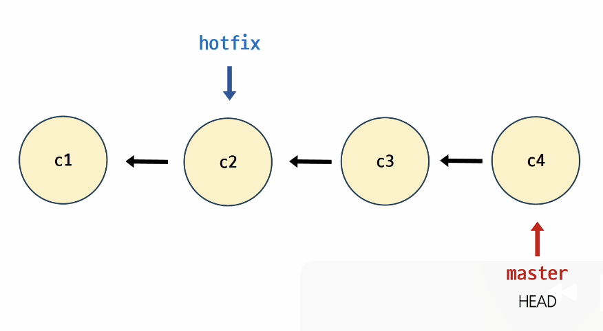  

  10. hotfix 브랜치로 이동 `git switch hotfix`
  11. article.txt 3번째 라인에 hotfix-1 작성  
      ```bash
      $ git add .
      $ git commit -m "c5"
      ``` 
      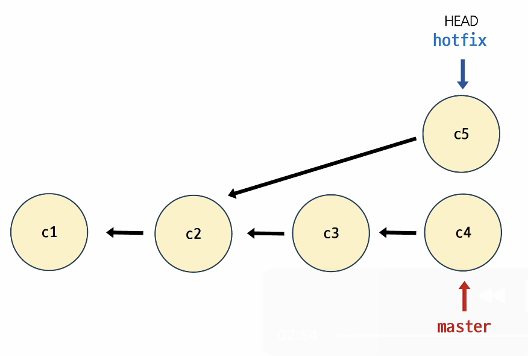  

  12. master 브랜치로 이동하고 hotfix 브랜치 병합 진행, 충돌 확인  
     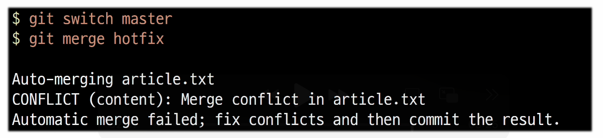

  13. 충돌 후 VSCode 화면 확인. 충돌 영역을 원하는 내용으로 변경해야 함    
     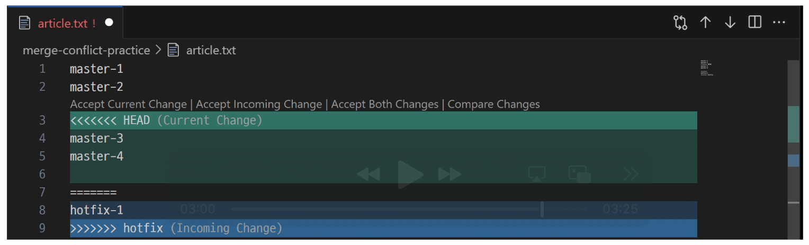  

  14. git status를 사용해 확인. 충돌이 일어난 article.txt 파일의 both modified 상태 확인  
     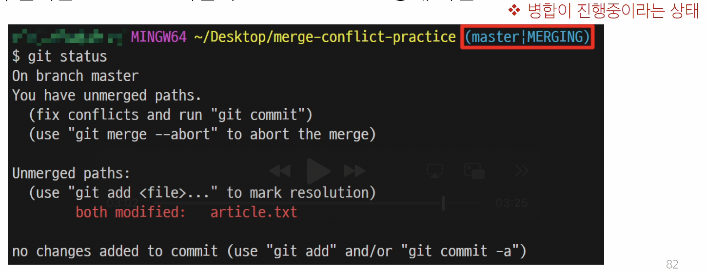  

  15. article.txt 파일 수정  
     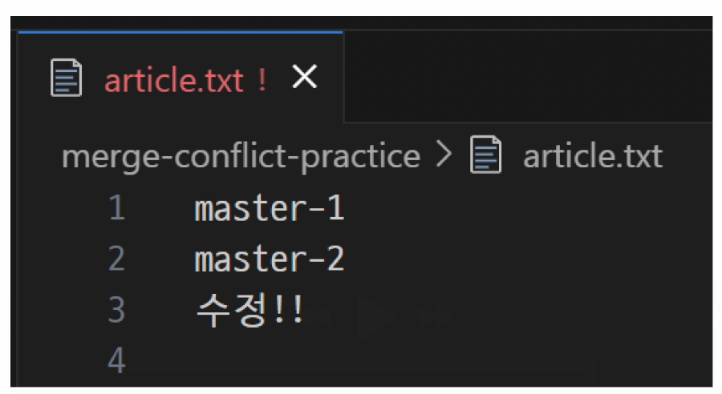  

  16. git add 진행 후 status 확인    
       

  17. git commit 진행 후 vim 에디터 실행 확인  
     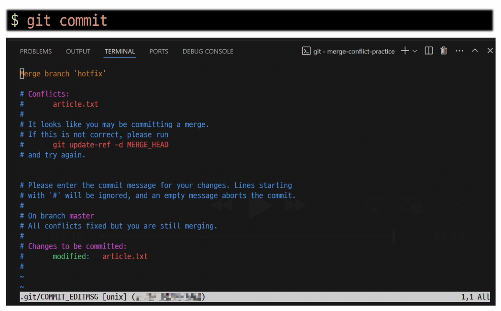  
  
  18. merge commit에 대한 commit 메시지를 작성하기 위한 vim 에디터가 실행되는 것
      1.  기본적으로 git이 지정한 commit 메세지가 작성되어 있음
      2.  필요에 따라 commit 메시지를 수정 가능
      3.  수정 없이 진행하려면 :wq를 입력 후 enter를 클릭해 저장 및 종료
  
  19. 충돌 해결 후 commit 목록 확인  
     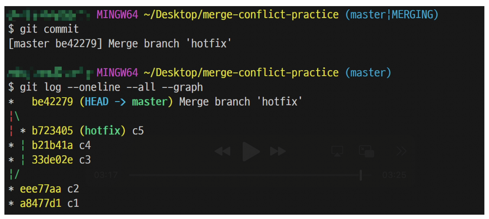
  
  20. 병합 완료된 브랜치 삭제 `$ git branch -d hotfix`

- 병합 결과  
   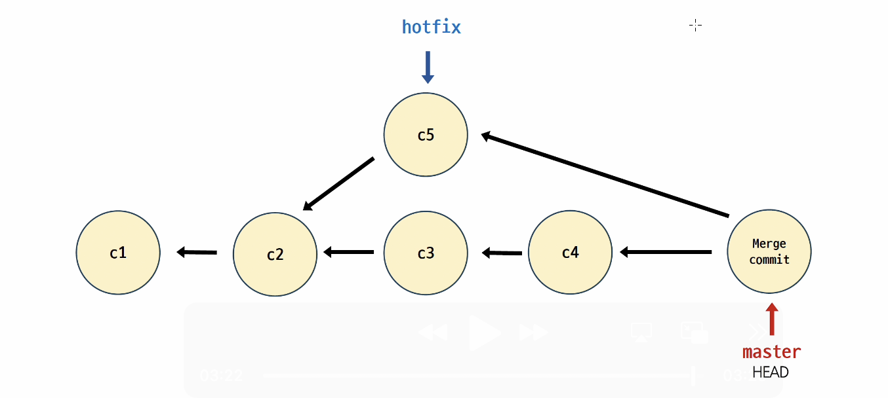
