<!-- TOC start (generated with https://github.com/derlin/bitdowntoc) -->

- [Bootstrap](#bootstrap)
  - [CDN](#cdn)
  - [Bootstrap CDN](#bootstrap-cdn)
  - [Bootstrap 사용 가이드](#bootstrap-사용-가이드)
- [Reset CSS](#reset-css)
  - [Normalize CSS](#normalize-css)
- [Bootstrap 활용](#bootstrap-활용)
  - [Typography](#typography)
    - [Display headings](#display-headings)
    - [Inline text elements](#inline-text-elements)
    - [Lists](#lists)
  - [Colors](#colors)
    - [text colors](#text-colors)
    - [background colors](#background-colors)
  - [Component](#component)
- [Semantic Web](#semantic-web)
  - [Semantic in HTML](#semantic-in-html)
  - [Semantic in CSS](#semantic-in-css)
- [Reference](#reference)
  - [CDN 없이 사용하기](#cdn-없이-사용하기)
  - [의미론적 마크업이 필요한 이유](#의미론적-마크업이-필요한-이유)

<!-- TOC end -->


# Bootstrap
CSS 프론트엔드 프레임워크(Toolkit)  
➡ 미리 만들어진 다양한 디자인 요소들을 제공하여 웹 사이트를 빠르고 쉽게 개발할 수 있도록 함

📌 Bootstrap 사용해보기
1. [Bootstrap 공식 문서 접속](https://getbootstrap.com/)
2. Docs ➡ Introduction ➡ Quick Start
3. "Include Bootstrap's CSS and JS" 코드 확인 및 가져오기
   1. https://getbootstrap.com/docs/5.3/getting-started/introduction/#quick-start
   2. head와 body에 bootstrap CDN이 포함된 코드 블록
      ```html
      <!doctype html>
      <html lang="en">
        <head>
          <meta charset="utf-8">
          <meta name="viewport" content="width=device-width, initial-scale=1">
          <title>Bootstrap demo</title>
          <link href="https://cdn.jsdelivr.net/npm/bootstrap@5.3.3/dist/css/bootstrap.min.css" rel="stylesheet" integrity="sha384-QWTKZyjpPEjISv5WaRU9OFeRpok6YctnYmDr5pNlyT2bRjXh0JMhjY6hW+ALEwIH" crossorigin="anonymous">
        </head>
        <body>
          <h1>Hello, world!</h1>
          <script src="https://cdn.jsdelivr.net/npm/bootstrap@5.3.3/dist/js/bootstrap.bundle.min.js" integrity="sha384-YvpcrYf0tY3lHB60NNkmXc5s9fDVZLESaAA55NDzOxhy9GkcIdslK1eN7N6jIeHz" crossorigin="anonymous"></script>
        </body>
      </html>
      ```

## CDN
📍 Content Delivery Network  
지리적 제약 없이 빠르고 안전하게 콘텐츠를 전송할 수 있는 전송 기술 (위에서 link 부분!)
- 서버와 사용자 사이의 물리적인 거리를 줄여 콘텐츠 로딩에 소요되는 시간을 최소화(웹 페이지 로드 속도를 높임)
- 지리적으로 사용자와 가까운 CDN 서버에 콘텐츠를 저장해서 사용자에게 전달  <p align='center'>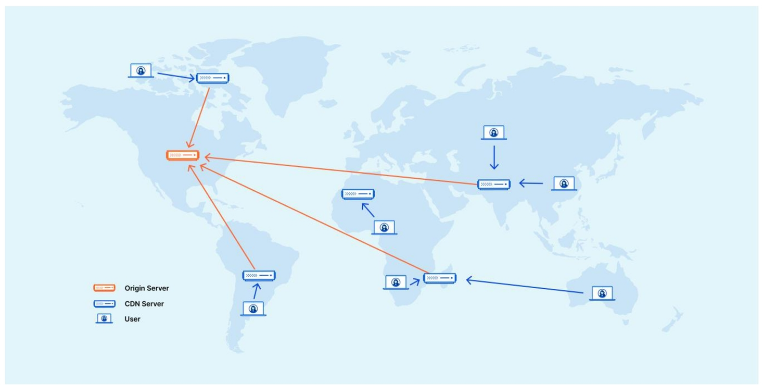</p>

## Bootstrap CDN
1. Bootstrap 홈페이지 - Download - "Compiled CSS and JS" 다운로드
2. CDN을 통해 가져오는 Bootstrap CSS와 js 파일을 확인
3. bootstrap.css, bootstrap.js 파일 참고  
➡ 온라인 CDN 서버에 업로드 된 css 및 js 파일을 불러와 사용하는 것

## Bootstrap 사용 가이드
```html
<p class="mt-5">Hello, world!</p>
```
<p align='center'>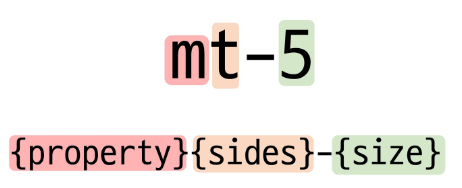</p>
margin-top-5

[Bootstrap에서 클래스 이름으로 Spacing을 표현하는 방법](https://getbootstrap.com/docs/5.3/utilities/spacing/#margin-and-padding)
<p align='center'>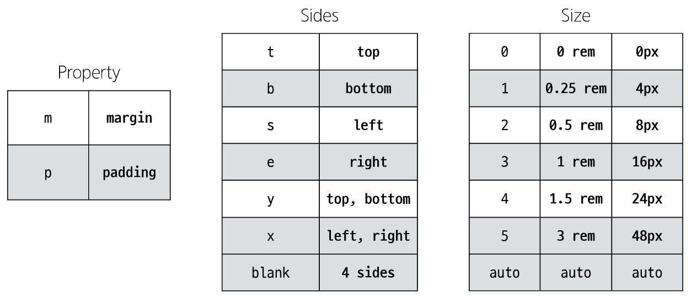</p>  

- rem : root em
  - root : 브라우저의 기본 폰트 사이즈 (ex: 16px) (브라우저, 디바이스마다 다름)
  - 그거에 대한 상대 사이즈가 rem
  - 픽셀 단위로 쓰면 어떠한 모니터에선 크고 작을 수 가 있음(모니터의 픽셀에 따라가서)
 
> Bootstrap에는 특정한 규칙이 있는 클래스 이름으로 스타일 및 레이아웃이 미리 작성되어 있음

# Reset CSS
Bootstrap 적용 전/후 비교  <p align='center'>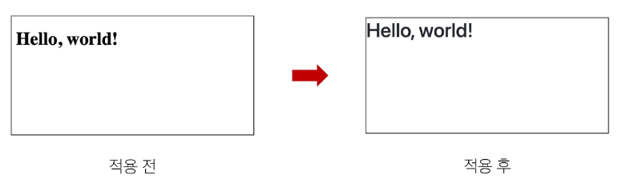</p>  

모든 HTML 요소 스타일을 일관된 기준으로 재설정하는 간결하고 압축된 규칙 세트  
➡ HTML Element, Table, List 등의 요소들에 일관성 있게 스타일을 적용 시키는 기본 단계

📌  Reset CSS 사용 배경
- 모든 브라우저는 각자의 `user agent stylesheet`를 가지고 있음
  - 웹 사이트를 보다 읽기 편하게 하기 위해
- 문제는 이 설정이 브라우저마다 상이하다는 것
- 모든 브라우저에서 웹사이트를 동일하게 보이게 만들어야 하는 개발자에겐 매우 골치 아픈 일  
➡ 모두 똑같은 스타일 상태로 만들고 스타일 개발을 시작하자!

📌 User-agent stylesheets  
모든 문서에 기본 스타일을 제공하는 기본 스타일 시트  <p align='center'>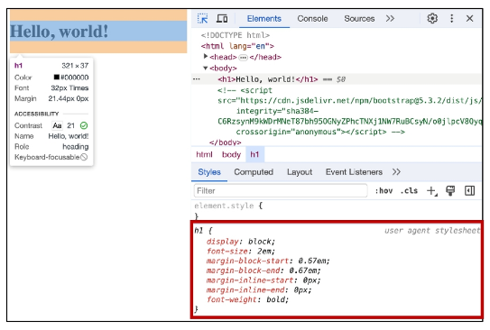</p>   

## Normalize CSS
- Reset CSS 방법 중 대표적인 방법
- 웹 표준 기준으로 브라우저 중 하나가 불일치 한다면 차이가 있는 브라우저를 수정하는 방법
  - 경우에 따라 IE 또는 EDGE 브라우저는 표준에 따라 수정할 수 없는 경우도 있는데, 이 경우 IE 또는 EDGE의 스타일을 나머지 브라우저에 적용시킴

📌 Bootstrap에서의 Reset CSS
- Bootstrap은 `bootstrap-reboot.css`라는 파일명으로 normalize.css를 자체적으로 커스텀해서 사용하고 있음

# Bootstrap 활용
## Typography
제목, 본문 텍스트, 목록 등
[typography](https://getbootstrap.com/docs/5.3/content/typography/)

### Display headings
기존 Heading보다 더 눈에 띄는 제목이 필요할 경우 (더 크고 약간 다른 스타일)

```html
<!-- Display Heading -->
<h1 class="display-1">Display 1</h1>
<h1 class="display-2">Display 2</h1>
<h1 class="display-3">Display 3</h1>
<h1 class="display-4">Display 4</h1>
<h1 class="display-5">Display 5</h1>
<h1 class="display-6">Display 6</h1>
```

### Inline text elements
HTML inline 요소에 대한 스타일  <p align='center'>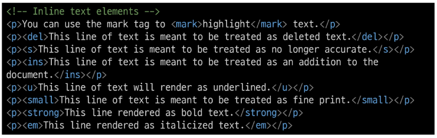</p>   

### Lists
HTML Lists 요소에 대한 스타일   <p align='center'>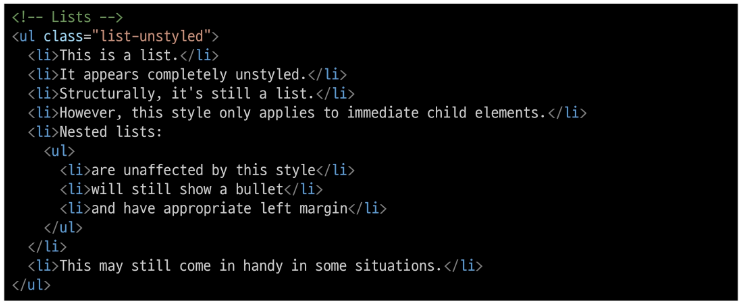</p>   


## Colors
📍 Bootstrap Color system  
Bootstrap이 지정하고 제공하는 색상 시스템  

📍 [Colors](https://getbootstrap.com/docs/5.3/utilities/colors/#colors)  
text, border, background 및 다양한 요소에 사용하는 bootstrap의 색상 키워드  <p align='center'></p>   

### text colors
```html
<!-- text colors -->
<p class="text-primary">.text-primary</p>
<p class="text-primary-emphasis">.text-primary-emphasis</p>
<p class="text-secondary">.text-secondary</p>
<p class="text-secondary-emphasis">.text-secondary-emphasis</p>
<p class="text-success">.text-success</p>
<p class="text-success-emphasis">.text-success-emphasis</p>
<p class="text-danger">.text-danger</p>
<p class="text-danger-emphasis">.text-danger-emphasis</p>
<p class="text-warning bg-dark">.text-warning</p>
<p class="text-warning-emphasis">.text-warning-emphasis</p>
<p class="text-info bg-dark">.text-info</p>
<p class="text-info-emphasis">.text-info-emphasis</p>
<p class="text-light bg-dark">.text-light</p>
<p class="text-light-emphasis">.text-light-emphasis</p>
<p class="text-dark bg-white">.text-dark</p>
<p class="text-dark-emphasis">.text-dark-emphasis</p>
```

### background colors
[background colors](https://getbootstrap.com/docs/5.3/utilities/background/#background-color)
```html
<!-- background colors -->
<div class="p-3 mb-2 bg-primary text-white">.bg-primary</div>
<div class="p-3 mb-2 bg-primary-subtle text-primary-emphasis">.bg-primary-subtle</div>
<div class="p-3 mb-2 bg-secondary text-white">.bg-secondary</div>
<div class="p-3 mb-2 bg-secondary-subtle text-secondary-emphasis">.bg-secondary-subtle</div>
<div class="p-3 mb-2 bg-success text-white">.bg-success</div>
<div class="p-3 mb-2 bg-success-subtle text-success-emphasis">.bg-success-subtle</div>
<div class="p-3 mb-2 bg-danger text-white">.bg-danger</div>
<div class="p-3 mb-2 bg-danger-subtle text-danger-emphasis">.bg-danger-subtle</div>
<div class="p-3 mb-2 bg-warning text-dark">.bg-warning</div>
<div class="p-3 mb-2 bg-warning-subtle text-warning-emphasis">.bg-warning-subtle</div>
<div class="p-3 mb-2 bg-info text-dark">.bg-info</div>
<div class="p-3 mb-2 bg-info-subtle text-info-emphasis">.bg-info-subtle</div>
<div class="p-3 mb-2 bg-light text-dark">.bg-light</div>
<div class="p-3 mb-2 bg-light-subtle text-light-emphasis">.bg-light-subtle</div>
<div class="p-3 mb-2 bg-dark text-white">.bg-dark</div>
<div class="p-3 mb-2 bg-dark-subtle text-dark-emphasis">.bg-dark-subtle</div>
<div class="p-3 mb-2 bg-body-secondary">.bg-body-secondary</div>
<div class="p-3 mb-2 bg-body-tertiary">.bg-body-tertiary</div>
<div class="p-3 mb-2 bg-body text-body">.bg-body</div>
<div class="p-3 mb-2 bg-black text-white">.bg-black</div>
<div class="p-3 mb-2 bg-white text-dark">.bg-white</div>
<div class="p-3 mb-2 bg-transparent text-body">.bg-transparent</div>
```

## Component
Bootstrap에서 제공하는 **UI 관련 요소** ➡ 버튼, 네비게이션 바, 카드, 폼, 드롭다운 등
일관된 디자인을 제공하여 웹 사이트의 구성 요소를 구축하는 데 유용하게 활용

- Alerts
- Badges
- Buttons
- Cards
- Navbar

[예시 코드](https://github.com/waterhyun/TIL/blob/master/web/05-fundamentals-of-bootstrap/04-components.html)

[carousel 예시 코드](https://github.com/waterhyun/TIL/blob/master/web/05-fundamentals-of-bootstrap/05-carousel.html)

`data-bs-target="#carouselExample"` id 속성 값과 각 버튼의 data-bs-target 속성 값이 각각 올바르게 일치하는지 확인(그렇지 않으면 작동이 올바르지 않을 수 있음) ➡ carousel뿐만 아니라 상호작용하는 것들의 경우 잘 파악하기!

[modal 예시 코드](https://github.com/waterhyun/TIL/blob/master/web/05-fundamentals-of-bootstrap/06-modal.html)

- modal id 속성 값과 각 버튼의 data-bs-target 속성 값이 각각 올바르게 일치하는지 확인
- modal 버튼과 modal 본체가 함께 다닐 필요 없다.
- modal 본체는 버튼을 눌러야만 활성화되는 코드이기 때문에 코드 최하단에 모아두는 것을 권장
  - 깊은 속에 있으면 안 눌릴 수도 있으니(다른 레이아웃에 깔림) modal의 경우 맨 아래에 배치하는 게 좋음

# Semantic Web
웹 데이터를 **의미론적**으로 구조화된 형태로 표현하는 방식  
"이 요소가 시각적으로 어떻게 보여질까?" ➡ "이 요소가 가진 목적과 역할은 무엇일까?"

## Semantic in HTML
HTML 요소가 의미를 가진다는 것
```html
<p style="font-size: 30px;">Heading</p>
```
- 단순히 제목처럼 보이게 큰 글자로 만드는 것

```html
<h1>Heading<h1>
```
'페이지 내 최상위 제목'이라는 의미를 제공하는 요소 h1 ➡ 브라우저에 의해 스타일이 지정됨

📌 HTML Semantic Element  
기본적인 모양과 기능 이외에 의미를 가지는 HTML 요소
➡ 검색 엔진 및 개발자가 웹 페이지 콘텐츠를 이해하기 쉽도록

semantic element 사용 예시  <p align='center'>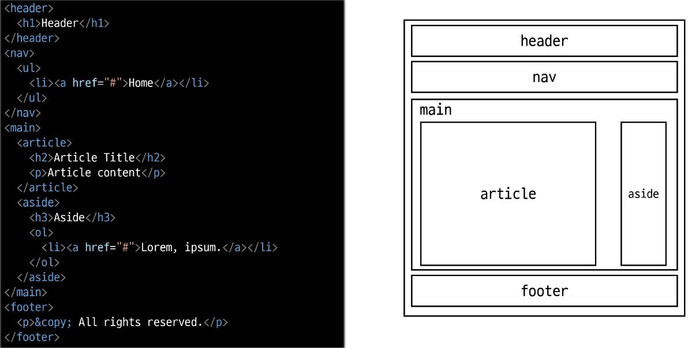</p> 

대표적인 semantic element ➡ 기능상 div랑 똑같음(block)
- header
- nav
- main
- article
- section
- aside
- footer


## Semantic in CSS
📍 CSS 방법론  
CSS를 효율적이고 유지 보수가 용이하게 작성하기 위한 일련의 가이드라인 ➡ 규칙은 아니다

[예시](https://github.com/waterhyun/TIL/blob/master/web/06-semantic-web/01-semantic-element.html)

📍 OOCSS(Object Oriented CSS)  
객체 지향적 접근법을 적용하여 CSS를 구성하는 방법론

[예시](https://github.com/waterhyun/TIL/blob/master/web/06-semantic-web/02-oocss.html)

OOCSS 기본 원칙
1. 구조와 스킨을 분리
   - 구조와 스킨을 분리함으로써 재사용 가능성을 높임
   - 모든 버튼의 **공통** 구조를 정의 + 각각의 스킨(배경색과 폰트 색상)을 정의  <p align='center'>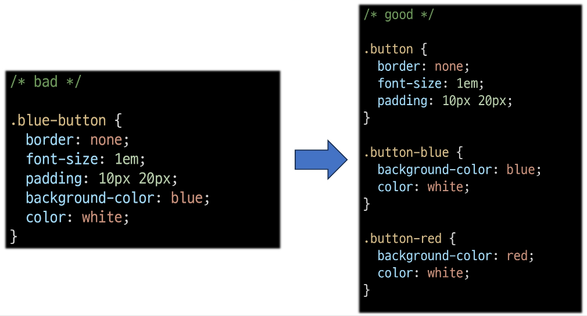</p> 

2. 컨테이너와 콘텐츠를 분리
   - 객체에 직접 적용하는 대신 객체를 둘러싸는 컨테이너에 스타일을 적용
   - 스타일을 정의할 때 위치에 의존적인 스타일을 사용하지 않도록 함
   - 콘텐츠를 다른 컨테이너로 이동시키거나 재배치할 때 스타일이 깨지는 것을 방지  
   - OOCSS 적용 예시  <p align='center'>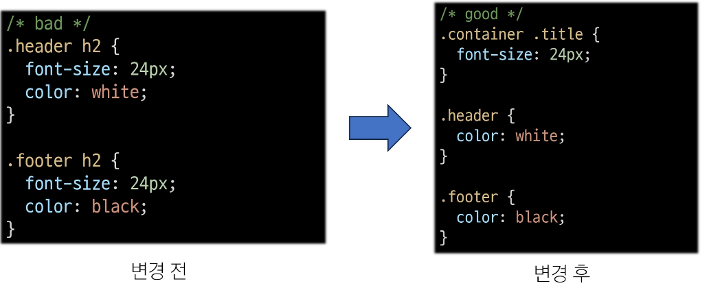</p> 
     - 변경 전
       - `.header`와 `.footer` 클래스가 폰트 크기와 색 둘 다 영향을 주고 있음
     - 변경 후  
       - `.container .title`은 폰트 크기 담당 (콘텐츠 스타일)
       - `.header`와 `.footer`는 폰트 색 담당 (컨테이너 스타일)  
    |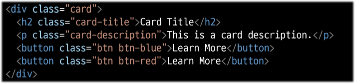|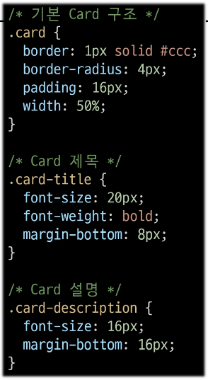|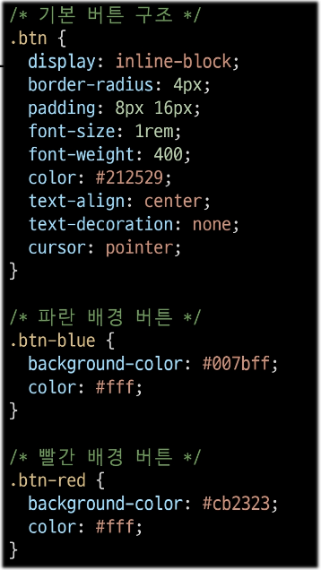|


# Reference
Bootstrap을 사용하는 이유
- 가장 많이 사용되는 CSS 프레임 워크
- 사전에 디자인된 다양한 컴포넌트 및 기능
  - 빠른 개발과 유지보수
- 손쉬운 반응형 웹 디자인 구현
- 커스터미이징(customizing)이 용이
- 크로스 브라우징(cross browsing) 지원
  - 모든 주요 브라우저에서 작동하도록 설계되어 있음

## CDN 없이 사용하기
- Bootstrap 코드 파일을 다운받아 활용
  1. bootstrap 코드 파일 [다운로드](https://getbootstrap.com/docs/5.3/getting-started/download/)
  2. bootstrap.css와 bootstrap.bundle.js만 선택
  3. css파일은 html head 태그에 가져와서 사용
  4. js파일은 html body 태그에 가져와서 사용
- 파일별 포함된 기능이 다르므로 [공식 문서](https://getbootstrap.com/docs/5.3/getting-started/contents/)를 통해 확인
- 파일 배치 및 불러오기 코드 예시  <p align='center'>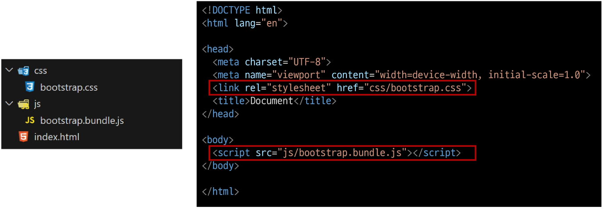</p> 
  - (별다른 안내가 없으면) 배치할 때 javascript는 body 닫히기 전에 붙여주는 걸 권장(javascript가 마지막에 실행됨)

## 의미론적 마크업이 필요한 이유
- 검색 엔진 최적화(SEO)
  - 검색 엔진이 해당 웹 사이트를 분석하기 쉽게 만들어 검색 순위에 영향을 줌
- 웹 접근성(Web Acceessibility)
  - 웹 사이트, 도구, 기술이 고령자나 장애를 가진 사용자들이 사용할 수 있도록 설계 및 개발하는 것
  - 예시 : 스크린 리더를 통해 전맹 시각장애 사용자에게 웹의 글씨를 읽어줌
  - https://nuli.navercorp.com/ 