# CSS-Layout
## CSS Box Model
📍 CSS Box Model  
웹 페이지의 모든 HTML 요소를 감싸는 사각형 상자 모델

> 내용(content), 안쪽 여백(padding), 테두리(border), 외부 간격(margin)으로 구성되어 요소의 크기와 배치를 결정


### Box type
[html-css.md 참고](https://github.com/waterhyun/TIL/blob/master/web/html-css.md)
1. Block box
2. Inline box

박스 타입에 따라 페이지에서의 배치 흐름 및 다른 박스와 관련하여 박스가 동작하는 방식이 달라짐

### Box Display type
박스 표시 타입  
1. Outer display type : 박스가 문서 흐름에서 어떻게 동작할지를 결정
   1. Block
   2. Inline
2. Inner display type : 박스 내부의 요소들이 어떻게 배치될지를 결정
   1. Flexbox(속성: flex)

### Box 구성요소  <p align='center'>

</p> 

- margin box
  - 이 박스와 다른 요소 사이의 공백 가장 바깥쪽 영역
  - 콘텐츠, 패딩 및 테두리를 래핑
  - 박스와 다른 요소 사이의 공백
  - margin 관련 속성을 사용하여 크기 조정
- border box
  - 콘텐츠와 패딩을 감싸는 테두리 영역
  - 콘텐츠와 패딩을 래핑
  - border 관련 속성을 사용하여 크기 조정
- padding box
  - 콘텐츠가 표시되는 영역
  - 콘텐츠 주위에 공백
  - padding 관련 속성을 사용하여 크기 조정
- content box
  - 콘텐츠 주위에 위치하는 공백 영역
  - 실제 콘텐츠가 표시되는 영역 크기
  - width 및 height 속성을 사용하여 크기 조정

#### Box 구성의 방향 별 속성 값
<p align='center'>

</p>

#### 구성 요소 예시
[예시](https://github.com/waterhyun/TIL/blob/master/web/02-box-model/02-part-of-box.html) 
- 테두리 큰 속성 3가지
  - 색, 굵기, 선의 종류
- shorthand
  - border에서는 순서가 상관이 없음
  - padding도 마찬가지 (상하-좌우 ➡ 개수에 따라서 다름)

### shorthand 속성
1. border
   - border-width, border-style, border-color를 한번에 설정하기 위한 속성

    ```css
    /* 작성 순서는 영향을 주지 않음 */
    border: 5px dotted black;
    ```

2. margin & padding
   - 4방향의 속성을 각각 지정하지 않고 한 번에 지정할 수 있는 속성

    ```css
    /* 4개 - 상우하좌 (시계방향) */
    margin: 10px 20px 30px 40px;
    padding: 10px 20px 30px 40px;

    /* 3개 - 상/좌우/하 */
    margin: 10px 20px 30px;
    padding: 10px 20px 30px;

    /* 2개 - 상하/좌우 */
    margin: 10px 20px;
    padding: 10px 20px;

    /* 1개 - 공통 */
    margin: 10px;
    padding: 10px;
    ```

### box-sizing 속성
📍 The standard CSS box model  
표준 상자 모델에서 width와 height 속성 값을 설정하면 이 값은 content box의 크기를 조정하게 됨 

<p align='center'>

</p>

실제 박스 크기는 350px가 아닌 테두리, 패딩 값을 모두 더한 값을 가짐

📍 The alternative CSS box model
<p align='center'>

</p>
대체 상자 모델에서 만든 width와 height는 실제 상자의 너비  
실제 박스 크기를 정하기 위해 테두리와 패딩을 조정할 필요가 없음  

<br>
📌 대체 상자 모델로 변경  

<p align='center'>

</p>

[예시](https://github.com/waterhyun/TIL/blob/master/web/02-box-model/03-box-sizing.html) 

### 기타 display 속성
1. inline-block
   - inline과 block 요소 사이의 중간 지점을 제공하는 display 값
   - width 및 height 속성 사용 가능 ➡ blcok
   - padding, margin 및 border로 인해 다른 요소가 상자에서 밀려남 ➡ block
   - 새로운 행으로 넘어가지 않음 ➡ inline
   - 요소가 줄 바꿈 되는 것을 원하지 않으면서 너비와 높이를 적용하고 싶은 경우에 사용
   - [예시](https://github.com/waterhyun/TIL/blob/master/web/02-box-model/04-inline-block.html) 
2. none
   - 요소를 화면에 표시하지 않고, 공간조차 부여되지 않음
   - Java Script를 통해 제어를 많이 함
   - [예시](https://github.com/waterhyun/TIL/blob/master/web/02-box-model/05-none.html) 


## CSS position
📍 CSS Layout  
각 요소의 위치와 크기를 조정하여 웹 페이지의 디자인을 결정하는 것  
➡ Display, Position, Flexbox 등

📍 CSS Position  
요소를 Normal Flow에서 **제거**하여 다른 위치로 배치하는 것  
➡ 다른 요소 위에 올리기, 화면의 특정 위치에 고정시키기 등

📌Position의 목적  
전체 페이지에 대한 레이아웃을 구성하는 것보다는 페이지 특정 항목의 위치를 조정하는 것

<p align='center'>

</p>

- z축은 모니터 얼굴 방향이라고 생각하면 됨

📍 CSS Position 유형
- static
- relative
- absolute
- fixed
- sticky

### static
[예시](https://github.com/waterhyun/TIL/blob/master/web/03-css-layout-position/01-position.html)
- 요소를 normal flow에 따라 배치
- top, right, bottom, left 속성이 적용되지 않음
- 기본 값

### relative
- 요소를 normal flow에 따라 배치
- 자신이 원래 위치(static)을 기준으로 이동
  - 기준이 본인의 과거 위치
- top, right, bottom, left 속성으로 위치를 조정
- 다른 요소의 레이아웃에 영향을 주지 않음(요소가 차지하는 공간은 static일 때와 같음) - 📌 absolute와 다른 점

### absolute
[예시](https://github.com/waterhyun/TIL/blob/master/web/03-css-layout-position/03-absolute.html)
- 요소를 normal flow에서 제거
- 가장 가까운 relative 부모 요소를 기준으로 이동
  - 만족하는 부모 요소가 없다면 body 태그를 기준으로 함
  - 즉, 어떤 부모를 찾고 움직임
- top, right, botoom, left 속성으로 위치를 조정
- 문서에서 요소가 차지하는 공간이 없어짐

### fixed
- 요소를 normal flow에서 제거
- 현재 화면영역(viewport)을 기준으로 이동
- 스크롤해도 **항상 같은 위치**에 유지
- top, right, bottom, left 속성으로 위치를 조정
- 문서에서 요소가 차지하는 공간이 없어짐

### sticky
[예시](https://github.com/waterhyun/TIL/blob/master/web/03-css-layout-position/02-sticky.html)
- relative와 fixed의 특성을 결합한 속성
- 스크롤 위치가 임계점에 도달하기 전에는 relative처럼 동작
- 스크롤리 특정 임계점에 도달하면 fixed처럼 동작하여 화면에 고정됨
- 만약 다음 sticky 요소가 나오면 다음 sticky 요소가 이전 sticky 요소의 자리를 대체
  - 이전 sticky 요소가 고정되어 있던 위치와 다음 sticky 요소가 고정되어야 할 위치가 겹치게 되기 때문

## z-index
- 요소의 쌓임 순서(stack order)를 정의하는 속성
- 정수 값을 사용해 z축 순서를 지정
- 값이 클수록 요소가 위에 쌓이게 됨
- static이 아닌 요소에만 적용됨
- 특징
  - 기본값은 auto
  - 부모 요소의 z-index 값에 영향을 받음
  - 같은 부모 내에서만 z-index 값을 비교
  - 부모의 z-index가 낮으면 자식의 z-index가 아무리 높아도 부모보다 위로 올라갈 수 없음
  - z-index 값이 같으면 html 문서 순서대로 쌓임

<p align='center'>
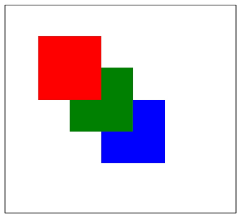
</p>
 

## CSS Flexbox
요소를 행과 열 형태로 배치하는 1차원 레이아웃 방식  
➡ 공간 배열 & 정렬

<p align='center'>
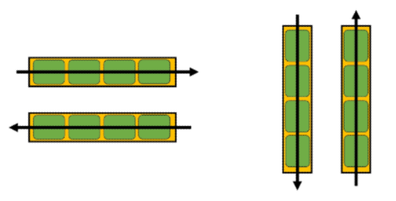
</p>

### flexbox 구성 요소
<p align='center'>

</p>

#### main axis
<p align='center'>
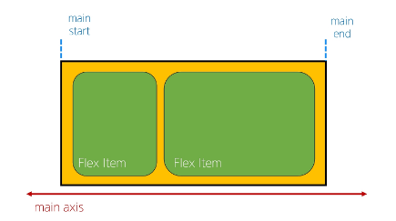
</p> 

- 주축
- flex item들이 배치되는 기본 축
- main start에서 시작하여 main end 방향으로 배치(기본 값)

#### cross axis
<p align='center'>
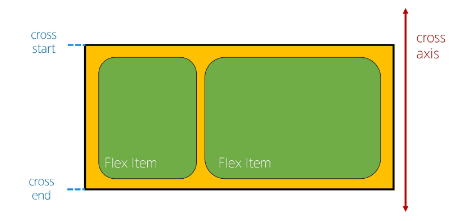
</p> 

- 교차 축
- main axis에 수직인 축 ➡ 따라서 교차축을 외우지 말기, main 축을 잘 알고 있어야 헷갈리지 않음(축을 돌릴 수 가 있으므로 항상 교차축이라고해서 상-하가 아님)
- cross start에서 시작하여 cross end 방향으로 배치(기본 값)

#### flex container
<p align='center'>
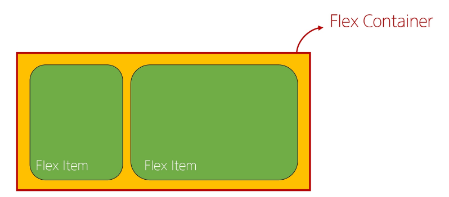
</p>  

- display: flex; 혹은 display: inline-flex; 가 설정된 부모 요소
- 이 컨테이너의 1차 자식 요소들이 flex item이 됨
- flexbox 속성 값들을 사용하여 자식 요소 flex item들을 배치하는 주제

#### flex item
<p align='center'>
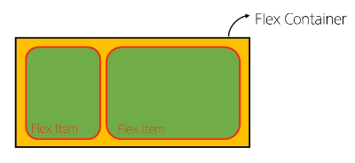
</p>  
- flex container 내부에 레이아웃 되는 항목

### flexbox 속성
- flex container 관련 속성
  - display
  - flex-direction
  - flex-wrap
  - justify-content
  - algin-items
  - align-content
- flex item 관련 속성
  - align-self
  - flex-grow
  - flex-basis
  - order
  
1. Flex Container 지정
     - flex item은 기본적으로 행(주 축의 기본값인 가로 방향)으로 나열
     - flex item은 주 축의 시작 선에서 시작
     - flex item은 교차 축의 크기를 채우기 위해 늘어남
     - [예시](https://github.com/waterhyun/TIL/blob/master/web/04-css-layout-flexible-box/01-flexbox.html) <p align='center'>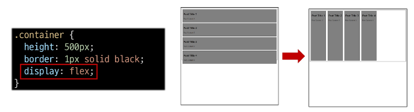</p>   
2. flex-direction
     - flex item이 나열되는 방향을 지정
     - column으로 지정할 경우 주 축이 변경됨
     - `-reverse`로 지정하면 flex item 배치의 시작 선과 끝 선이 서로 바뀜
       <p align='center'>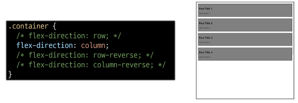</p>   

3. flex-wrap
     - flex item 목록이 flex container의 한 행에 들어가지 않을 경우 다른 행에 배치할지 여부 설정
       <p align='center'>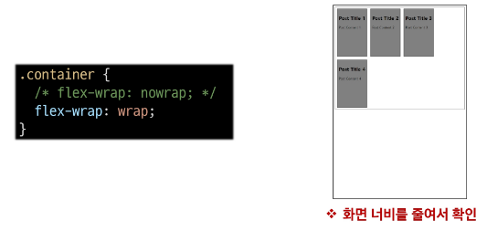</p>   
4. justify-content
     - 주 축을 따라 flex item과 주위에 공간을 분배
       <p align='center'>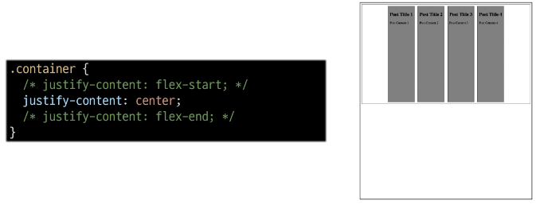</p>   
5. align-content  
     - 교차 축을 따라 flex item과 주위에 공간을 분배
     - flex-wrap이 wrap 또는 wrap-reverse로 설정된 여러 행에만 적용됨
     - 한 줄 짜리는 행에는 효과 없음(flex-wrap이 nowrap으로 설정된 경우)
     <p align='center'>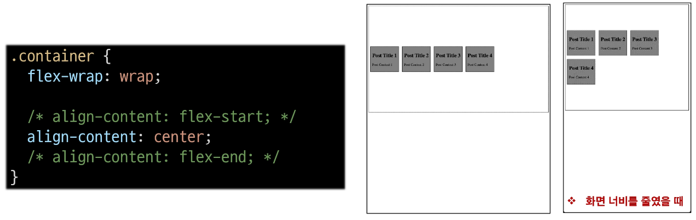</p>   
6. align-items
     - 교차 축을 따라 flex item 행을 정렬
     <p align='center'>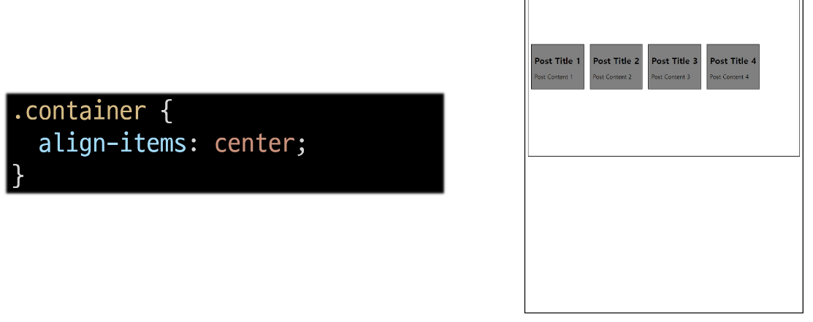</p>   

7. algin-self
     - 교차 축을 따라 개별 flex item을 정렬
      <p align='center'></p>   


📌 목적에 따른 속성 분류
- 배치
  - flex-direction
  - flex-wrap
- 공간 분배
  - justify-content
  - align-content
- 정렬
  - align-items
  - align-self

📌 속성명 Tip
- justify - 주축
  - content
- align - 교차 축
  - content
  - items
  - self

1. flex-grow  <p align='center'>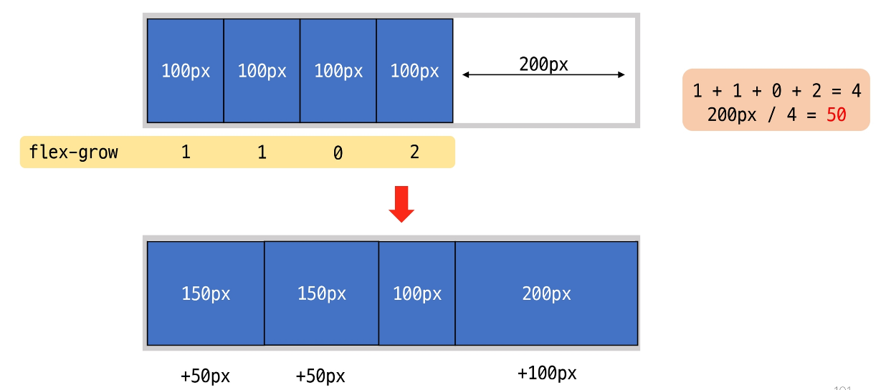</p>  [예시](https://github.com/waterhyun/TIL/blob/master/web/04-css-layout-flexible-box/02-flexbox-grow.html)
   - 남는 행 여백을 비율에 따라 각 flex item에 분배
     - 아이템이 컨테이너 내에서 확장하는 비율을 지정
     - 남는 공간을 분배해서 제공(여백을 지우고 싶을 때 사용!)
     - flex-grow의 반대는 flex-shrink  
2. flex-basis  <p align='center'></p>  [예시](https://github.com/waterhyun/TIL/blob/master/web/04-css-layout-flexible-box/03-flexbox-basis.html)
    - flex item의 초기 크기 값을 지정
    - flex-basis와 width 값을 동시에 적용한 경우 **flex-basis**가 우선


### flex-wrap 응용
📍 반응형 레이아웃  
다양한 디바이스와 화면 크기에 자동으로 적응하여 콘텐츠를 최적으로 표시하는 웹 레이아웃 방식  <p align='center'>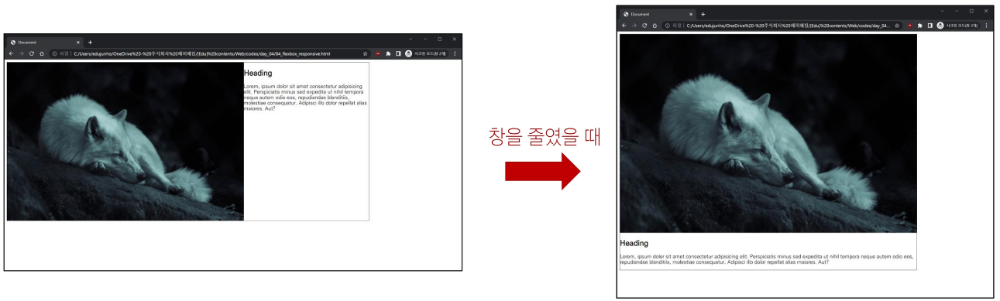</p>  [예시](https://github.com/waterhyun/TIL/blob/master/web/04-css-layout-flexible-box/04-flexbox-responsive.html)

justify-items 및 justify-self 속성이 없는 이유  
"필요 없기 때문"
➡ margin auto를 통해 정렬 및 배치가 가능


## 참고  
### 마진 상쇄
### 박스 타입 별 수평 정렬
Block 요소의 수평 정렬 [예시](https://github.com/waterhyun/TIL/blob/master/web/02-box-model/99-horizontal-align.html)
### 실제 position 활용 예시
### flexbox shorthand 속성
### flexbox 속성 정리