<!-- TOC start (generated with https://github.com/derlin/bitdowntoc) -->

- [Responsive Web](#responsive-web)
   * [Bootstrap Grid system](#bootstrap-grid-system)
      + [Grid system 구조](#grid-system-구조)
      + [Grid system 실습](#grid-system-실습)
   * [Grid system for responsive web](#grid-system-for-responsive-web)
      + [Grid system Breakpoints](#grid-system-breakpoints)
      + [Breakpoints 실습](#breakpoints-실습)
   * [CSS Layout 종합 정리](#css-layout-종합-정리)
   * [UX & UI](#ux-ui)

<!-- TOC end -->

# Responsive Web

`emmet` [cheat sheet](https://docs.emmet.io/cheat-sheet/)

## Bootstrap Grid system

📍 웹 페이지의 레이아웃을 조정하는 데 사용되는 **12개의 컬럼**으로 구성된 시스템

> **왜 12개일까?**
> 
> 1. 약수가 많음 (1, 2, 3, 4, 6, 12)
> 
> 2. 적당히 큰 수

📍 Grid system 목적
- 반응형 디자인을 지원해 웹 페이지를 모바일, 태블릿, 데스크탑 등 다양한 기기에서 적절하게 표시할 수 있도록 도움
  - 화면의 사이즈에 따라 변경하기에 용이

📍 **<mark>반응형 웹 디자인 (Responsive Web Design)</mark>**
    
    디바이스 종류나 화면 크기에 상관없이, 어디서든 일관된 레이아웃 및 사용자 경험을 제공하는 디자인 기술
    

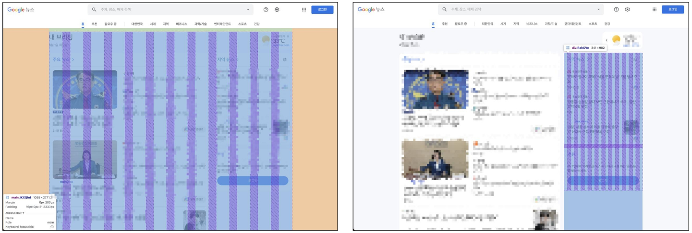

### Grid system 구조
📌 Grid system 기본 요소
  
1. `Container` : Column들을 담고 있는 공간  
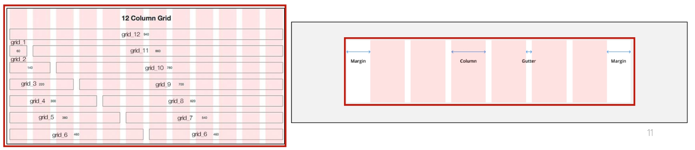

2. `Column` : 실제 컨텐츠를 포함하는 부분  
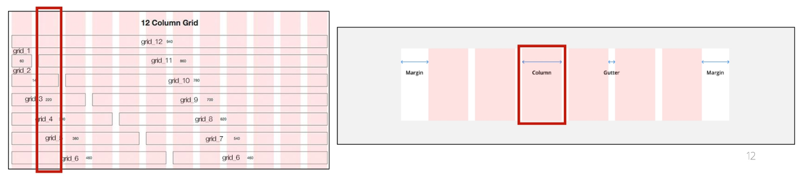

3. `Gutter` : 컬럼과 컬럼 사이의 여백 영역  
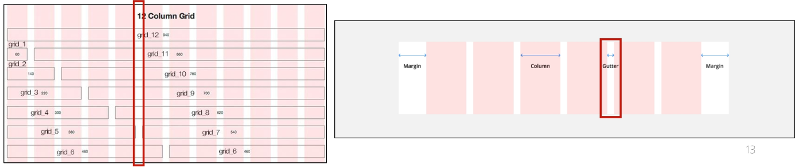

4. 1개의 `row` 안에 12개의 column 영역이 구성 ➡ 각 요소는 12개 중 몇 개를 차지할 것인지 지정됨  

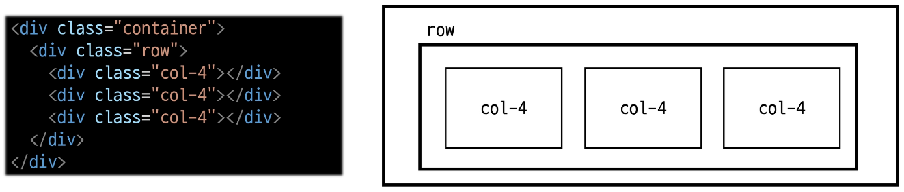
  ➡ 이렇게 하면 3등분(몇 칸을 나눠줄 것인지!)

### Grid system 실습
[실습 코드](https://github.com/waterhyun/TIL/blob/master/web/07-bootstrap-grid-system/01-grid-system.html)

- **기본** : `col-n`

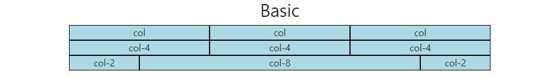

🤔 12칸을 넘어가게 되면 어떻게 될까?  
➡ 다음 칸으로 넘어가게 된다

- **중첩 (Nesting)** : `row` 안에 `col-n`

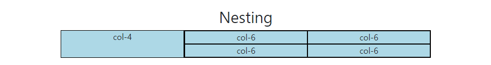

- **상쇄 (Offset)** : `col-n offset-n`   
jump를 하는 것, offset-n간 이후에 등장

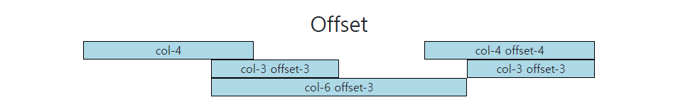

- **Gutters** : `row g(x or y)-n` 안에 `col-n`
 
Grid system에서 column 사이에 여백 영역 생성
(컴퓨터가 알아서 x축 : padding, y축 : margin) 

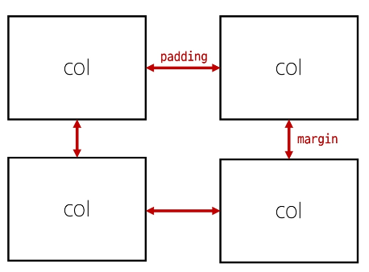

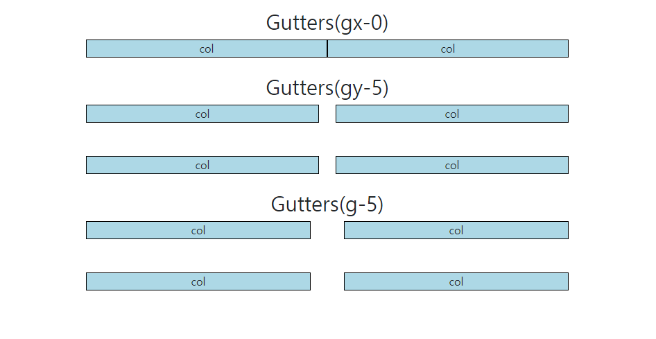

> - Grid cards : `row-cols-1 ros-cols-sm-3 row-cols-md-2 g-4`
>   
>   

## Grid system for responsive web
📍 Responsive Web Design  
디자인 종류나 화면 크기에 상관없이, 어디서든 일관된 레이아웃 및 사용자 경험을 제공하는 디자인 기술

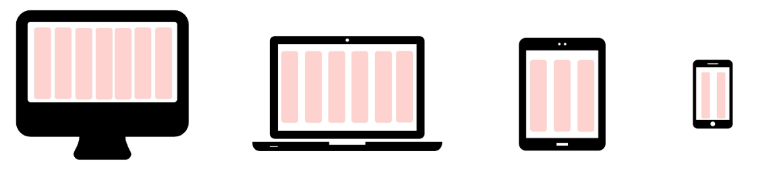

Bootstrap grid system에서는 12개의 column과 **6개의 breakpoints**를 사용하여 반응형 웹 디자인을 구현

### Grid system Breakpoints
📍 웹 페이지를 다양한 화면 크기에서 적절하게 배치하기 위한 분기점

- 화면 너비에 따라 **6개**의 분기점 제공 (xs, s, md, lg, xl, xxl)  
  - 각 breakpoints마다 설정된 최대 너비 값 **<mark>이상으로</mark>** 화면이 커지면 grid system 동작이 변경됨  
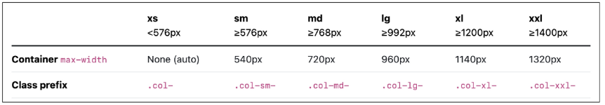

    - xs은 쓰지 않음
    - col뿐만 아니라 다른 것과도 쓸 수 있음 

### Breakpoints 실습
[실습 코드](https://github.com/waterhyun/TIL/blob/master/web/08-grid-system-for-responsive-web/01-breakpoints.html)

- Breakpoints 실습 : `col-12 col-sm-6 col-md-2 col-lg-3 col-xl-4 box`  
- `col-사이즈 이름- 칸 수`  
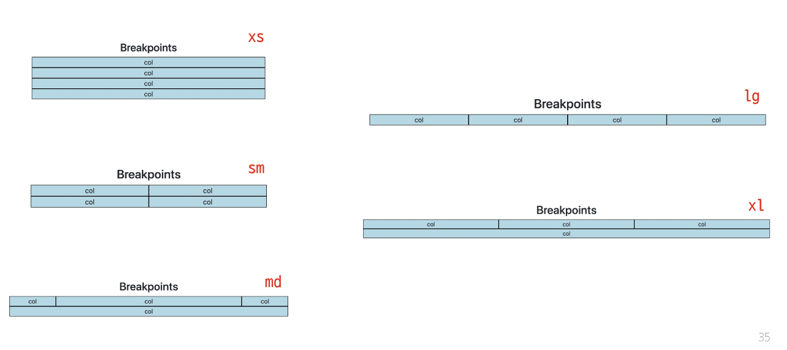

- Breakpoints + offset 실습 :  
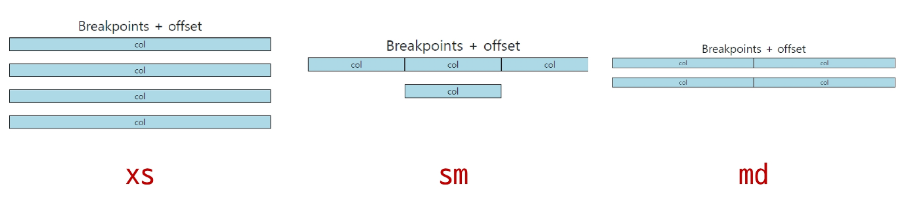

  - 해제하는 것도 잘 알아두기 `col-12 col-sm-4 offset-sm-4 col-md-6 offset-md-0`

> ⭐ Grid System은 화면 크기에 따라 12개의 칸을 각 요소에 나누어 주는 것

## CSS Layout 종합 정리

1. **Grid System** : 12개의 컬럼에 어떤 레이아웃 기술이 사용됐는지 생각해보기  
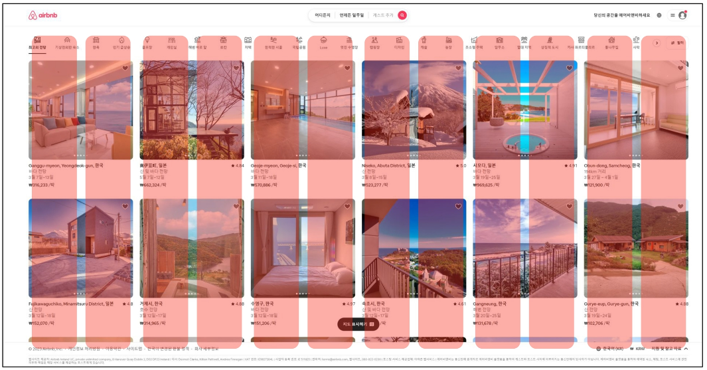

2. **Flexbox** : 각 박스마다 어떤 레이아웃 기술이 사용됐는지 생각해보기  
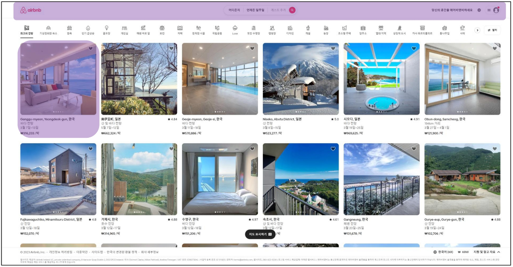

3. **Position** : header와 footer, nav에 어떤 레이아웃 기술이 사용됐는지 생각해보기  

  

>📌 CSS Layout 특징  
>
>  - CSS 레이아웃 기술들은 각각 고유한 특성과 장단점을 가지고 있음
>  
>  - 이들은 상호 보완적이며, 특정 상황에 따라 적합한 도구가 달라짐
>  
>  - 최적의 기술을 효과적으로 선택 및 활용하기 위해서는 다양한 실제 개발 경험이 필수

## UX & UI

- UX (User Experience)
  
  제품이나 서비스를 사용하는 사람들이 느끼는 전체적인 경험과 만족도를 개선하고 최적화하기 위한 디자인과 개발 분야
  
  - ex: 백화점 1층 향기, 러쉬 향기, 음악 검색 기능이 적절하고 정확하게 작동하는 것
  
  - UX 설계
    - 사람들의 마음과 생각을 이해하고 정리해서 제품에 녹여내는 과정
  
    - 유저 리서치, 데이터 설계 및 정제, 유저 시나리오, 프로토타입 설계
  
    - 기획자의 역할

- UI (User Interface)
  
  서비스와 사용자 간 상호작용을 가능하게 하는 디자인 요소들을 개발하고 구현하는 분야
  
  - ex: 리모컨, ATM, 웹 사이트
  
  - UI 설계
    - 예쁜 디자인보다는 사용자가 더 쉽고 편리하게 사용할 수 있도록 고려
  
    - 이를 위해서는 디자인 시스템, 중간 산출물, 프로토타입 등이 필요
  
    - 디자이너의 역할

- 많은 회사에서는 UX/UI 디자인을 함께하는 디자이너를 채용하거나 UX는 기획자, UI는 디자이너의 역할로 채용하기도 함
  - UX (직무 : UX Researcher, User Researcher)
    - 구글 : 사용자의 경험을 이해하기 위한 통계 모델을 설계
    - MS : 리서치를 기획하고 사용자에 대한 지표를 정의
    - Meta : 정성적인 방법과 정량적인 방법을 사용해서 사용자 조사를 실시
  - UI (직무 : Product Designer, Interaction Designer)
    - 구글 : 다양한 디자인 프로토타이핑 툴을 사용해서 개발 가이드를 제공
    - MS : 시각 디자인을 고려해서 체계적인 디자인 컨셉을 보여줌
    - Meta : 제품을 이해하고 더 나은 UI Flow와 사용자 경험을 디자인